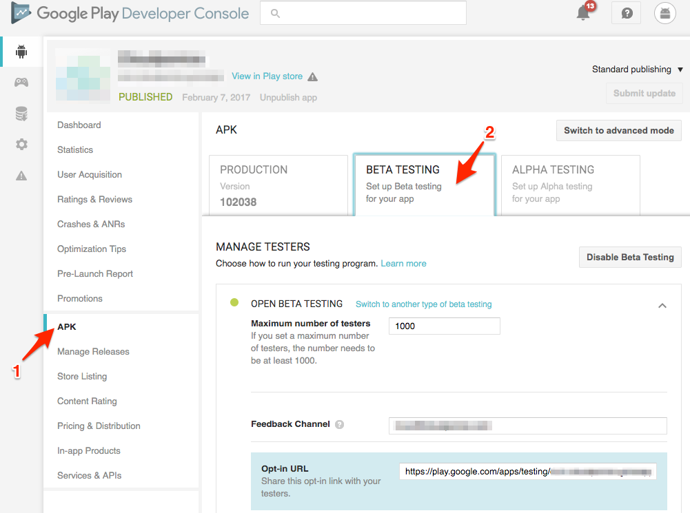

# Google Play

Toda la administración de aplicaciónes Android se realiza en el portal
de desarrolladores de Google.

## Ingresar al Developer Console

- Ingresar al [Developer Console](https://play.google.com/apps/publish) de Google Play
- Iniciar sesión el usuario que tiene permisos para la aplicación en cuestión
- Seleccionar la applicación de la lista.

## Promover una app desde beta a producción

Como práctica general las aplicaciones seran publicadas por Platanus
en la seccón beta o alpha. Luego el cliente debe probar, aprobar y promover
la aplicación a producción.

Para esto debes seguir los siguientes pasos.

- Ingresar a la seccion *APK*
- Seleccionar el tab *Beta Testing* (o Alpha testing)
- En la sección *Current APK* seleccionar *Promote* en la columna de _actions_

