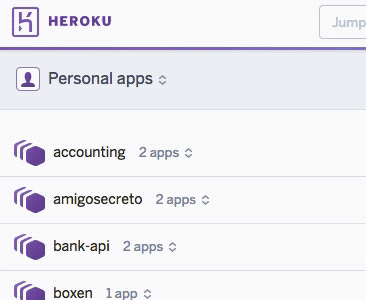
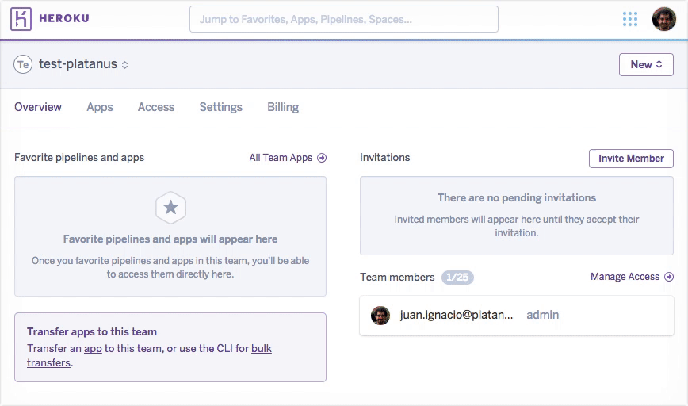

# Heroku

Heroku es el servicio que usamos para "hostear" la aplicación web y todos los servicios extras que necesitemos (Base de Datos, repositorio de archivos, etc...). Acá estará el admin, el API y la página de cara a los clientes.

## Crear una cuenta

Para crear una cuenta debes ingresar a https://signup.heroku.com/

- Ingresar los datos en el formulario (en la pregunta Primary Development language elegir Ruby)
- Revisar email de confirmación
- Activar cuenta haciendo click en el link de activación en el email
- Elegir un password

A continuacion te recomendamos [crear un team](#crear-un-team) para dar acceso a los desarrolladores de platanus.

## Team

Los teams en Heroku nos dan mayor flexibilidad para administrar las aplicaciones.

### Crear un team

Para crear un team debemos ingresar a [heroku](https://id.heroku.com/login).

 - Hacer login
 - Click en *Personal apps*
 - Click en *Create Team*

A continuación deberás asignar un nombre al team y agregar la tarjeta de crédito con la que se pagará la cuenta de Heroku asociada las aplicaciones del team.

1. Seleccionar un nombre.
1. Agregar tarjeta de crédito
1. Crear Team

Luego de esto vas a poder seleccionar el team haciendo click en _Personal apps_

### Agregar miembros a un team

Para poder administrar las aplicaciones del team, es necesario dar persmisos de administración desde el [dashboard](https://dashboard.heroku.com)

- Seleccionar el team
- Ir al tab *Access*
- Click en botón *Invite Member*
- Agregar el mail del usuario a quién darás permisos. (contacto@platan.us)
- Seleccionar *admin* el la opción *Role*
- Click en *Save changes*

### Transferir una app a un team

Una vez creado el team, puedes transferir una aplicación existente al team, para que pueda ser administrada por sus miembros.

- Seleccionar la aplicación a transferir
- Ir al tab *settings*
- Scroll hasta la sección *Transfer Ownership*
- Seleccionar el team debajo el encabezado *Teams & Organizations*
- Click en el botón *Transfer*
- Confirmar haciendo click en el botón *Transfer* del diálogo de confirmación.

