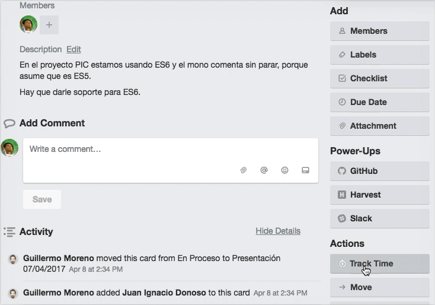

Time Tracking
=============

[Harvest](https://platanus.harvestapp.com) es la herramienta que utilizamos en Platanus para registrar el tiempo de nuestras actividades.

### ¿Por qué hacemos time tracking?

Porque es muy sano saber cuanto tiempo le dedicamos a los distintos proyectos. No solamente para comunicarle a nuestros clientes, nosotros también medimos los esfuerzos en proyectos internos.

### ¿Qué debemos trackear?

- El tiempo de las **tareas que estamos realizando** en el momento.

  Como nada representa mejor estas tareas que los títulos de las tarjetas de [Trello](trello.md) en las cuales estamos trabajando se recomienda, al iniciar la tarea, copiar este título y agregarlo en harvest sin olvidar asociar el proyecto al cual pertenece la misma.

  **Trello card**

  Puedes usar el [chrome extention](#harvest-chrome-extension) o el PowerUp.

  

  **Github Issues**

  Puedes usar el [chrome extention](#harvest-chrome-extension)

  

- El tiempo de las **reuniones**.

  Esto es cuando: tenemos una reunión de sprint, un compañero nos pide ayuda, surge una reunión espontánea para tomar decisiones, conversarmos sobre el diseño de una aplicación, etc. Algunos ejemplos de descripción para esas tareas.

  - Reunión para definir que mapas user
  - Ayudando a Pepito a instalar node

- El tiempo de **revisar código** de nuestros compañeros.

  Esto lo hacemos usualmente en los pull requests de Github en los que somos asignados. Lo ideal aquí, es tomar el título del PR y agregar el prefijo "Revisando".

#### [Harvest Chrome Extension](https://chrome.google.com/webstore/detail/harvest-time-tracker/fbpiglieekigmkeebmeohkelfpjjlaia)

Esta extensión de Google Chrome agrega un botón para trackear tiempo a Trello, Github, Gmail y muchas otras aplicaciones. Con esta herramienta podremos hacer menos tediosa la tarea de registrar el tiempo.
