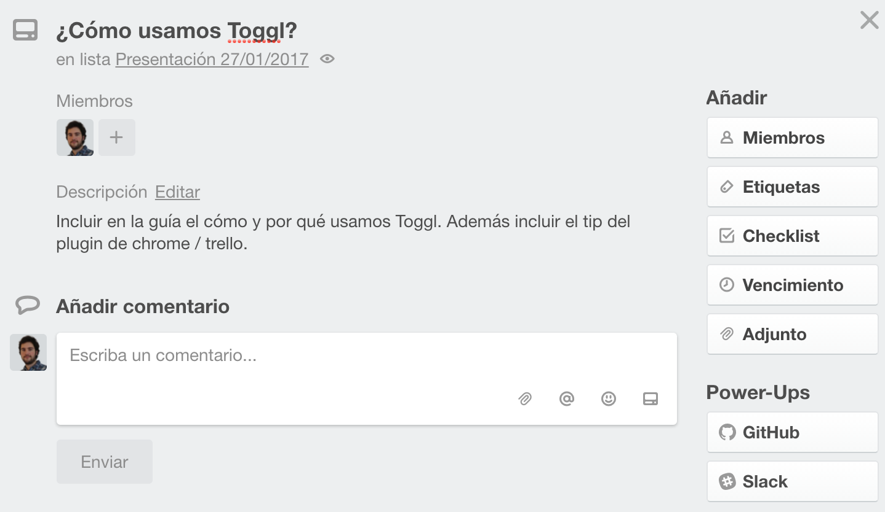
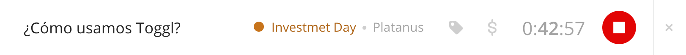
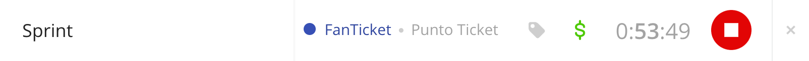
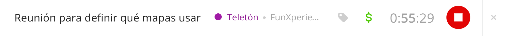
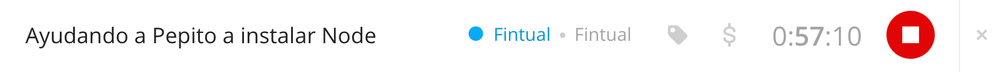
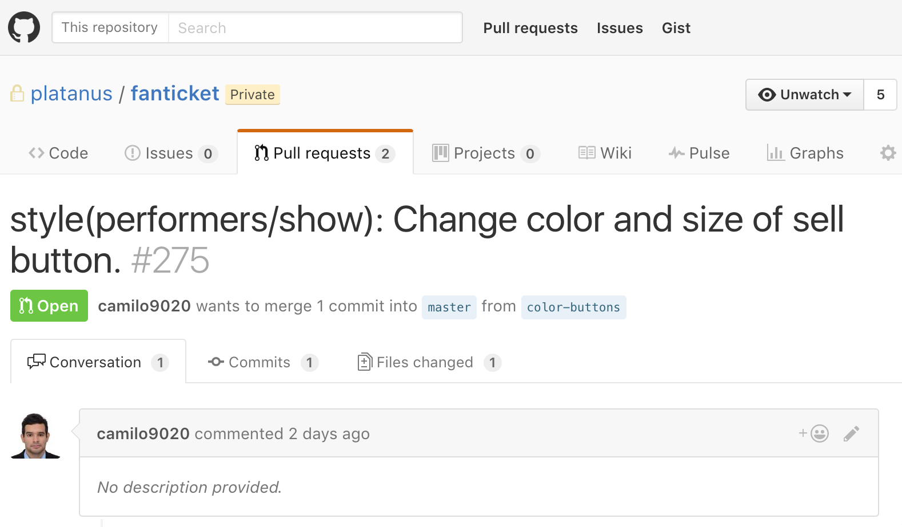
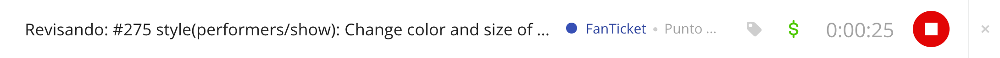
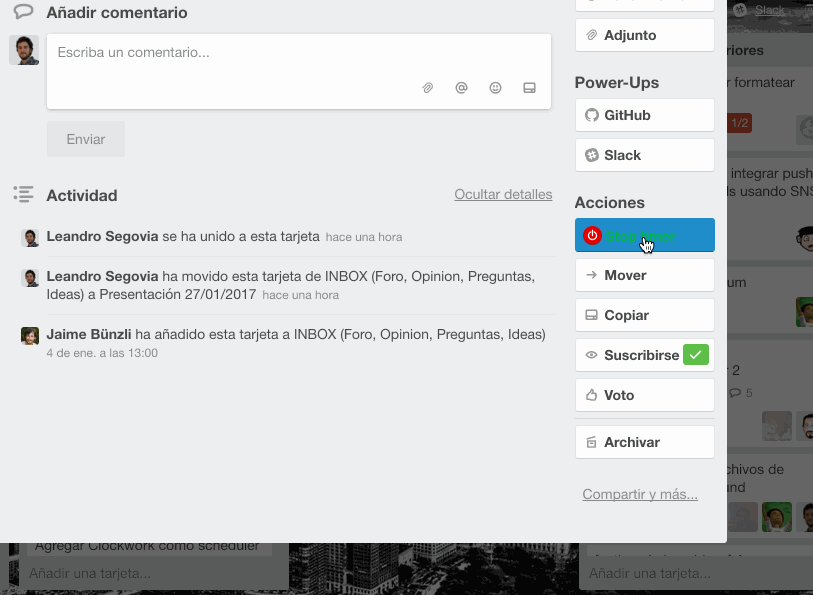
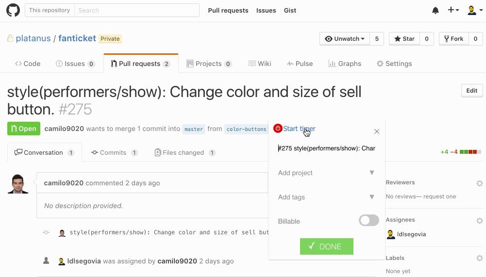

Toggl
=====

[Toggl](https://www.toggl.com/) es la herramienta que utilizamos en Platanus para registrar el tiempo de nuestras actividades.

### ¿Por qué toggleamos?

Porque es muy sano saber cuanto tiempo le dedicamos a los distintos proyectos. No solamente para comunicarle a nuestros clientes, nosotros también medimos los esfuerzos en proyectos internos.

### ¿Qué debemos "togglear"?

- El tiempo de las **tareas que estamos realizando** en el momento.

  Como nada representa mejor estas tareas que los títulos de las tarjetas de [Trello](trello.md) en las cuales estamos trabajando se recomienda, al iniciar la tarea, copiar este título y agregarlo en toggl sin olvidar asociar el proyecto al cual pertenece la misma.

  **Trello card**

  

  **Toggl**

  

- El tiempo de las **reuniones**.

  Esto es cuando: tenemos una reunión de sprint, un compañero nos pide ayuda, surge una reunón espontánea para tomar decisiones, conversarmos sobre el diseño de una aplicación, etc.

  **Toggl**

  

  

  

- El tiempo de **revisar código** de nuestros compañeros.

  Esto lo hacemos usualmente en los pull requests de Github en los que somos asignados. Lo ideal aquí, es tomar el título del PR y agregar el prefijo "Revisando".

  **Github Pull Request**

  

  **Toggl**

  

### Herramientas útiles

#### [Toggl Button: Productivity & Time Tracker](https://chrome.google.com/webstore/detail/toggl-button-productivity/oejgccbfbmkkpaidnkphaiaecficdnfn)

Esta extensión de Google Chrome agrega un botón para "togglear" a Trello, Github, Gmail y muchas otras aplicaciones. Con esta herramienta podremos hacer menos tediosa la tarea de registrar el tiempo.

**Trello**

**Github Pull Request**

