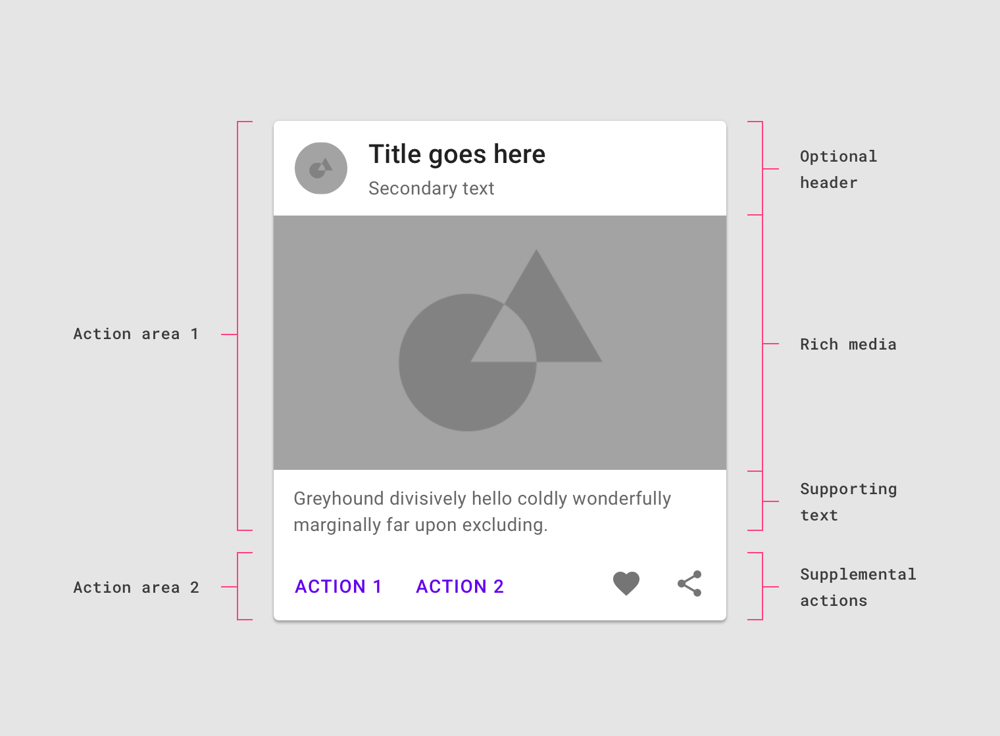

# Guía de Estilo

## Rails

* Las variables de ambiente deberían ser definidas como métodos en un módulo para agruparlas y para que sea más fácil hacer mock de ellas. ()

    ```ruby
    # ❌
    DEFAULT_TIME = ENV.fetch("DEFAULT_TIME", 60 * 24 * 3).to_i
    DEFAULT_TIME * 4
    
    # ✅
    Item.default_time * 4
    ```

* Encapsular lógica de negocios en Jobs, sin importar si no es reutilizable, para limitar el tamaño de los controllers.

* En API usar siempre memoization. En app usar `set_model` explícito en el método de la acción. Nunca usar `before_action`.

    ```ruby
    # ❌
    before_action :set_variables
    
    def set_variables
      @variables = Variable.all
    end
    
    # ✅
    def variables
      @variables ||= Variable.all
    end
    ```

* Preferir Shrine por sobre ActiveStorage para manejo de imágenes.

* Serializer: Solo métodos para estructurar data que se ve a necesitar en una API

* Decorador: Cosas que tienen html o especifico para consumo de vista por parte de Rails

* Presenter: Lógica/condicionales para usar en vistas. En general se debería preferir Vue por sobre presenters.

## API

* Usamos PowerAPI para crear APIs

* Cada controller debería manejar un solo recurso.

    ```ruby
    # ❌
    
    class BookController
    	def index
    		respond_with Book.all
    	end
    	
    	def chapters
    		respond_with Chapter.all
    	end
    
    # ✅
    class BookController
    	def index
    		respond_with Book.all
    	end
    end
    
    class ChapterController
    	def index
    		respond_with Chapter.all
    	end
    end
    ```

* Todo lo que es API para uso interno (formularios, scroll infinito, etc) se usa PowerAPI en modo internal

* Solo cuando la aplicación va a ser consumida de manera independiente a la web (app mobile) se usa las API exposed, teniendo tanto API interna como exposed si es necesario.

* Se usa `serialize_resource` para pasar variables de Rails a Vue
` :prop="<%= serialize_resource(@resource, @options) %>"`

* Para generar endpoints nuevos preferir usar el generador de PowerAPI (`bin/rails generate power_api:controller my_resource`

* Preferir usar BaseController a la hora de agregar cosas como Pundit en vez de editar cada controller.

* Serializers - No sacar el root. El formato de respuesta debería ser consistente en todos los serializers

* Usar objetos decorados en serializer

* Preferir `respond_with` a `render json:`

* Evitar agregar valores traducidos o formateados en la respuesta de una API. Idealmente los valores siempre se mandan sin formatear (fechas, números, moneda).

* Valores para vistas deberían ir en serializer y/o decorador, métodos de datos deberían ir modelo.

* Por definir: estructura REST de rutas - uso de verbos en url (https://platanus.slack.com/archives/C021F62E15G/p1651518650410749)

## Modelos

* Para manejar callbacks después de un evento en un modelo usamos dos maneras:

    * Callbacks en el modelo cuando se editan atributos de la misma tabla

    * PowerTypes - Observers para ejecutar side-effects (mandar correos, crear otro recurso en otra tabla, etc)

* Evitar side-effects en AASM (mandar emails, modificar otros modelos), usar Observers para eso.

* Si se están usando estados de AASM, siempre usar sus eventos para cambiar de un estado a otro. No cambiar de estado con `Resource.update`

* usar keys de locale en errores activemodel

* En observers todo lo que depende de un recurso externo se ejecuta en perform_later

## ActiveAdmin

*  No tener lógica directo en el DSL de active admin. Usar jobs o servicios.

* Si se usan componentes de Vue, se pueden llamar a los endpoint de AA directamente con `.json` usando query params de Ransack si es necesario

## Modelos: ActiveRecord

* Preferir dos queries simples versus una query muy complicada.

* pluck en vez de map para obtener atributos de un modelo

* Preferir siempre métodos de ActiveRecord para las relaciones por sobre consultas con where o raw SQL. En otras palabras, no usar SQL “a mano”

* En colecciones de ActiveRecord, preferir métodos de ActiveRecord sobre métodos de Ruby/Enumerable, para delegar el cálculo o búsqueda a la base de datos y no traer toda la colección a memoria innecesariamente. Una excepción puede ser cuando los elementos ya se cargaron previamente en m

    ```ruby
    # ❌
    collection.find { |record| record.some_column == 'something' }
    collection.select { |record| record.some_column == 'something' }
    collection.select { |record| record.association.some_column == 'something' }
    collection.pluck(:some_column).sum
    
    # ✅
    collection.find_by(some_column: 'something')
    collection.where(some_column: 'something')
    collection.joins(:association).where(
      associations: { some_column: 'something' }
    )
    collection.sum(:some_column)
    ```

* Usar transactions para grupos de acciones.

* Los scopes siempre deberían ser chainables.

* Preferir definir scopes en vez de definir queries en controllers.

## Views

* Mientras menos nesteado el html, mejor. No agregar divs wrappers para agregar una sola clase a menos que sea 100% necesario.

    ```javascript
    <!-- ❌ -->
    <div class="mt-2">
      <div class="bg-white">Hola</div>
    <div>
    
    <!-- ✅ -->
    <div class="mt-2 bg-white">Hola</div>
    ```

## Vue

* Seguir guía de estilos de Vue a la hora de ponerle nombre a los componentes.

    * Tener todos los componentes en la misma carpeta. Fuente ([detailed explanation en guía de estilo](https://vuejs.org/style-guide/rules-strongly-recommended.html#tightly-coupled-component-names))

        * Si es que se hace inmanejable la cantidad de componentes, lo más probable es que la aplicación en si sea lo suficientemente grande como para dividir en engines, en cuyo caso los componentes deberían ir en sus carpetas de engine respectivas.

    * Si un componente es global y básico (inputs, botones) usar prefijo `Base`. Ejemplos: `BaseInput`, `BaseModal`. [Fuente](https://vuejs.org/style-guide/rules-strongly-recommended.html#tightly-coupled-component-names)

    * Si es un componente que se usa una sola vez (headers, footers, etc) usar prefijo `The`. Ejemplos: `TheHeader`, `TheContactForm` [Fuente](https://vuejs.org/style-guide/rules-strongly-recommended.html#tightly-coupled-component-names)

    * Componentes que solo se van a usar en otro componente, tienen de prefijo el nombre de ese componente. Ejemplo: `TheHeaderNavBar`. [Fuente](https://vuejs.org/style-guide/rules-strongly-recommended.html#tightly-coupled-component-names)

* Usar `href` en vez de `@click` cuando la única acción que se quiere realizar es cambiar de página.

* Usar variables multilinea en vez desactivar regla de eslint

* Preferir librerías que no muten sus valores, por ejemplo date-fns en vez de moment.

* Preferir sintaxis que ayude al tree-shaking, para bajar el tamaño del bundle.

    ```javascript
    // ❌
    import * as dateFns from 'date-fns'
    // o, en el caso especifico de lodash
    import { get } from 'lodash'
    
    // ✅
    import get from 'lodash/get'
    // o 
    import { get }  from 'lodash-es'
    
    import { format, parse } from 'date-fns'
    ```

* Las promesas deberían estar con catch y mostrar feedback al usuario.

    ```javascript
    // ❌
    
    const items = await itemsApi.getAll();
    doSomething(items)
    
    // ✅
    try {
    	const items = await itemsApi.getAll();
      doSomething(items);
    } catch (e) {
      showTryAgainMessage.value = true;
    }
    ```

* Estructuras repetidas deberían ser extraidas a componentes o ser usadas con v-for (sobre todo si se están usando métodos en vez de valores computed)

* Preferir computed por sobre métodos (cuando son valores para el template)

* Si hay CSS custom en `<style>` usar `scoped` para limitar su efecto al resto de la aplicación.

* Usar [form generators](https://vee-validate.logaretm.com/v4/tutorials/dynamic-form-generator/) puede ahorrar mucho tiempo si el proyecto tiene varios formularios con el mismo estilo.

* Inline SVGs:

    * Todos los iconos *o s*i se necesita cambiar el color de un SVG que no es un icono, usar [https://www.npmjs.com/package/vue-inline-svg](https://www.npmjs.com/package/vue-inline-svg). La librería es necesaria para que los SVGs queden insertados directamente en el template en vez de quedar como imágenes enlazadas, y así puedan ser modificados con css. 

    * Íconos SVG no deberían tener atributo `fill` o deberían tener `fill="currentColor"` para que tomen el color del texto.

    * https://github.com/jamesmartin/inline_svg (con `inline_svg_tag`) cuando el svg se vaya a usar en un template de rails directamente.

    * En otro casos usar img con el SVG directamente en el src.

* Evitar anidar elementos interactivos (`<button>` dentro de <a>)

    * Normalmente esto pasa cuando se quiere que todo un elemento sea clickable pero que además tenga acciones extras. La solución es separar las acciones secundarias de la acción principal: 

        

* `<button>` siempre debería tener un `type`

    ```html
    <!-- ❌ -->
    <form>
      <button @click="cancel">Cancelar</button>
      <button @click="submit">Enviar</button>
    </form>
    <!-- ✅ -->
    <form @submit="submit">
      <button @click="cancel" type="button">Cancelar</button>
      <button type="submit">Enviar</button>
    </form>
    ```

* Base mínima a la que queremos llegar de accesibilidad

    * Por lo mínimo los formularios deberían ser navegables con el teclado (inputs y botones en vez de divs, todo dentro de un form, evento submit debería ser manejado para que funcione el enter)

    * Cada input debería tener un label, ya sea dentro del tag o con un id/for. Si por diseño no se puede ver un label, usar la clase `sr-only` para esconderlo.

    * Evitar `@click` en cosas que no sean links o botones. No usar divs.

    * No usar outline-none en los elementos a menos que el focus se marque de otra manera (`focus-visible`)

* Todos los formularios deben ser implementados en Vue con submit mediante API.

* Preferir Vue por sobre Rails (y presenters) cuando hayan condicionales o cosas dinámicas. Considerar casos de uso futuros a la hora de decidir.

* En lo posible la primera carga de una página nunca debería requerir esperar más requests para mostrar contenido. Usar el mismo serializer para el prop y el endpoint de la API (`serialize_resource`)

* No usar tags self-closing en `.erb`. Se usan en Vue por ser más simples y rápidas de usar, pero en HTML normal no son válidas y tienden a romper el template de manera misteriosa. 

    ```javascript
    <!-- ❌ -->
    <super-component />
    
    <!-- ✅ -->
    <super-component></super-component>
    ```

* Si en un test se necesita seleccionar un elemento, no agregar una clase, ref o cualquier otro atributo que ya tenga otro significado. Para esto se le puede agregar al elemento un `data-testid="something"` si es un elemento único, o `data-test` si no lo es

* **Por definir: **Qué hacer con variables globales que vienen desde Rails (ej, current user) y se necesitan en Vue

* [DRAFT] En Vue 3, poner primero el `<script>`, luego el `<template>` y al final `<style>` si es que hay

## State Management (Pinia, Vuex)

* **Usamos **[**Pinia**](https://pinia.vuejs.org/)** en vez de Vuex.**

* El store debería estar normalizado (array de ids + objeto con ids identificando cada item)

    ```javascript
    <!-- ❌ -->
    const state = {
      items: [
        {id: 1, name: 'Name 1'},
        {id: 2, name: 'Name 2'}
      ]
    }
    
    const itemWithId = state.items.find(item => item.id === ITEM_ID);
    
    <!-- ✅ -->
    const state = {
      items: {
        1: {id: 1, name: 'Name 1'},
        2: {id: 2, name: 'Name 2'}
      }
    }
    
    const itemWithId = state.items[ITEM_ID];
    ```

* Evitar usar getters que acepten parámetros. Si es necesario que un getter sea dinámico, los parámetros deberían ser atributos del mismo store.

* Solo en Vuex: Mutaciones deberían ir en su propio archivo como constantes.

## Vue - Librerías

* [Pinia ](https://pinia.vuejs.org/)para state management

* [Axios ](https://github.com/axios/axios#installing)para hacer requests a APIs + [vue-query](https://vue-query.vercel.app/#/getting-started/installation) para manejar los estados de loading/success/error

* [date-fns](https://date-fns.org/docs/Getting-Started#installation) para manejar fechas

* [VueUse](https://vueuse.org/) para utilidades varias usando la Composition API.

## Tailwind

* Extraer clases repetidas a componentes o iterar templates (con `.each` o `v-for`)

* No cambiar tamaño base de fuente en body

* Considerar estados (active, focus, hover) a la hora de agregar estilo a elementos interactivos

* Aparte de agregar los colores y fuente de la marca, tratar de no modificar ni extender mucho el `theme` de tailwind. Ver si se puede obtener un resultado suficientemente parecido usando las clases ya existentes. Si se necesita un valor arbitrario que no está en estas clases, y este valor se usa en solo una parte, preferir agregarlo [como valor arbitrario directo en el html](https://tailwindcss.com/docs/adding-custom-styles#using-arbitrary-values)

    ```html
    <!-- ❌ -->
    <div id="hero-only-used-once" class="h-hero w-hero">
    
    <!-- ✅ -->
    <div id="hero-only-used-once" class="h-[400px] w-[100%]">
    ```

## Quiero implementar trackeo de cambios en valores de modelo

Usar paper_trail

## Quiero implementar 2FA

Usar devise-two-factor

PR de ejemplo: https://github.com/platanus/ventures-nest/pull/322/files

## Quiero implementar Tags

Usar act-as-taggable-on


