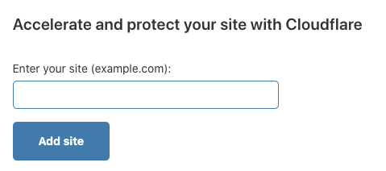
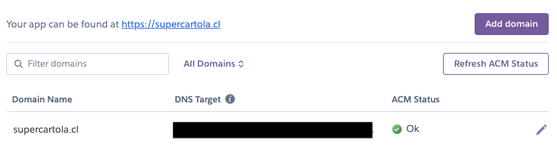
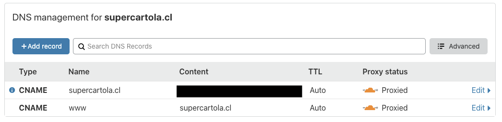
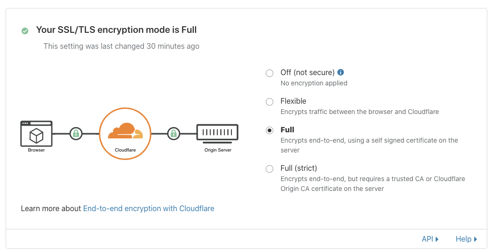
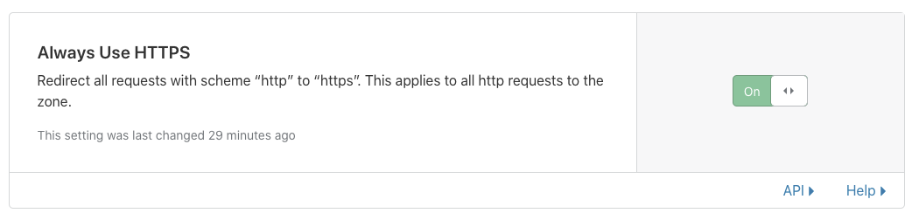
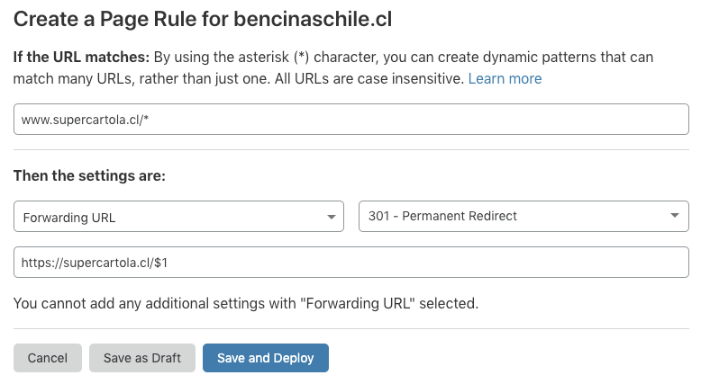
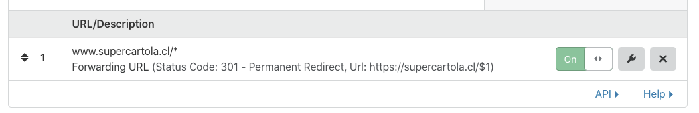

# Cloudflare

En Platanus usamos Cloudflare para administrar los DNS.

Si tienes que configurar un nuevo dominio, estos son los pasos:

1. Configurar nic.cl

1. Agregar el dominio en Cloudflare

1. Configurar Heroku

1. Configurar los DNS en Cloudflare

1. Configurar los SSL/TLS en Cloudflare

1. Configurar una page rule en Cloudflare

**Nic.cl**

    Si es un dominio .cl, vas a tener que hacer un truquito antes. En [nic.cl](http://nic.cl) configura los siguientes nameservers:

    1. [alex.ns.cloudflare.com](http://alex.ns.cloudflare.com/)

    1. [jade.ns.cloudflare.com](http://jade.ns.cloudflare.com/)

**Agregar dominio en Cloudflare**

Si es un `.cl` puede que tengas que esperar unos minutos para que te funcione luego de hacer el primer paso.

**Heroku**

Agrega un dominio en la página de settings del proyecto:

El **DNS target** es lo importante.

(luego del siguiente paso quizás tengas que hacerle click al "Refresh ACM Status")

**DNS en Cloudflare**

Agrega 2 CNAMEs:

    1. Para el root con el DNS target que te dio Heroku

    1. Para el `www` apuntando al root

    

**SSL/TLS en Cloudflare**

Acá debes hacer dos cosas

    1. Encriptación Full

        

        **Nota: **A veces hay que esperar un rato para que esto haga efecto. También a veces este setting aparece en Full en un principio y si uno intenta ir al sitio arroja un error de Too Many Redirects. Esperen un rato y actualicen, ahí debería aparecer en Flexible, y se debe modificar para que quede en Full.

    1. En Edge Certificates activa "Always Use HTTPS"

    

    

**Page Rules en Cloudflare**

Agrega una regla para redirect de www al root. Este page rule se construye notando que capture todo lo que viene después de la url con `*`, y se usa en el `$1`. Así se ve el form:

Y una vez que esté agregado se va a ver así:

