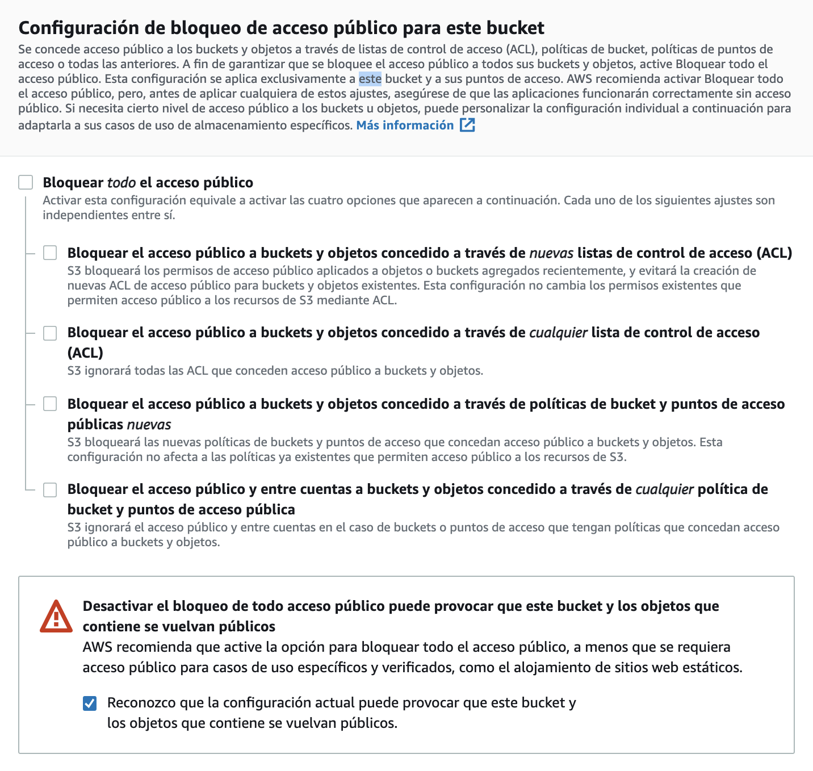
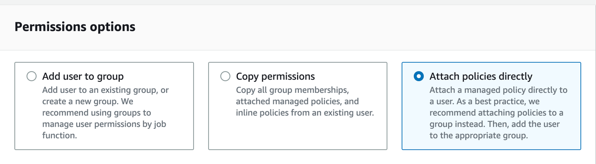
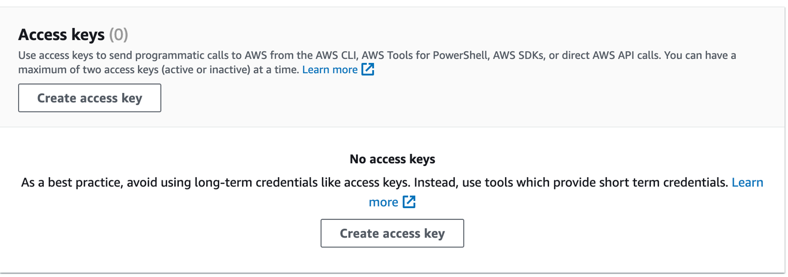

# Crear un bucket de S3

Muchas veces es necesario hacer un bucket en S3 para no usar bucketeer, sobretodo en productos internos.

Para eso, necesitamos hacer 3 cosas: crear un bucket, crear un usuario para acceder al bucket (y tener las credenciales) y una política de acceso que asocie al usuario con el bucket.

# Crear el bucket

1. [Ir acá](https://s3.console.aws.amazon.com/s3/home?region=us-east-1)

1. Apretar el botón `Create bucket`.

1. Poner el nombre usando la convención `proyecto.platan.us` y `proyecto-staging.platan.us`, por ejemplo `lacatan.platan.us`  y `lacatan-staging.platan.us`. Seguiré usando lacatan para el ejemplo.

1. Dejar la región como está. (generalmente es us-east-1)

1. Desmarcar las opciones que dicen "Bloquear todo" (aparecerá un warning, aceptarlo).

    

1. Dejar todos los otros campos como están y crear.


Ahora debemos modificar un permiso del bucket. Para eso, seleccionar el bucket recién creado del listado y:

1. Ir a la pestaña de permisos

1. Ir al fondo y buscar la sección `Uso compartido de recursos entre orígenes (CORS)`.

1. Seleccionar el botón editar.

1. Escribir lo siguiente dentro, cambiando en allowed origins, las urls que correspondan:

    ```json
    [
    	{
    		"AllowedHeaders": [
    			"Authorization",
    			"x-amz-date",
    			"x-amz-content-sha256",
    			"content-type"
    		],
    		"AllowedMethods": [
    			"GET",
    			"POST",
    			"PUT"
    		],
    		"AllowedOrigins": [
    			"https://pl-lacatan-staging.herokuapp.com"
    		],
    		"ExposeHeaders": [
    			"ETag"
    		],
    		"MaxAgeSeconds": 3000
    	}
    ]
    ```

    **Nota:** En mute por ejemplo, que hay url para staging, se pueden poner dos orígenes: `pl-mute-meetings-staging.herokuapp.com` y `staging.mute.so`

1. Guardar los cambios

# Crear una política de acceso

La política es lo que permite que el usuario que vamos a crear después pueda meter cosas al bucket (y nadie más que el)

1. Ir a [https://console.aws.amazon.com/iam/home](https://console.aws.amazon.com/iam/home) o a IAM en el menú del sito de AWS

1. En la barra lateral ir a "Políticas"

1. Apretar crear política

1. Seleccionar la pestaña JSON

1. Escribir lo siguiente, reemplazando lacatan por el nombre que corresponda:

    ```json
    {
        "Version": "2012-10-17",
        "Statement": [
            {
                "Sid": "",
                "Effect": "Allow",
                "Action": "s3:*",
                "Resource": [
                    "arn:aws:s3:::lacatan-staging.platan.us/*",
                    "arn:aws:s3:::lacatan-staging.platan.us"
                ]
            }
        ]
      }
    ```

1. Siguiente y revisar (sin agregar etiquetas)

1. Poner el nombre, no hay convención dura, pero yo les pongo `s3-lacatan` o `s3-lacatan-staging`

1. Guardar (los otros campos dejar como están).

# Crear un usuario para acceder al bucket

Ahora creamos un usuario (y las correspondientes credenciales) para usar la política y tener lo que poner en las vars de heroku

1. Ir [acá](https://us-east-1.console.aws.amazon.com/iamv2/home?region=us-east-1#/users).

1. Darle a `Create User`

1. En el nombre poner `lacatan` o `lacatan-staging` y le damos a siguiente.

1. Le asignamos una Policy directamente y seleccionamos la que creamos anteriormente y vamos a siguiente.

    

1. En el siguiente paso le damos a crear

1. Una vez creado, entramos al user recién creado a la sección de `security credentials` y ahí buscamos `Access Keys` y creamos una nueva.



1. Elegimos la opción de `Application running outside AWS` y vamos al siguiente paso.

1. No le agregamos descripción y creamos la llave de acceso.

1. IMPORTANTE acá ahora aparecerá la Access Key y Secret Access Key. Acá tenemos que guardar esos valores que nos saldrán para luego poder configurarlos en la aplicación. Abajo sale un botón de `Download CSV File`. Descarga y guarda el archivo.

1. **Bonus: **ir a heroku a las vars de entorno y poner las credenciales correspondientes, junto al nombre del bucket. La región en general siempre es us-east-1.


