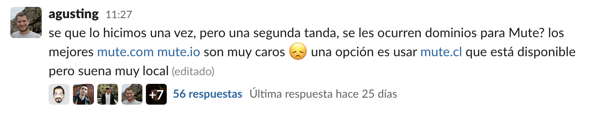
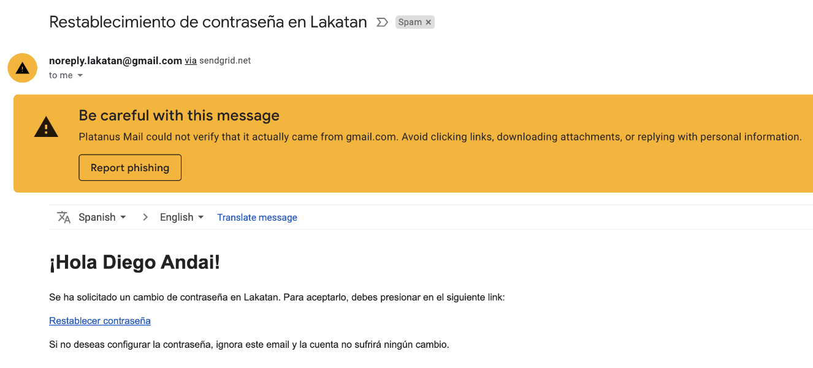
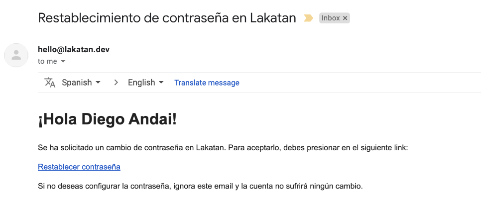

# Dominio + Mailing

Cuando lanzamos a producción una aplicación en general hay dos preocupaciones nuevas con las que lidiar: el dominio y el mail.

## Dominio

El proceso de registrar un dominio es bien directo, y nos ayuda a que nuestras apps dejen de llamarse algo como `pl-super-banco-production.herokuapp.com` y se pasen a llamar `superbank.com`. 

Veamos los pasos para la parte del dominio en detalle:

1. Se elige un nombre para la app, muchas veces este proceso aparte de estar ligado a mucha imaginación, está amarrado a la disponibilidad de los nombres, por lo que se mezcla mucho con el siguiente paso.

    

1. Se busca y compra el dominio en un [registrar](https://en.wikipedia.org/wiki/Domain_name_registrar) como [name](https://www.name.com/), [namecheap](http://namecheap.com), [godaddy](http://godaddy.com), [nic.cl](http://nic.cl/), etc. Hay que tener en cuenta que algunos [TLD](https://en.wikipedia.org/wiki/Domain_name_registrar) (.com, .cl, .io, .so, etc.) solo son vendidos por algunos *registrar* así que a veces hay que abandonar el regalón. 

    

    **Nota**: debe quedar en las cuentas de Platanus

1. Los dominios y su DNS los manejamos en Cloudflare y hay una muy buena guía para hacerlo con un dominio comprado en nic. En otros servicios es parecido, lo que hay que hacer es configurar los nameservers que nos pide Cloudflare en el servicio. La guía está acá:

Una vez completados los pasos anteriores podemos acceder a nuestro dominio fancy y olvidarnos del `pl-super-banco-production.herokuapp.com`. Lo que falta es que ahora se manden mails desde `superbank.com` correctamente.

## Mailing

En general uno quiere mandar mails en nuestros proyectos rails, ya sean de bienvenida, de recuperar contraseña, de notificaciones, etc. Cuando ya se configuró Sendgrid como addon de Heroku o como una cuenta externa, basta con mandar un mail en rails escogiendo el parámetro `from` y listo, se va a enviar un mail que vendrá de parte de quién sea que hayamos especificado en ese parámetro.

¿Estamos listos o no? ¿No basta con poner `misupermail@superbank.com` en el from y conseguí mi objetivo? Por suerte no.

### ¿Por qué me tengo que preocupar del mailing?

En mi opinión el protocolo de mails es inherentemente malo y permite cosas terribles como mandar mails a nombre de otros sin problemas, dejando a criterio del servicio de mail si catalogarlos como spam o no, pero eso da para toda una conversa aparte.

Por suerte Gmail y otros servicios nos van a advertir de que hay algo raro y de que probablemente es spam o suplantación de identidad mostrando algo como:

Lo que pasa es que el mail `noreply.lakatan@gmail.com` no ha autorizado a nuestra app para mandar mails en su nombre. Por eso Gmail nos alega y lo manda directo al spam. Además se ve un `via sendgrid.net`, que tampoco nos gustaría que se viera, pero esto lo hace Sendgrid de buena voluntad dado que sabe que no estamos autorizados, un atacante podría esconder eso.

Lo que menos queremos es que todo esto pase con nuestro nuevo dominio fancy. El problema es que si ponemos el `from` con un mail del dominio que somos dueños, por ejemplo `hola@superbank.com`, igual va a llegar a spam porque Gmail no nos cree, incluso aunque yo nunca le haya mentido a nadie.

Aquí es donde entra la ***autenticación de dominio, ***el término que usa Sendgrid (sender authentication) para poder comprobarle a todo el mundo, más allá de cualquier juramento que uno pueda hacer, que se es dueño del dominio y que el envío de mails desde ahí está autorizado.

Este proceso se basa en harta criptografía (firmas digitales y demás) pero a grandes rasgos permite que configurando registros DNS en nuestro dominio, se autorice a Sendgrid y los servicios de mail sepan que está autorizado y no nos marquen como spam. Un mail correctamente enviado se va a ver así:

## Uff qué harto preámbulo

Sí, fue un poco largo, pero creo que es importante saber que uno puede mandar mails de dónde quiera, que primero serán *flaggeados* como spam, pero que hay un procedimiento para que todo ande sin alertas, con certeza de que no hay suplantación de identidad. Todo lo que queremos para nuestro nuevo producto recién lanzado.

En la guía a continuación se ven 3 cosas, como configurar el addon o cuenta particular, qué variables de entorno usar y por qué, y finalmente cómo hacer el Sender Authentication.

