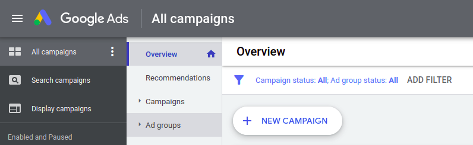
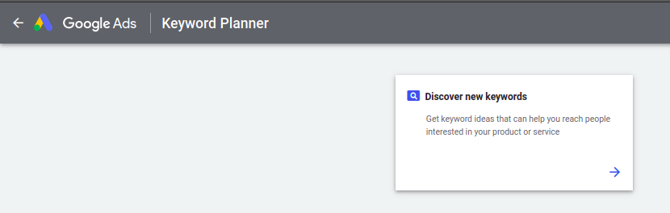
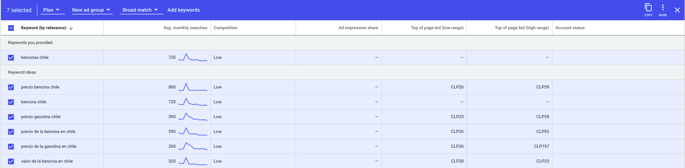
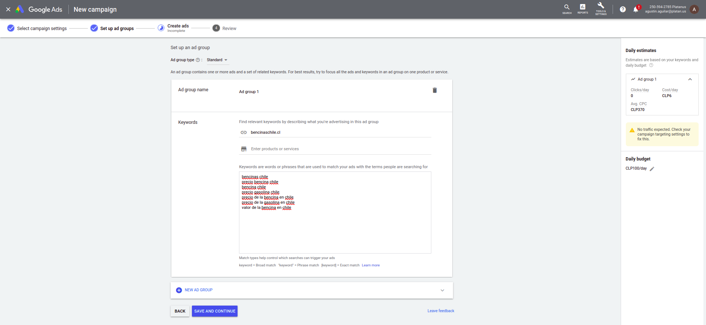
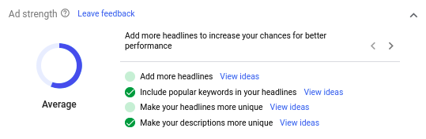

# Google Ads

Es muy posible que nuestra aplicación no aparezca en la primera página de Google, y quizás consideremos crear un anuncio en Google para así aumentar la visibilidad.

Para esto, vamos a [Google Ads](https://ads.google.com/) (Puede ser que tengas que solicitar acceso a la organización). En la sección *All campaigns*, saldrá un *overview* de todas las campañas creadas, y arriba a la izquierda hacemos *click* en **NEW CAMPAIGN**.

Ahí luego se elige el objetivo y el tipo de campaña deseada (lo más basico es 'Web Traffic' y 'Search' respectivamente), además de introducir el sitio web. (Si se quiere elegir otro objetivo y tipo de campaña, al hacer hover sobre cada uno explica brevemente que significa cada uno, para mí, los dos que mencioné calzaban con lo que buscaban y resulta ser lo más "clásico").

En la parte 1 se va configurando el anuncio a lo que uno desee lograr (pais/es donde se anuncia, en que parte de internet se anuncia, etc.). Algo importante que uno debe ingresar un *budget*, que es cuánto uno planea gastar en el anuncio **POR DIA** en promedio (a veces se gastará un poco más, a veces un pcoo menos, pero en promedio se buscar llegar a eso) además de *Bidding*. *Biddings* es lo que uno busca maximizar, o busca aumentar, lo más clásico en *clicks* pero tambien pueden ser conversiones, valor de conversiones, etc.. En general Google deja varias cosas automáticas para maximizar clicks, pero es bueno que leas todas las opciones disponibles si buscar maximizar otro tipo de acciones o customizar más tu anuncio.

En la parte 2 se configuran los ad groups, lo que es muy importante ya que ahí se configuran las *keywords* de búsqueda que haran que aparezca nuestro anuncio. Recomiendo usar el [Keyword planner](https://ads.google.com/aw/keywordplanner/home) que provee google ads para ver cuales son las mejores opciones para lo que uno busca. En esta herramienta, apretamos *Discover new keywords*

Ahi desplegará una ventana con unos campos a rellenar, ahí escribimos una o más palabras claves que representen en general las palabras claves que queremos generar (tambien podemos usar un sitio web para empezar a generar palabras claves). Luego hacemos click en **Get Results**.

Ahora debería desplegarse una vista que varias palabras claves, las cuales tienen un checkbox y podemos elegir varias. Notar que hay una columna que dice "Competition", en general queremos buscar algunas que tengan baja competencia al principio, ya que queremos harta visibilidad de nuestro anuncio. Entonces, elegimos las palabras claves que nos resultan interesantes, y arriba nos aparecerá esta barra

Aqui podemos guardar las keywords en un ad group, e incluso podemos copiar las keywords seleccionadas (a la derecha).

Una vez copiadas (y si quieren pueden guardarlas), volvemos a la configuracion del anuncio y las pegamos donde dice keywords

Al agregar keywords, a la derecha se actualiza una "predicción" de los clicks estimados para el anuncio y el CPC (cost per click). Una vez contento con las keywords seleccionadas, damos *save and continue* OJO: en mi caso, siempre salió no traffic expected, movi hartas cosas y logré aumentarlo a 1. Pero si uno elige bien las keywords, buenos headers y descripciones para su anuncio, estos números aumentarian mas adelante, así que uno puede ignorarlo un poco.

Por último, se configura el anuncio en sí (se puede crear mas de uno y Google va cambiando y ya despues de un tiempo muestra el que tenga mejor performance), se tiene que crear headers y descripciones (Google usa distintas combinaciones de estos y se va quedando con la mejor combinación) para el anuncio. No olvidar agregar la url a la que se quiere redirigir con el anuncio.

Finalmente, al continuar, aparece un *Review* del anuncio creado e indica si hay campos que arreglar o revisar. Y luego de dar el visto bueno, se da publicar y ya se anuncia. Se tarda un poco en publicarse ya que primero Google verifica que este todo en orden, y una vez publicado, se pueden ver métricas de las interacciones de los usuarios con el anuncio.
