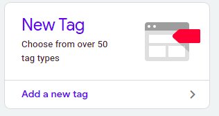
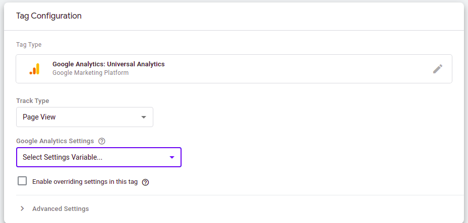
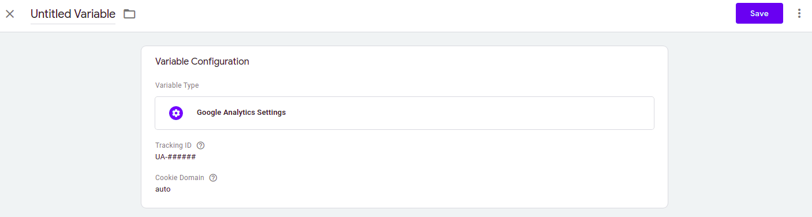

# Google Analytics

Teniendo nuestro contenedor en tag manager y ya agregados los *code snippets*, hacemos [setup de Analytics para el sitio](https://support.google.com/analytics/answer/10269537?ref_topic=1009620). Con esa corta guía, logramos crear una propiedad de *Universal Analytics* (importante tener al menos la universal, para agregarla Google Tag Manager). Teniendo configurada la propiedad, copiamos el Id de esta, que podemos verlo acá (tiene forma `UA-####`)

Teniendo este id, vamos de vuelta a nuestro contenedor de Google Tag manager, le damos a *Add a new tag*

En **Tag Configuration** le elegimos la opción `Google Analytics: Universal Analytics`

En *Google Analytics Settings* elegimos *New Variable*, lo que nos mostrará otra ventana donde tenemos que ingresar nuestro *Tracking id* (el que tiene la forma `UA-#####`), le damos un nombre a la variable y la guardamos.

Luego de esto en el selector debería aparecer la variable con el nombre que le dimos, elegimos esta para configurarlo con Google Analytics.

En **Triggering**, selecionamos *All Pages*. No olvidar darle un nombre descriptivo al tag, y ya con esto, guardamos el Tag.

Al guardar, debería cerrarse esa vista, y arriba a la derecha debería salir un botón que diga **Submit**, le hacemos click, agregamos una descripcion mencionando que agregamos el tag de google analytics y luego apretamos **Publish**. Y listo, queda configurado google analytics para nuestra aplicación y ya podemos ver las métricas.

