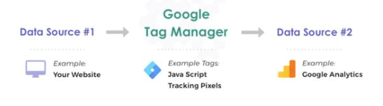

# Google Tag Manager

[Configurar Google Tag Manager](google_tag_manager/configurar_google_tag_manager.md)

## ¿Qué es?

Es una herramienta que permite manejar y publicar tags (pedazos de código) en tu página web o app sin tener que tocar el código.

### Ejemplo

Un usuario entra a mi página web. Yo quiero guardar esa info en Google Analytics. 

La página web le envía un evento a GTM y esté a su vez manda el evento a Google Analytics.

## Ventajas

1. Permite que el equipo de marketing agregue tags sin molestar a los desarrolladores

1. Un mismo evento en la página web puede gatillar varios tags distintos

1. Evita ensuciar el código enviando eventos a proveedores de analytics

# ¿Cómo funciona?

Hay 3 partes fundamentales en GTM.

* **Tags: **el código que se ejecuta - o el pixel

* **Triggers: **el gatillador, le dice a GTM que tiene que ejecutar un tag

* **Variables: **información adicional que puede ser utilizada como información del tag o del trigger

## Tags

Son pedazos de código o pixeles para trackear información de los usuarios. Los tags le dicen a GTM que tiene que hacer.

Tags comunes:

* Google Analytics: Universal Analytics (para configurar Google Analytics)

* Google Analytics: GA4 Configuration/Event (para configurar la nueva versión de GA)

* Hotjar Tracking Code

* LinkedIn Insight 

* Twitter Universal Website Tag

* Custom HTML - permite agregar el código que queramos

    * El pixel de Facebook se debe agregar como Custom HTML (me imagino que es un tema de competencia y Google no quiere poner a Facebook en su página)

Hay muchos más, la gracia es que una vez configurado GTM, el equipo de marketing puede configurar todas estas cosas sin tener que molestar a los desarrolladores.

## Triggers

Los triggers le indican a GTM cuándo tiene que ejecutar el código de una tag. Funcionan como un if, cuando ocurre el evento mencionado en el trigger se ejecuta el tag.

Triggers comunes:

* Page View: se gatilla cuando el usuario entra a una nueva página

* Click - All Elements: se gatilla al hacer click

* History Change: se gatilla cuando cambia la url, es muy útil al hacer SPA ya que esos cambios no gatillan Page Views

* Custom Event: se pueden definir eventos custom

Todos los triggers tienen la opción de gatillarse siempre que ocurre un evento o solamente cuando se cumplen ciertas condiciones.

## Variables

Las variables permiten pasarle información a los tags o para agregarle condiciones a un trigger.

Se separan en dos tipos Built-In Variables (variables que vienen por defecto) y User-Defined Variables (variables que crea el usuario)

Built-In Variables comunes:

* Page URL - url de la página

* Page Path - path actual

* Click Classes - classes de css en el cual se hizo clic

* Click Id - id del elemento que se clickeo

* Clit Text - texto del elemento que se clickeo

User-Defined Variables comunes

* 1st Party Cookie - cookies del sitio

* Constant - una constante

* Google Analytics Settings - el id para trackear Google Analytics (parte con UA-)

