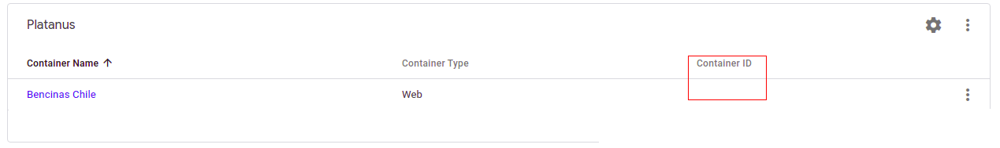

# Configurar Google Tag Manager

Primero tenemos que configurar un contenedor de [Google Tag Manager](https://tagmanager.google.com/) para nuestra aplicación. Para hacer esto, si no se tiene una cuenta primero se debe crear una, y bajo esta crear un contenedor. [Este corto video](https://www.youtube.com/watch?v=P4suvDuj0kI&list=PLI5YfMzCfRtYLtw_djEwG0nR-F9r6B5JT) explica bastante bien como crear un contenedor.

## Instalación con Potassium

Actualmente se puede agregar GTM utilizando Potassium. Revisar si `env.development` tiene la variable de entorno `GTM_CONTAINER_ID`, si no la tiene ejecutar `potassium install google_tag_manager`.


Luego hay que agregar la variable de entorno en el proyecto. El valor se obtiene en tagmanager.google.com, y siempre comienza en GTM-




## Instalación Manual

 Una vez creado el contenedor, se obtendran unos *code snippets* que deben agregarse a la aplicación para *linkearla* con el contenedor

Como yo lo hice fue asi:
Creé un archivo `/app/views/common/_tag_manager_head.html.erb` con el siguiente código:

```javascript
<% if Rails.env.production? %>
	<!-- Google Tag Manager -->
	<script>(function(w,d,s,l,i){w[l]=w[l]||[];w[l].push({'gtm.start':
	new Date().getTime(),event:'gtm.js'});var f=d.getElementsByTagName(s)[0],
	j=d.createElement(s),dl=l!='dataLayer'?'&l='+l:'';j.async=true;j.src=
	'https://www.googletagmanager.com/gtm.js?id='+i+dl;f.parentNode.insertBefore(j,f);
	})(window,document,'script','dataLayer','GTM-####');</script>
	<!-- End Google Tag Manager -->
<% end %>
```

Y otro archivo `/app/views/common/_tag_manager_body.html.erb` con el siguiente código:

```javascript
<% if Rails.env.production? %>
	<!-- Google Tag Manager (noscript) -->
	<noscript><iframe src="https://www.googletagmanager.com/ns.html?id=GTM-####"
	height="0" width="0" style="display:none;visibility:hidden"></iframe></noscript>
	<!-- End Google Tag Manager (noscript) -->
<% end %>
```

OJO! EN `GTM-####` deben reemplazarlo por el id de su contenedor, que aparecé en el menú.


y luego, deben agregarse estas vistas parciales en `/app/views/layouts/application.html.erb`, el *head* debería ir lo más arriba posible en el *head*, y el *body* lo más arriba posible dentro del tag *body*. Debería verse algo así:

```html
<!DOCTYPE html>
<html>
  <head>
    <%= render partial: '/common/tag_manager_head' %>
    <title>My Applications</title>
    <%= csrf_meta_tags %>
    <meta name="viewport" content="width=device-width, initial-scale=1">

    <%= csp_meta_tag %>

    <%= stylesheet_link_tag 'application', media: 'all', 'data-turbolinks-track': 'reload' %>
    <%= javascript_pack_tag 'application', 'data-turbolinks-track': 'reload' %>

    <%= stylesheet_pack_tag 'application' %>
  </head>

  <body>
    <%= render partial: '/common/tag_manager' %>
    <div id="app">
      <app></app>
      <%= yield %>
    </div>
  </body>
</html>
```

Luego, se suben estos cambios a producción y estamos listos con Google Tag Manager (por ahora)
