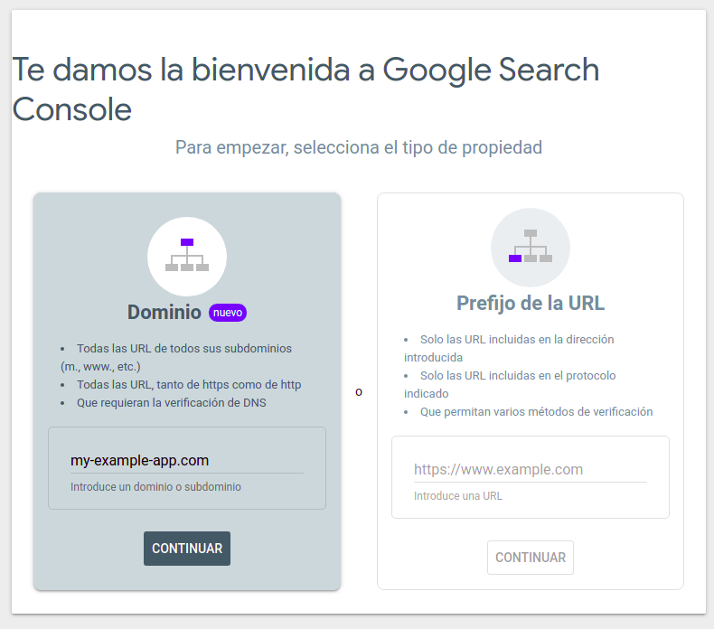
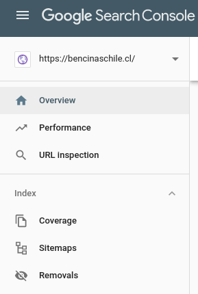

# Indexación en Google

Si bien Google tarde o temprano indexará nuestra aplicación, a veces queremos que esté disponible lo más rápido posible para que aparezca en búsquedas de google (es muy posible que esto no sea del todo suficiente para aparecer en las primeras páginas al principio y sea necesario publicar un anuncio, hablaremos de esto mas adelante). Para verificar si Google ya indexó nuestra página, vamos a [Google Search Console](https://search.google.com/) (asegurarse de esta conectado con la cuenta correcta, ya que acá se verificará el dominio y pedir los permisos correspondientes) e ingresamos el dominio de nuestra app.

Al hacer click en continuar, hará una verificación de si eres propietario del sitio, y lo más seguro es que no esté verificada aún. Ahí saldra una ventana para hacer una configuración con el DNS (agregar un registro TXT) y así verificar la propiedad. Como se menciona ahí mismo, es posible que esto tarde, e igual hay [otras maneras de verificar la propiedad de un sitio](https://support.google.com/webmasters/answer/9008080), como por ejemplo con Google Tag Manager.

Una vez verificada la propiedad, [se le puede solicitar a Google](https://support.google.com/webmasters/answer/6065812) que rastree las URLs, que puede tardar algunos días también. Es recomendable también agregar un `sitemap` que así el *crawler* de Google indexe todas nuestras URLs y lo haga más rápido. Para proyectos en RoR, es puede usar [sitemap_generator](https://github.com/kjvarga/sitemap_generator).

Para agregar un sitemap, primero se debe configurar uno (que puede ser con la gema `sitemap_generator` u otro método), y una vez configado, en Google Search Console, uno selecciona el dominio que quiere configurar, va a la sección *Sitemaps*

Y ahí se rellena el field con la dierección al sitemap (Generalmente es algo como `www.example.org/sitemap.xml`) y luego *click* en *submit*. Con esto hacemos que Google pueda encontrar e indexar mas rápido las URLs de nuestra aplicación.
