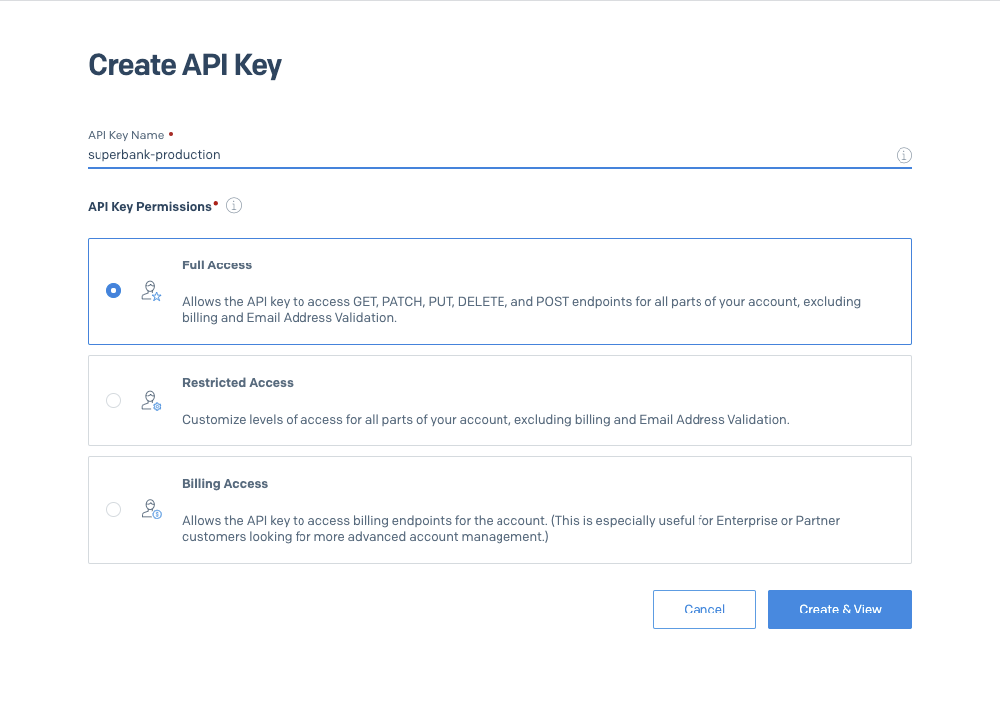

# Sendgrid

Para dejar configurado Sendgrid correctamente y mandando mails a nombre del sitio que queremos, primero hay que configurarlo correctamente en Heroku.

# Configurar una cuenta

Cuando nos enfrentamos a querer mandar mails usando Sendgrid tenemos dos opciones. Usar los addons de Heroku o usar una cuenta de Sendgrid directamente.

### Addon de Heroku

Heroku nos provee una interfaz bien cómoda para agregar servicios a nuestras apps. Para hacerlo:

1. Ir a la app en Heroku, pestaña resources

1. En el buscador escribir sendgrid y seleccionar la primera opción

1. Elegir el plan gratis y *submit order form*

    

Si todo anda bien el addon va a aparecer en el listado y se habrán agregado dos variables de entorno al proyecto, `SENDGRID_USERNAME` y `SENDGRID_PASSWORD`. 

Muchas veces *todo no anda bien*, y esto se debe a unos problemas que tienen entre Heroku y Sendgrid. Si sale que no se pudo provisionar con un alarmante mensaje de ban como este

Solo queda ir a la opción **Cuenta de Sendgrid**, o contactarse con el soporte de Sendgrid, proceso tedioso pero que funciona.

Por otro lado si no sale eso y se provisiona correctamente, podemos hacer click en el listado de resources y esto nos llevará a Sendgrid mismo, Heroku inteligentemente nos *loginea* en su servicio.

**Nota/Tip: **muchas veces cuando entramos por primera vez a la interfaz de sendgrid nos dice que validemos el mail `app12983123@heroku.com`. Si intentamos hacerlo poniendo por ejemplo nuestro mail, nos van a *bannear* automáticamente así que ignorar ese mensaje! Todo funciona bien sin hacerlo.

Si somos capaces de entrar a la interfaz de Sendgrid y no tenemos problemas para navegar dentro, lo logramos! 🚀 

Más adelante explicaré el paso de la API Key que es igual para addon y para cuenta directa.

### Cuenta de Sendgrid

Ya sea porque no nos funcionó con el addon, o porque un cliente ya tiene cuenta, podemos registrarnos directamente en Sendgrid. Acá todo debería andar bien, probablemente nos pida configurar un 2FA, a lo que obviamente deberíamos acceder.

Tener en cuenta que acá la validación de mail de usuario puede ser necesaria.

El único drawback de este camino es que la cuenta ya no está encapsulada bajo Heroku y hay que recordar unas credenciales más para el traspaso al cliente o para administrarlas internamente.

# Variable de entorno (API Key)

Ahora que ya tenemos acceso a nuestra cuenta Sendgrid por la vía que hayamos elegido, tenemos que informarle a nuestra app cómo conectarse a Sendgrid para enviar los benditos mails.

Para eso, en Sendgrid, hay que ir a **Settings > API Keys > Create API Key** y crear una nueva con *full access *y el nombre que estimemos conveniente:

Luego copiamos la key que nos entregue Sendgrid y lo ponemos en nuestra app de Heroku en la variable de entorno `SENDGRID_API_KEY`. Esto porque nuestras apps rails configuradas para Sendgrid esperan una API key como variable de entorno, no las variables de entorno de usuario y contraseña que puso automáticamente Sendgrid en nuestra app si usaron el camino del Addon.

# Sender Authentication

Al fin llegamos a la parte importante. Una vez que nuestra app puede mandar mails vía sendgrid, nos falta hacer que se manden correctamente a nombre nuestro. Esto implica que no lleguen a spam y que aparezcan enviados de nuestro dominio, por ejemplo `algo@mute.cl` (usaré mute de ejemplo de ahora en adelante).

Sendgrid nos provee un paso a paso de cómo hacerlo, es bien directo:

1. Ir a **Settings > Sender Authentication **y hacer click en **Get Started** bajo *Domain Authentication*

    

1. Nos va a preguntar qué DNS usamos, seleccionamos Cloudflare y dejamos el branding de links como está

1. Ahora nos pregunta qué dominio vamos a registrar, ponemos el nuestro y listo

    

1. Al apretar siguiente nos aparecerán los registros DNS que tenemos que agregar en Cloudflare.

    

1. Ahora en Cloudflare, vamos a nuestro dominio y seleccionamos DNS

1. Arriba de la lista de registros apretar el botón **Add Record**

1. Copiamos y agregamos los datos que nos entregó Sendgrid uno a uno.

    

    Hay que desmarcar la opción `proxied` haciendo click en la nube naranja, y pasará a decir DNS only:

    

    **Nota/Warning: **algo que puede pasar es que no funcione la validación de los pasos siguientes a pesar de haber puesto acá los datos que Sendgrid pedía. Hay que tener cuidado con que el registro CNAME muchas veces espera el subdominio sin el dominio (en el ejemplo sería `em1570` y no `em1570.mute.cl`). Esto hace que si uno pega el string con dominio, en algunos servicios de DNS aparezca duplicado (`em1570.mute.cl.mute.cl` en el ejemplo), lo que claramente no es lo que se espera. Cloudflare detecta automáticamente cuando se estaría duplicando así que no debería haber problema, pero si son porfiados y usan otro DNS, puede pasar y es difícil de cachar.

    

1. Si todo se hizo correctamente la lista se debería ver así:

    

1. De vuelta en Sendgrid podemos hacer click en **I've added those records **y en **Verify.** Recordemos que la validación puede tomar algunas horas pero en general es bastante instantánea. Debería aparecer algo como:

    

Con esto ahora podemos enviar mails desde nuestra app rails pudiendo configurar el from del mail desde cualquier mail `@mute.cl` en el caso del ejemplo. No saldrán en spam!

# Recapitulemos

Primero configuramos una cuenta de Sendgrid para nuestra app, usando Heroku y sus addons o directamente Sendgrid. Después obtuvimos una API Key y pusimos la variable de entorno necesaria para que se pueda ocupar realmente Sendgrid en nuestra app. Finalmente le avisamos al mundo que somos dueños del dominio y que Sendgrid está autorizado a mandar mails por nosotros. :hypers:

