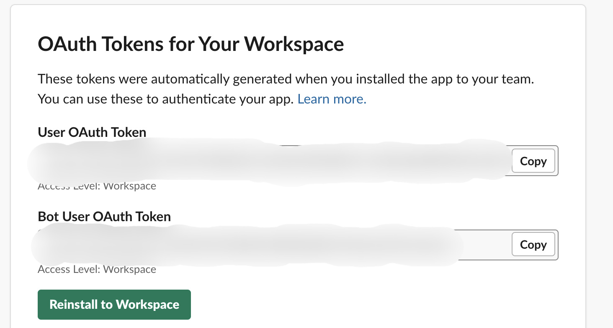
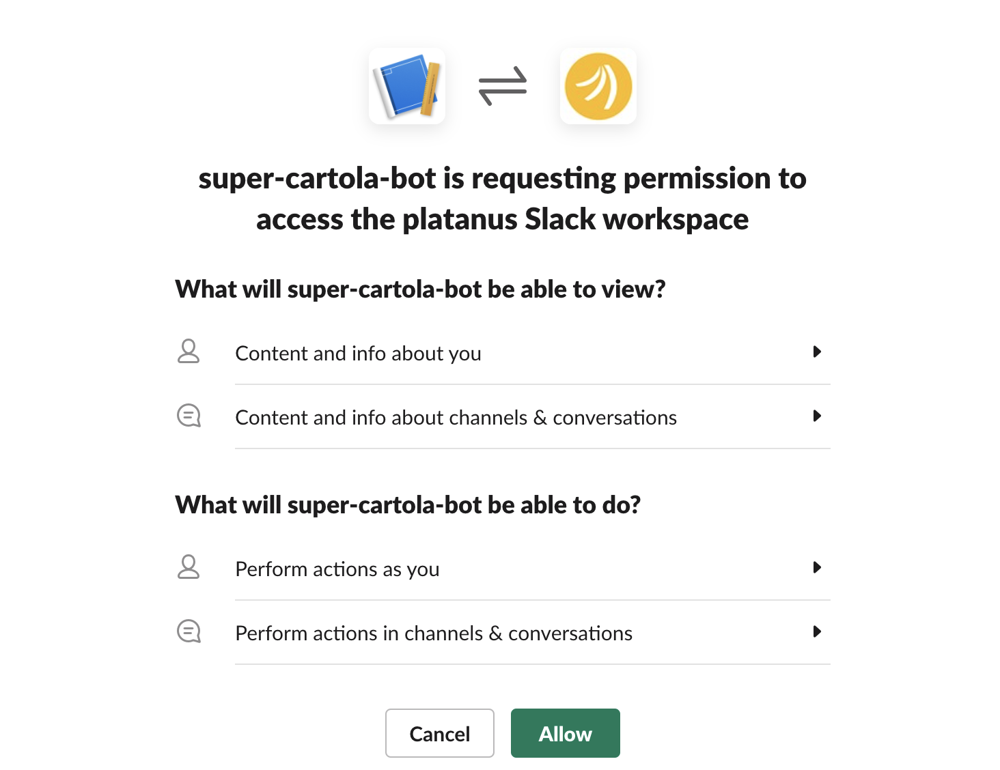

# SlackBot

## Contexto

Muchas veces queremos recibir información desde nuestras aplicaciones a algún canal de Slack y para esto existe una [API](https://api.slack.com) que nos provee diversas funcionalidades. 

## Configuración

Para configurar un nuevo bot que interactue con nuestro workspace de Slack es importante seguir [esta guía. ](https://api.slack.com/authentication/basics)

Y luego hacer pruebas desde rails con la gema [slack-ruby-client](https://github.com/slack-ruby/slack-ruby-client/blob/v0.17.0/README.md) . 

## Posibles errores

Puede pasar que tu app esté bien configurada, pero que cuando intentes que el código mande mensajes o haga alguna acción, la request te entregue el siguiente error: 

```javascript
Slack::Web::Api::Errors::MissingScope: missing_scope
```

Esto pasa porque no se han actualizado bien los scopes en el workspace, entonces Slack cree que tu app no tiene ningún permiso. 

Para eso tienes que hacer Reinstall to Workspace como en la imagen: 




Y luego tiene que pedirte permiso para acceder al workspace como en la siguiente imagen:



Si no te aparece la segunda imagen te recomendamos agregar a alguien del workspace como colaborador, y que esa persona reinstale la app. 
