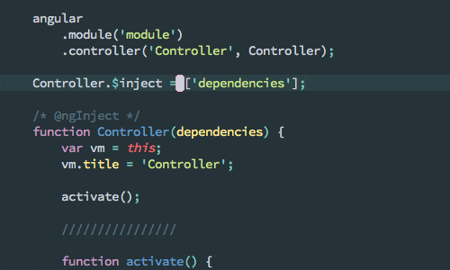
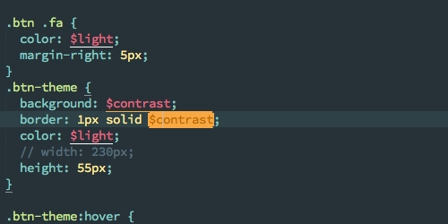
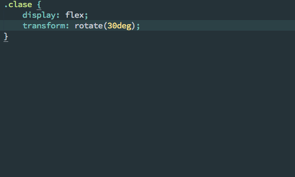

# Sublime Text

## Extensiones

### Genéricas

* [**EditorConfig**](https://github.com/sindresorhus/editorconfig-sublime): Nos ayuda a mantener un estilo de código (espacios o tabs, sangrado, etc) consistente en los proyectos de Platanus.

* [**SublimeLinter**](http://www.sublimelinter.com/en/latest/): Framework para aplicar linting al código.

* [**GitSavvy**](https://github.com/divmain/GitSavvy): Interfaz para administrar git desde el editor. Muy útil para agregar solo *hunks* (partes de los cambios de un archivo) a los commits, manejar ramas, hacer rebase, diffs, etc.

* [**SideBarEnhancements**](https://github.com/titoBouzout/SideBarEnhancements): Agrega múltiples funciones para manejar archivos y carpetas a la sidebar.

* [**Unicode Character Highlighter**](https://packagecontrol.io/packages/Unicode%20Character%20Highlighter): Destaca caracteres como el [espacio duro](https://es.wikipedia.org/wiki/Espacio_duro) que OSX inserta al usar `⌥` + `ESPACIO` para hacer más facil su eliminación.

    

* [**DocBlockr**](https://github.com/spadgos/sublime-jsdocs): Hace más fácil la creación de comentarios. [Ejemplos](https://github.com/spadgos/sublime-jsdocs#docblock-completion).

* [**Aligntab**](https://github.com/randy3k/AlignTab): Ayuda a alinear variables.

    

* [**GitGutter**](https://github.com/jisaacks/GitGutter): Muestra las lineas que han sido editadas con respecto al último commit de git.

* [**GitHubinator**](https://github.com/ehamiter/GitHubinator): Abre la linea seleccionada en GitHub.

* [**MarkdownEditing**](https://packagecontrol.io/packages/MarkdownEditing): Agrega soporte Markdown a Sublime Text.

### HTML/CSS

* [**Emmet**](https://github.com/sergeche/emmet-sublime): Permite escribir HTML y CSS mediante abreviaciones.

    

* [**SCSS**](https://packagecontrol.io/packages/SCSS) y [**Sass**](https://packagecontrol.io/packages/Sass): Agregan soporte para Sass.

* [**Color Highlighter**](https://github.com/Monnoroch/ColorHighlighter): Permite previsualizar los colores en el CSS.

    

* [**AutoPrefixer**](https://github.com/sindresorhus/sublime-autoprefixer): Agrega automáticamente prefijos propietarios a propiedades de CSS.

    

### JavaScript

* [**SublimeLinter-eslint**](https://github.com/SublimeLinter/SublimeLinter-eslint): Hace linting directamente en el editor usando ESlint (y archivos `.eslintrc.json`).

* [**AngularJS**](https://github.com/angular-ui/AngularJS-sublime-package): Agrega "ir a definición", autocompletado de funciones, entre otras cosas.

* [**AngularJS Snippets (John Papa)**](http://www.johnpapa.net/angularjs-snippets-for-sublime-visual-studio-and-webstorm/): Agrega snippets basados en la [guía de estilo](https://github.com/johnpapa/angular-styleguide) para AngularJs de John Papa.

### OSX

### Atajos de teclado útiles:

* `⌘`+`d` permite duplicar la selección actual creando cursores múltiples

    

* `CTRL`+`⌘`+`g` busca la selección actual en todo el documento.

    

* `⌘`+`⇧`+`l` separa la seleccion actual en lineas independientes

    

* `⌘`+`j` une la selección en una sola linea.

    

### Windows

TODO

### Linux

TODO

