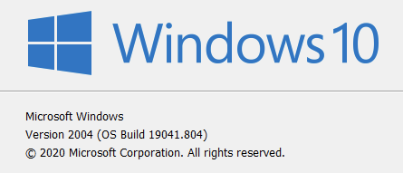
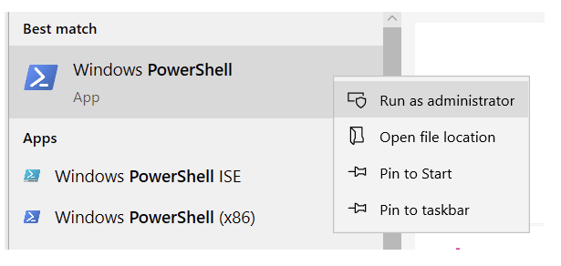

# Windows

## Windows 10

Estos días la mejor manera de tener un ambiente de desarrollo en Windows es usando WSL 2, que genera una instalación de Linux integrada a Windows sin tener que reiniciar.

### Instalando Windows Terminal

Para instalar Windows Terminal, sigue las instrucciones [aquí](https://docs.microsoft.com/en-us/windows/terminal/get-started).

### Instalando WSL 2

> 💡 Si estás leyendo esto en el futuro (o estás dentro del Windows Insiders Program) instalar wsl puede ser tan fácil como ejecutar `wsl --install` en una consola con permisos de Administrador.

> 💡 Antes de empezar, asegúrate de tener una versión de Windows mayor o igual a **1903** o **Build 18362**. Puedes chequear esto ejecutando con `winver` en el buscador del menu de Windows.

    

1. Activa WSL ejecutando lo siguiente en una consola de powershell con permisos de administrador:

    

    ```plain text
    dism.exe /online /enable-feature /featurename:Microsoft-Windows-Subsystem-Linux /all /norestart
    ```

1. Reinicia y ejecuta lo siguiente para activar la virtualización necesaria para WSL 2:

    ```plain text
    dism.exe /online /enable-feature /featurename:VirtualMachinePlatform /all /norestart
    ```

1. Reinicia y descarga la actualización del kernel de linux de la siguiente url:
[https://wslstorestorage.blob.core.windows.net/wslblob/wsl_update_x64.msi](https://wslstorestorage.blob.core.windows.net/wslblob/wsl_update_x64.msi)

1. En una consola de powershell ejecuta el siguiente comando para usar WSL 2 por defecto:

    ```plain text
    wsl --set-default-version 2
    ```

1. Instala [Ubuntu desde la tienda de Microsoft](https://www.microsoft.com/store/apps/9n6svws3rx71) y crea un usuario cuando termine la instalación.

1. Para tener un terminal decente instala Windows Terminal desde la [Microsoft Store](https://aka.ms/terminal), desde [el repo](https://github.com/microsoft/terminal/releases) o usando scoop (`scoop install windows-terminal`) (ver [Instalando Utilidades](https://www.notion.so/platanus/Windows-a7204bb1aa4f4af597c4cb39fda4df6d#instalando-utilidades))

1. Es posible que sea necesario limitar la cantidad de memoria que WSL usa. Esto se puede lograr editando (o creando) el archivo `C:\\Users\\TU_USUARIO\\.wslconfig` con lo siguiente:

    ```plain text
    [wsl2]
    memory=4GB
    ```

### Ambiente de Desarrollo

Una vez instalado Windows Terminal, el ambiente de desarrollo funciona como cualquier otra instalación de Linux.

La mayoría de los proyectos de Platanus modernos usan Docker para los servicios como postgres o redis pero lo siguiente es una lista de los requisitos mínimos y como instalarlos desde Windows Terminal y la shell de Ubuntu:

* git (`sudo apt install git`)

* rbenv ([https://github.com/rbenv/rbenv-installer](https://github.com/rbenv/rbenv-installer)) y rbenv-aliases ([https://github.com/tpope/rbenv-aliases](https://github.com/tpope/rbenv-aliases))

* nodenv ([https://github.com/nodenv/nodenv-installer](https://github.com/nodenv/nodenv-installer)) y nodenv-aliases ([https://github.com/nodenv/nodenv-aliases](https://github.com/nodenv/nodenv-aliases))

* yarn (`npm install -g yarn` o [https://github.com/pine/nodenv-yarn-install](https://github.com/pine/nodenv-yarn-install) para no tener que instalarlo a mano con cada versión de node)

* dependencia para la gema pg (`sudo apt install libpq-dev`)

> 💡 Si tienes Git for Windows instalado (con scoop: `scoop install git`) puedes usar Git Credential Manager de Windows para que se encargue de recordar tus credenciales de GitHub en WSL.
`git config --global credential.helper /mnt/c/Users/TU_USUARIO/scoop/apps/git/current/mingw64/libexec/git-core/git-credential-manager-core.exe`

> 💡 A pesar que WSL 2 lo permite, no te recomendamos clonar los proyectos dentro del filesystem de Windows (`/mnt/c` o similar) por temas de performance. Lo mejor es mantener los proyectos dentro del filesystem de Linux (`~/`). Si necesitas entrar a estas carpetas con File Explorer puedes hacerlo ejecutando `explorer.exe . ` en la carpeta correspondiente o navegando a `\\\\wsl$\\Ubuntu-20.04\\home\\TU_USUARIO\\`. En Windows Terminal puedes configurar que siempre se abra en tu home en las opciones.

### Instalando Utilidades

Aparte de WSL 2, para instalar utilidades nativas de Windows puedes usar [scoop](https://scoop.sh/), un instalador para la linea de comando que hace muy fácil instalar binarios (como imagemagick, ffmpeg, etc) para que queden disponibles en el PATH de Windows.

> 💡 En teoría es posible usar scoop y Docker para instalar todo lo necesario ejecutar los proyectos sin necesidad de WSL 2 pero se aleja del setup estandar que usamos en Platanus y no podremos ayudarte si tienes algún problema.

## Links de Referencia

* [https://docs.microsoft.com/en-us/windows/wsl/install-win10](https://docs.microsoft.com/en-us/windows/wsl/install-win10)

* [https://docs.microsoft.com/en-us/windows/terminal/get-started](https://docs.microsoft.com/en-us/windows/terminal/get-started)

* [https://docs.microsoft.com/en-us/windows/wsl/tutorials/wsl-containers](https://docs.microsoft.com/en-us/windows/wsl/tutorials/wsl-containers)

* [https://docs.microsoft.com/en-us/windows/wsl/wsl-config#configure-global-options-with-wslconfig](https://docs.microsoft.com/en-us/windows/wsl/wsl-config#configure-global-options-with-wslconfig)


