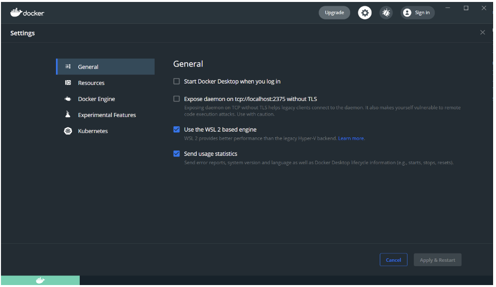
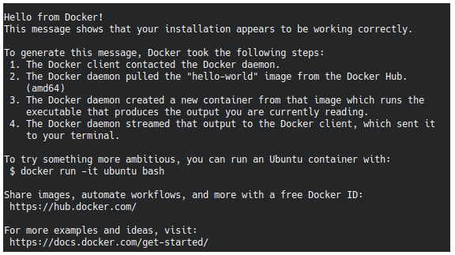

# Docker

## OSX

Para instalar Docker en Mac encuentras las instrucciones [aquí](https://docs.docker.com/docker-for-mac/install/).
Pon atención a la versión de procesador que tienes en tu Mac (Intel Chip o Apple Chip), porque las instrucciones cambian.

## Windows

### Instalación

1. Descarga [Docker Desktop](https://docs.docker.com/docker-for-windows/wsl/#download)

1. Abre Docker Desktop y

    1. en Settings > General activa "Use the WSL 2 based engine"

    1. en Settings > WSL Integration asegurate que todas las opciones estén activadas

        

🛑 **Observación**: En el caso que tengas algún problema al momento usar Docker Desktop con WSL, [es importante dejar como por default la imagen de Ubuntu](https://docs.docker.com/desktop/windows/wsl/#enabling-docker-support-in-wsl-2-distros). Para poder realizarlo hay que hacer lo siguiente:

```bash
# Listamos las imagenes que tenemos en WSL
wsl.exe -l -v

# Poner por defecto la imagen que vamos a utilizar
wsl --set-default <distro-name>

# En el caso de que estés usando Ubuntu para WSL podrías utilizar:
wsl --set-default ubuntu
```


##  Linux

Aquí encuentras las instrucciones para Ubuntu, pero si tienes otro SO basado en linux puedes buscar las instrucciones [aquí](https://docs.docker.com/engine/install/)

**Desinstalar las versiones antiguas de Docker**

```bash
sudo apt-get remove docker docker-engine docker.io containerd runc
```

> Nota: no hay problema si apt reporta que ninguna de esos paquetes estaba instalado.

Luego hay dos opciones para instalar Docker: desde repositorios oficiales o instalando los archivos manualmente.

En esta guía explicamos como instalar desde repositorios oficiales, que es más automatizado, y en [este link](https://docs.docker.com/engine/install/ubuntu/#install-from-a-package) encuentras las instrucciones para la instalación manual.

**Descargar versión estable de Docker**

```bash
sudo apt-get update
sudo apt-get install \\
   apt-transport-https \\
   ca-certificates \\
   curl \\
   gnupg \\
   lsb-release
```

Agrega la llave GPG oficial de docker

```bash
curl -fsSL https://download.docker.com/linux/ubuntu/gpg | sudo gpg --dearmor -o /usr/share/keyrings/docker-archive-keyring.gpg
```

Con el siguiente comando configuramos el repositorio:

```bash
echo \\
"deb [arch=amd64 signed-by=/usr/share/keyrings/docker-archive-keyring.gpg] https://download.docker.com/linux/ubuntu \\
$(lsb_release -cs) stable" | sudo tee /etc/apt/sources.list.d/docker.list > /dev/null
```

Nota: Este comando es específico a arquitecturas x86_64 / amd64. Para otras arquitecturas (como armhf o arm64 puedes buscar el comando acá: [https://docs.docker.com/engine/install/ubuntu/](https://docs.docker.com/engine/install/ubuntu/))

**Instalación de Docker**

```bash
sudo apt-get update
sudo apt-get install docker-ce docker-ce-cli containerd.io
```

**Correr docker sin sudo**

Debemos hacer lo siguiente para poder usar Docker sin sudo:

Crea un grupo unix llamado `docker` y agrega tu usuario a este

```bash
sudo groupadd docker
```

```bash
sudo usermod -aG docker $USER
```

Corre el siguiente comando para activar los cambios:

```bash
newgrp docker
```

**Confirmar que quedó instalado**

```bash
docker run hello-world
```

Deberías ver algo así:



Si no funciona intenta reiniciando tu computador.

**Instalar docker-compose**

Lo primero es revisar cuál es la última versión disponible en los [releases](https://github.com/docker/compose/releases) del repositorio oficial de docker-compose.

En la última actualización de esta guía, la última versión estable es la v2.14.2. Deberás reemplazar esta versión en la URL del siguiente comando:

```bash
sudo curl -L "https://github.com/docker/compose/releases/download/v2.14.2/docker-compose-"$(uname -s | tr '[:upper:]' '[:lower:]')"-$(uname -m)" -o /usr/local/bin/docker-compose
```

```bash
sudo chmod +x /usr/local/bin/docker-compose
```

Si quieres mas información sobre docker-compose la encuentras [aquí](https://docs.docker.com/compose/).


