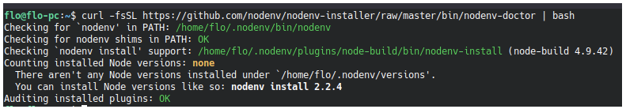

# Node

Para el uso de node utilizamos el manejador de versiones [nodenv](https://github.com/nodenv/nodenv) y algunos plugins.
Siempre usamos la versión LTS, poniendo la `major` en el archivo `.node-version`. Es decir, se debe preferir escribir 10 en vez de 10.12.1.

Nodenv es realmente un clone de rbenv pero para node, por lo que funciona muy parecido. Toda la información de la sección de ruby aplica para node.

## OSX

### Instalación

```bash
# Instalar nodenv y node-build
brew install nodenv node-build
```

### TAPS

Taps son repositorios de donde brew puede buscar aplicaciones. Brew viene con el *tap* [homebrew-core](https://github.com/Homebrew/homebrew-core) incluido, pero se puede agregar más. En este caso tuvimos que agregar el tap de [nodenv](https://github.com/nodenv/homebrew-nodenv) para poder instalar los plugins de nodenv con brew.

### Agregar tap de nodenv

```bash
brew tap nodenv/nodenv
```

### Agregar plugines para nodenv

```bash
brew install nodenv-vars nodenv-aliases
```

Luego debes cargar nodenv en tu shell para que puedas acceder a las diferentes versiones. Para esto debes agregar la siguiente linea en tu `.bash_profile` o `.zshrc` dependiendo del shell que uses. Hay dos formas de hacerlo:

1. Ejecutar el siguiente, que agrega automáticamente la línea necesaria:

    * Si usas `.bash_profile`

        ```plain text
        echo 'eval "$(nodenv init -)"' >> ~/.bash_profile
        ```

    * Si usas `.zshrc`

        ```plain text
        echo 'eval "$(nodenv init -)"' >> ~/.zshrc
        ```

1. Abrir `.bash_profile` o `.zshrc` y agregar la linea en el archivo usando el editor de preferencia:

    ```bash
    eval "$(nodenv init -)"
    ```

## Windows

Para instalar `nodenv` con WSL2, sigue las instrucciones de Linux y en el paso 2 preocupate de usar el comando especial para WSL.

## Linux

Las instrucciones para instalar `nodenv` se obtuvieron del [repositorio oficial](https://github.com/nodenv/nodenv#basic-github-checkout) por si tienes alguna duda.

1. Clonar `nodenv`

    ```plain text
    git clone <https://github.com/nodenv/nodenv.git> ~/.nodenv
    ```

1. Agrega `~/.nodenv/bin` a tu $PATH para usar los comando en la shell.

    * Si usas bash:

        ```bash
        echo 'export PATH="$HOME/.nodenv/bin:$PATH"' >> ~/.bash_profile
        ```

    * Si usas Zsh:

        ```bash
        echo 'export PATH="$HOME/.nodenv/bin:$PATH"' >> ~/.zshrc
        ```

    * Si usas Windows con WSL:

        ```bash
        echo 'export PATH="$HOME/.nodenv/bin:$PATH"' >> ~/.bashrc
        ```

1. Configura `nodenv` en tu shell

```bash
~/.nodenv/bin/nodenv init
```

Con este comando deberías ver el siguiente mensaje:

```bash
# Load nodenv automatically by appending
# the following to ~/.bashrc:
eval "$(nodenv init -)"
```

1. Reinicia tu shell para que se apliquen todos los cambios.

1. Verifica que `nodev` se instaló correctamente con el siguiente script llamado nodenv-doctor:

    ```bash
    curl -fsSL <https://github.com/nodenv/nodenv-installer/raw/master/bin/nodenv-doctor> | bash
    ```

    Con este script deberías ver algo así:

    

1. Instalar plugins necesarios

    * [nodenv-vars](https://github.com/nodenv/nodenv-vars#installation):

        ```bash
         mkdir -p $(nodenv root)/plugins
         cd $(nodenv root)/plugins
         git clone <https://github.com/nodenv/nodenv-vars.git>
        ```

    * [nodenv-aliases](https://github.com/nodenv/nodenv-aliases#installation):

        ```bash
        git clone <https://github.com/nodenv/nodenv-aliases.git> $(nodenv root)/plugins/nodenv-aliases
        ```

    * [node-build](https://github.com/nodenv/node-build#installation):

        ```bash
        mkdir -p "$(nodenv root)"/plugins
        git clone <https://github.com/nodenv/node-build.git> "$(nodenv root)"/plugins/node-build
        ```

## Instalando versiones de node

Para instalar nuevas versiones de node:

```bash
# Actualizar las versiones de node disponibles para instalar
cd $(nodenv root)/plugins/node-build && git pull
# o en OSX
brew upgrade node-build

# Listar todos las versiones disponibles para instalar
nodenv install --list

# Instalar una version en particular
nodenv install 12.19.1

# Establecer una version global de node
nodenv global 12.19.1
```
