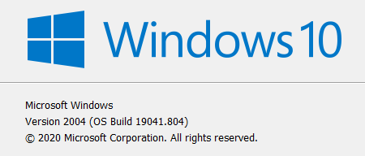
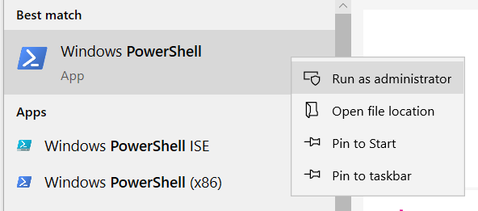
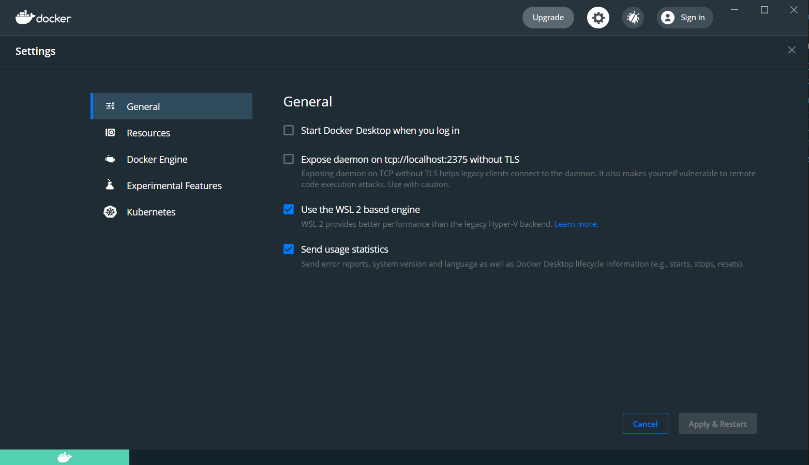

# Windows 10

Estos días la mejor manera de tener un ambiente de desarrollo en Windows es usando WSL 2, que genera una instalación de Linux integrada a Windows sin tener que reiniciar.

## Instalando WSL 2


Si estás leyendo esto en el futuro (o estás dentro del Windows Insiders Program) instalar wsl puede ser tan fácil como ejecutar `wsl --install` en una consola con permisos de Administrador.



Antes de empezar, asegúrate de tener una versión de Windows mayor o igual a **1903** o **Build 18362**. Puedes chequear esto ejecutando con `winver` en el buscador del menu de Windows.





1. Activa WSL ejecutando lo siguiente en una consola de powershell con permisos de administrador:



```
dism.exe /online /enable-feature /featurename:Microsoft-Windows-Subsystem-Linux /all /norestart
```

2. Reinicia y ejecuta lo siguiente para activar la virtualización necesaria para WSL 2:

```
dism.exe /online /enable-feature /featurename:VirtualMachinePlatform /all /norestart
```

3. Reinicia y descarga la actualización del kernel de linux de la siguiente url:
https://wslstorestorage.blob.core.windows.net/wslblob/wsl_update_x64.msi

4. En una consola de powershell ejecuta el siguiente comando para usar WSL 2 por defecto:

```
wsl --set-default-version 2
```

5. Instala [Ubuntu desde la tienda de Microsoft](https://www.microsoft.com/store/apps/9n6svws3rx71) y crea un usuario cuando termine la instalación.

6. Para tener un terminal decente instala Windows Terminal desde la [Microsoft Store](https://aka.ms/terminal), desde [el repo](https://github.com/microsoft/terminal/releases) o usando scoop (`scoop install windows-terminal`) (ver [Instalando Utilidades](#instalando-utilidades))

## Instalando Docker

1. Descarga [Docker Desktop](https://docs.docker.com/docker-for-windows/wsl/#download)
2. Abre Docker Desktop y
	1. en Settings > General activa "Use the WSL 2 based engine"
	2. en Settings > WSL Integration asegurate que todas las opciones estén activadas




## Ambiente de Desarrollo

Una vez instalado Docker y Windows Terminal, el ambiente de desarrollo funciona como cualquier otra instalación de Linux.

La mayoría de los proyectos de Platanus modernos usan Docker para los servicios como postgres o redis pero lo siguiente es una lista de los requisitos mínimos y como instalarlos desde Windows Terminal y la shell de Ubuntu:

- git (`sudo apt install git`)
- rbenv (`sudo apt install rbenv`)
- nodenv (`curl -fsSL https://raw.githubusercontent.com/nodenv/nodenv-installer/master/bin/nodenv-installer | bash`)


A pesar que WSL 2 lo permite, no te recomendamos clonar los proyectos dentro del filesystem de Windows (`/mnt/c` o similar) por temas de performance. Lo mejor es mantener los proyectos dentro del filesystem de Linux (`~/`). Si necesitas entrar a estas carpetas con File Explorer puedes hacerlo ejecutando `explorer.exe . ` en la carpeta correspondiente o navegando a `\\wsl$\Ubuntu-20.04\home\TU_USUARIO\`


## Usando VS Code

A menos que tengas una razón muy válida para usar otro editor, te recomendamos usar [Visual Studio Code](https://code.visualstudio.com/). Una de las gracias que tiene es que se puede conectar de manera "nativa" a WSL 2, sin tener que preocuparse de paths, compatibilidad de extensiones o performance, usando la extensión [Remote-WSL](https://marketplace.visualstudio.com/items?itemName=ms-vscode-remote.remote-wsl).

## Instalando Utilidades

Aparte de WSL 2, para instalar utilidades nativas de Windows puedes usar [scoop](https://scoop.sh/), un instalador para la linea de comando que hace muy fácil instalar binarios (como imagemagick, ffmpeg, etc) para que queden disponibles en el PATH de Windows.


En teoría es posible usar scoop y Docker para instalar todo lo necesario ejecutar los proyectos sin necesidad de WSL 2 pero se aleja del setup estandar que usamos en Platanus y no podremos ayudarte si tienes algún problema.


## Links de Referencia

https://docs.microsoft.com/en-us/windows/wsl/install-win10

https://docs.microsoft.com/en-us/windows/terminal/get-started

https://docs.microsoft.com/en-us/windows/wsl/tutorials/wsl-containers
