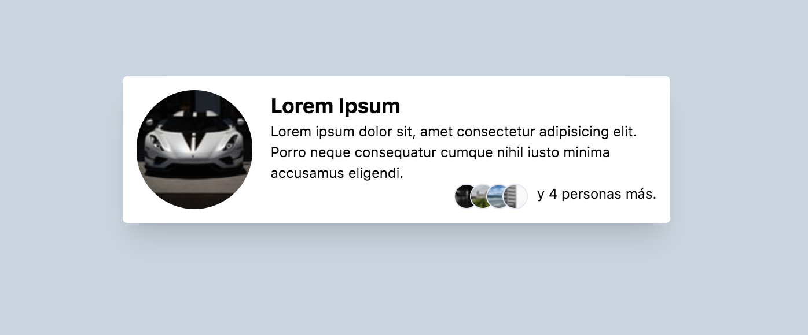
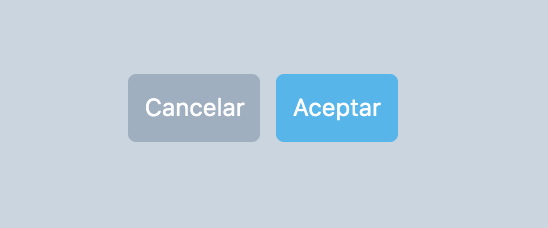

## Tailwind CSS

[Tailwind CSS](https://tailwindcss.com/) es un framework de CSS que apunta a ser altamente personalizable, ofreciendo clases atómicas para armar cualquier tipo de interfaz sin tener que pelear con estilos pre-definidos como pasa con frameworks de componentes.

### ¿Por qué lo usamos?

Este framework ofrece el equilibro perfecto entre partir de cero y el usar un framework tipo Bootstrap que tal vez no se adecua 100% a las necesidades de cada proyecto.

Mientras su implementación se puede ver "fea" al tener clases genéricas en el html, tiene la ventaja de ser altamente flexible dentro de las restricciones de un _design system_ [configurable](https://tailwindcss.com/docs/theme), permitiendo la estandarización de como se trabaja en proyectos diferentes sin que todos los proyectos se vean iguales.

### ¿Cómo lo usamos?

#### Instalación

TailwindCSS ya viene configurado en Potassium. En proyectos más antiguos se puede usar `potassium install front_end [--force]` con el cuidado de revisar los cambios en Git para eliminar los cambios innecesarios.

Si el proyecto no fue creado con Potassium, en general se puede instalar siguiendo [las instrucciones en la documentación](https://tailwindcss.com/docs/installation).

#### Un ejemplo básico
```html
<div class="flex w-1/2 p-3 bg-white rounded shadow-xl box-shadow">
  
  <div>
    <h1 class="text-lg font-bold">Lorem Ipsum</h1>
    <p>
      Lorem ipsum dolor sit, amet consectetur adipisicing elit. Porro neque
      consequatur cumque nihil iusto minima accusamus eligendi.
    </p>
    <div class="flex justify-end">
      
      
      
      
      y 4 personas más.
    </div>
  </div>
</div>
```


#### Un ejemplo con elementos repetidos

TailwindCSS se describe como un framework utility-**first**, en otras palabras mientras se recomienda usar sus clases para todo, hay casos en que hace sentido [extraer html a componentes de Vue o partials de Rails](https://tailwindcss.com/docs/extracting-components). En casos especiales o muy simples (como botones) también se pueden extraer solo las clases a CSS usando [la directiva @apply](https://tailwindcss.com/docs/extracting-components/#extracting-css-components-with-apply) de Tailwind.

Hay que tener cuidado y aplicar criterio para extraer _**solo componentes que se repiten muchas veces**_ (si es que la razón para extraerlo es solo la repetición de clases). Para mantener el orden del CSS, se recomienda usar [BEM](./bem.md) como en el siguiente ejemplo.

```html
<button class="btn btn--secondary mr-2">Cancelar</button>
<button class="btn btn--primary">Aceptar</button>
```

```postcss
.btn {
  @apply text-md rounded p-2;
}

.btn:focus {
  @apply outline-none;
}

.btn--primary {
  @apply bg-blue-400 text-white;
}

.btn--primary:focus {
  @apply bg-blue-500;
}

.btn--secondary {
  @apply bg-gray-500 text-white;
}

.btn--secondary:focus {
  @apply bg-gray-600;
}
```


### Recursos Útiles

- [Component Library](https://platanus.github.io/component-library/): Tenemos una librería de componentes frecuentemente usados hechos en Tailwind y Vue, además de incluir sugerencias de librerías.
- [Documentación oficial](https://tailwindcss.com/): La documentación es excelente y cubre casi cualquier duda que puedas tener.
- [Tailwind CSS Intellisense](https://marketplace.visualstudio.com/items?itemName=bradlc.vscode-tailwindcss) (VS Code): Agrega autocompletado de clases al escribir HTML.
- [Tailwind Docs](https://marketplace.visualstudio.com/items?itemName=austenc.tailwind-docs) (VS Code): Permite buscar la documentación de Tailwind directamente desde el editor.
- [Headwind](https://marketplace.visualstudio.com/items?itemName=heybourn.headwind) (VS Code): Estandariza el orden de las clases de Tailwind al guardar.
