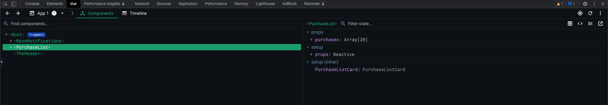

# Resolviendo problemas (debugging)

A veces un `puts` o `console.log` no es la mejor manera de debuggear o ver qué está pasando en una parte del código. En esta sección veremos algunas herramientas que te pueden servir cuando estés desarrollando o buscando el origen de un bug escondido. 

# Back - Rails

## Consola

Probablemente ya conoces el comando `rails s` para iniciar el server y ver en esa terminal el output mientras se usa la aplicación. Otro comando de Rails que puede ser útil cuando se quiere probar algo es `rails c`. Este comando abre una consola de rails en la que puedes correr cualquier comando de Ruby/Rails, y también llamar a clases (modelos, jobs, etc.) de tu aplicación.

> 💡 Ojo que si tienes una consola abierta y entremedio haces cambios en el código, esos cambios no se verán reflejados en la consola automáticamente. Debes correr manualmente `reload!`. 
Al igual que con el servidor, si tus cambios incluyen cambios en una migración o cambios a los initializers, deberás cortar y volver a abrir la consola de Rails, ahí no basta el `reload!`

## Pry

En la consola puedo llamar a métodos/clases de mi código, pero, qué pasa si quiero saber el valor de una variable o un método en un punto específico del código?

Una primera aproximación como mencioné antes podría ser el `puts`, pero hay una forma mejor: `binding.pry` , cortesía de la gema https://github.com/pry/pry. Se pone entremedio del código que queremos tener más detalles, igual como se haría con el puts. Luego, cuando la ejecución del código llega a esa línea, se pausa, y en la terminal aparece una consola. Igual que la consola con `rails c` , puedes ejecutar lo que quieras, pero ahora **dentro del contexto en que se puso el binding.pry. **O sea, puedes llamar a métodos privados, variables de instancia o locales, etc:

[Ver video](assets/resolviendo-problemas-debugging-1.qt)

Como se ve al final del video, si quieres salir de la consola del `binding.pry` y volver a la ejecución normal del programa, basta con poner `c`. En verdad es un alias de `continue`, definido en los `.pryrc` de nuestros proyectos. Puedes encontrar más detalles de este y otros comandos en https://github.com/deivid-rodriguez/pry-byebug, en particular `next` (o `n`) y `step` (o `s`) pueden servir harto cuando se necesita hacer una ejecución más controlada del código.

## Problemas en producción/staging

De repente hay problemas en las apps ya deployeadas que no son fáciles de replicar en local. En esos casos, necesitamos sacar más información desde la app que ya está arriba. Aquí lamentablemente no podremos usar `binding.pry`, pero hay un par de cosas que te pueden servir:

### Sentry

Nuestros proyectos están configurados para funcionar con [Sentry](https://docs.sentry.io/platforms/ruby/), que centraliza los errores que se lanzan. También está por lo general configurado para que mande notificaciones a un canal de Slack. Es un buen primer lugar para entender qué está pasando.

### Logs en Heroku

Puedes ver los logs de la aplicación, junto a los de sus workers, con:

```plain text
heroku logs --tail -a pl-nombre-proyecto-staging
```

El `--tail` hace que te sigan llegando los logs que se van generando, en un stream.

Con `-a` le dices a que app conectarse. El nombre de nuestras apps siguen por lo general el formato anterior, terminando en `staging` o `production` según corresponda.

Si quieres filtrar por logs del server o de un worker de sidekiq, puedes filtrar por nombre del dyno:

```plain text

heroku logs --tail --dyno worker.1 -a nombre-de-la-app
```

Puedes ver el nombre de los dynos con `heroku ps -a nombre-de-la-app`.

### Consola rails en heroku

Puedes correr también la consola de rails en el contexto de una app de heroku:

```plain text
heroku run bundle exec rails c -a nombre-de-la-app
```

> 🚨 Ojo que las cosas que corras aquí van a afectar tu ambiente de staging/production, no es un ambiente sandbox inofensivo. Si creas records por ejemplo, eso se verá reflejado en la base de datos de la app

### Monkeypatching en la consola

Ruby permite hacer fácilmente *monkeypatching* de una clase, en otras palabras, redefinir partes de esa clase “desde afuera” de dónde se define originalmente. Podemos usar eso para probar cosas en la consola de staging, poniendo puts para debuggear por ejemplo (la gema `pry` no está en ambientes de producción por si acaso). Una forma fácil de hacer eso es definir la clase nuevamente en consola, y redefinir solo los métodos que quiero modificar. El resto de la definición de la clase que no toqué (otros métodos, constantes, etc.) se mantendrán intactos.

Veamos un ejemplo. Digamos que tenemos la siguiente clase

```ruby
class MyJob < ApplicationJob
  def perform
    do_something
    do_something_else
  end

  private

  def do_something
    # do_something implementation
  end

  def do_something_else
    # do_something_else implementation
  end
end
```

Digamos que hay un error y sospecho que está en el método `do_something_else`. Puedo pegar en consola algo así:

```ruby
class MyJob < ApplicationJob
  private

  def do_something_else
    puts 'Some message to help me debug'
    # do_something_else implementation
  end
end
```

Luego puedo correr el Job en consola y se verá el puts o los cambios que haya hecho. Notar que no se necesitó redefinir el resto de la clase, pero si tengo que mantener la implementación de `do_something_else`.

> 💡 Los cambios que se hagan de esta manera solo se mantendrán **dentro de esa sesión de la consola de rails.** O sea que esos cambios no se verán reflejados en la aplicación cuando la usen los usuarios. Los cambios viven y mueren con ese `heroku run bundle exec rails c -a nombre-de-la-app`

# Front

## Debugger

Así como en Ruby está el `puts`, probablemente te suena que en javascript está el `console.log`. Y así como te mostramos `pry` como alternativa, en javascript también tenemos un símil: `debugger`. Lo mismo: se pone entremedio del código que queremos tener más detalles y luego, cuando la ejecución del código llega a esa línea, se pausa. El navegador aparece pausado también, y abre la pestaña Sources, mostrando la línea en que se paró la ejecución. Ahí puedes ir a la pestaña Console y ejecutar lo que sea necesario:

[Ver video](assets/resolviendo-problemas-debugging-2.qt)

## Extensión Vue.js devtools

https://devtools.vuejs.org/guide/installation.html

Con esta extensión se agrega una nueva pestaña al devtools del navegador. En ella se puede ver el árbol de componentes presente en la vista actual, y detalles de cada componente (props, computed, etc.).



También puedes ver los eventos que han sido emitidos con sus parámetros en la tab Timeline:


