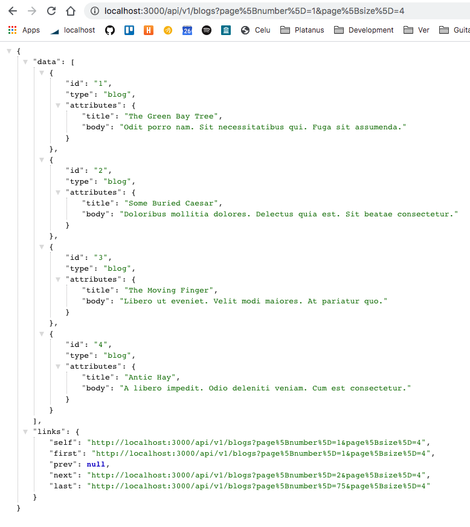
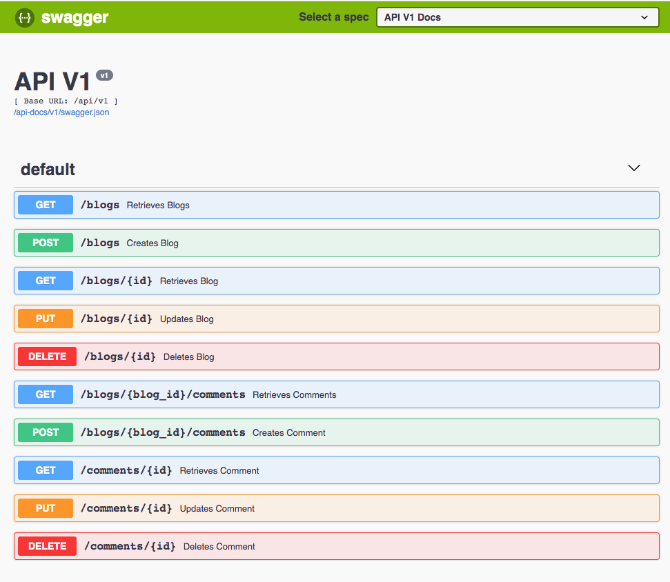

## [Power API](https://github.com/platanus/power_api)

Es un [engine de Rails](https://guides.rubyonrails.org/engines.html#what-are-engines-questionmark)
desarrollado por **Platanus** que reúne un conjunto de gemas y configuraciones pensadas
para construir APIs REST de calidad.

### ¿Por qué la usamos?

Por dos motivos:

1. Porque en esta gema hemos ido recopilando todas aquellas herramientas que consideramos nos han sido útiles a lo largo de nuestros desarrollos en Platanus.
2. Porque todas estas configuraciones varían muy poco (o nada) de proyecto en proyecto. Por esto, nos pareció buena idea realizar estas mejoras en un único lugar para luego ocupar en todas nuestras aplicaciones.

### ¿Cómo la usamos?

#### Instalación

La gema viene instalada si el proyecto se generó usando [Potassium](https://github.com/platanus/potassium) con la opción `api` activada. Si el proyecto no fue creado con Potassium, se puede instalar siguiendo las instrucciones de [README](https://github.com/platanus/power_api#installation).

#### Usamos el generador de la gema para agregar un recurso a la API

Supongamos que tenemos el modelo:

```ruby
class Blog < ApplicationRecord
end
```

y queremos tener los típicos endpoints REST:

```
GET     /api/v1/blogs
POST    /api/v1/blogs
GET     /api/v1/blogs/:id
PUT     /api/v1/blogs/:id
DELETE  /api/v1/blogs/:id
```

Para esto, deberíamos ejecutar el siguiente generador:

```bash
rails g power_api:controller blog
```

Esto creará el controlador (dentro de `/app/controllers/api/v1/blogs_controller.rb`) y todo lo necesario para que tengas tus endpoints funcionando.
Para más información u opciones que permite el comando, revisa la [documentación de la gema](https://github.com/platanus/power_api#controller-generation)

```ruby
class Api::V1::BlogsController < Api::V1::BaseController
  def index
    respond_with Blog.all
  end

  def show
    respond_with blog
  end

  def create
    respond_with Blog.create!(blog_params)
  end

  def update
    respond_with blog.update!(blog_params)
  end

  def destroy
    respond_with blog.destroy!
  end

  private

  def blog
    @blog ||= Blog.find_by!(id: params[:id])
  end

  def blog_params
    params.require(:blog).permit(
      :title,
      :body
    )
  end
end
```

**Tener en cuenta:**

- El generador sirve para crear los endpoints REST típicos y [anidados](https://github.com/platanus/power_api#--parent-resource). Si necesitas algo custom, deberás hacerlo a mano. Pero siempre ten en cuenta que si piensas en recursos REST, probablemente encontrarás una forma de modelar que calce con lo que ofrece el generador.

#### Usamos [AMS](https://github.com/rails-api/active_model_serializers) para estructurar el formato de respuesta de nuestra API

Siguiendo el ejemplo anterior, si corremos el generador, se agregará el siguiente serializer en `/app/serializers/api/v1/blog_serializer.rb`

```ruby
class Api::V1::BlogSerializer < ActiveModel::Serializer
  type :blog
  attributes(
    :title,
    :body
  )
end
```

Como la gema está configurada para devolver el formato de [json api](https://jsonapi.org/)
al ejecutar por ejemplo la request `GET /api/v1/blogs` obtendremos algo así:



**Tener en cuenta:**

- Siempre utiliza serializers para responder con el API. Es importante que todos los endpoints devuelvan la información con el mismo formato.

#### Usamos un [concern de Rails](https://api.rubyonrails.org/classes/ActiveSupport/Concern.html) para manejar los errores que genera la API

Supongamos que tenemos el siguiente controller con el `create` endpoint y supongamos también que el atributo `title` es requerido:

```ruby
class Api::V1::BlogsController < Api::V1::BaseController
  def create
    respond_with Blog.create!(blog_params)
  end

  def blog_params
    params.require(:blog).permit(
      :title,
      :body
    )
  end
end
```

Al ejecutar la request `POST /api/v1/blogs` sin enviar el atributo `title`, se lanzará una exception que será manejada por el [concern](https://github.com/platanus/power_api#the-apierror-concern) devolviendo una respuesta con formato estándar:


**Tener en cuenta:**

- Siempre lanza exceptions y deja que el concern los maneje. No hagas condicionales ni devuelvas errores custom. Los errores siempre deberían tener el mismo formato y ser manejados en un único lugar (el concern).
- Si necesitas manejar algún tipo de error específico, siempre podrás agregarlo así:
  ```ruby
  class Api::BaseController < PowerApi::BaseController
    rescue_from "MyCustomErrorClass" do |exception|
      respond_api_error(:bad_request, message: "some error message", detail: exception.message)
    end
  end
  ```

#### Usamos un [custom responder](https://github.com/platanus/power_api#the-apiresponder) para manejar las respuestas de nuestra API

Siguiendo el ejemplo anterior:

```ruby
class Api::V1::BlogsController < Api::V1::BaseController
  def create
    respond_with Blog.create!(blog_params)
  end

  def blog_params
    params.require(:blog).permit(
      :title,
      :body
    )
  end
end
```

Al ejecutar `POST /api/v1/blogs`, el método `respond_with` invocará al responder y entregará el objeto `Blog` que se acaba de crear usando el serializer y, por tratarse de un `POST`, entenderá que debe devolver el HTTP status code 201 (created).

El responder además devolverá:

- Un HTTP status code 200 OK si se trata de un `GET` o un `PUT` además del/los recurso/s serializado/s con AMS.
- Un HTTP status code 204 No Content si se trata de un `DELETE`.

**Tener en cuenta:**

- Evitar usar `render`. El uso de `render` se salta el responder y nos obliga a especificar el código y recurso a devolver en el mismo controller. Esto es una mala práctica porque es algo que debería definirse en un único lugar y ser consistente a través de todos los controladores.

#### Usamos [Rswag](https://github.com/rswag/rswag) para testear nuestra API

Si usamos el generador `rails g power_api:controller blog`, se crearán dentro del directorio:
`/spec/integration/api/v1/blogs_spec.rb` los tests para nuestro controlador.

```ruby
require 'swagger_helper'

describe 'API V1 Blogs', swagger_doc: 'v1/swagger.json' do
  path '/blogs' do
    get 'Retrieves Blogs' do
      description 'Retrieves all the blogs'
      produces 'application/json'
      let(:collection_count) { 5 }
      let(:expected_collection_count) { collection_count }
      before { create_list(:blog, collection_count) }
      response '200', 'Blogs retrieved' do
        schema('$ref' => '#/definitions/blogs_collection')
        run_test! do |response|
          expect(JSON.parse(response.body)['data'].count).to eq(expected_collection_count)
        end
      end
    end

    post 'Creates Blog' do
      description 'Creates Blog'
      consumes 'application/json'
      produces 'application/json'
      parameter(name: :blog, in: :body)
      response '201', 'blog created' do
        let(:blog) do
          {
            title: 'Some title',
            body: 'Some body'
          }
        end
        run_test!
      end
    end
  end

  path '/blogs/{id}' do
    parameter name: :id, in: :path, type: :integer
    let(:existent_blog) { create(:blog) }
    let(:id) { existent_blog.id }
    get 'Retrieves Blog' do
      produces 'application/json'
      response '200', 'blog retrieved' do
        schema('$ref' => '#/definitions/blog_resource')
        run_test!
      end
      response '404', 'invalid blog id' do
        let(:id) { 'invalid' }
        run_test!
      end
    end

    put 'Updates Blog' do
      description 'Updates Blog'
      consumes 'application/json'
      produces 'application/json'
      parameter(name: :blog, in: :body)
      response '200', 'blog updated' do
        let(:blog) do
          {
            title: 'Some title',
            body: 'Some body'
          }
        end
        run_test!
      end
    end

    delete 'Deletes Blog' do
      produces 'application/json'
      description 'Deletes specific blog'
      response '204', 'blog deleted' do
        run_test!
      end
      response '404', 'blog not found' do
        let(:id) { 'invalid' }
        run_test!
      end
    end
  end
end
```

**Tener en cuenta:**

- Para correr los tests se debe ejecutar:

  ```bash
  bundle exec rspec spec/integration
  ```

- Power API genera la estructura de directorios y archivos necesarios para trabajar con Rswag. Algunos de los más importantes son:

  - `/spec/swagger/v1/definition.rb` aquí se configura una versión de API específica. En este caso la 1.
  - `/spec/swagger/v1/schemas/` aquí se definen los schemas (formato de recursos del api y params) que son referenciados en el archivo anterior.
  - `spec/swagger_helper.rb` es como el análogo al `rails_helper` de `rspec`. Acá es donde se configura rswag.

#### Usamos [Rswag](https://github.com/rswag/rswag) para documentar nuestra API

Al armar nuestros tests con rswag, además estamos armando la documentación.
Para generarla se debe correr el siguiente comando:

```bash
rails rswag:specs:swaggerize
```

Esto creará el archivo `/swagger/v1/swagger.json` que es desde donde se armará la documentación que será accesible desde: `http://localhost:3000/api-docs` y se verá así:



#### Usamos [Simple Token Authentication](https://github.com/gonzalo-bulnes/simple_token_authentication) para autorizar el acceso a nuestra API

Para ver el funcionamiento, puedes visitar el README de la gema pero en corto lo que hacemos es lo siguiente:

1. Corriendo el generador de la gema, crearemos una migración que agregará un `authentication_token` al modelo que queremos autorizar.

2. Ejecutaremos en el modelo a autorizar el método `acts_as_token_authenticatable` así:

   ```ruby
   class User < ApplicationRecord
     acts_as_token_authenticatable

     # more code...
   end
   ```

3. Luego en el controller que queremos que sea autorizado ejecutaremos `acts_as_token_authentication_handler_for` así:

  ```ruby
  class Api::V1::BlogsController < Api::V1::BaseController
    acts_as_token_authentication_handler_for User, fallback: :exception

    # endpoints...
  end
  ```

  Esto exigirá que las requests sean firmadas con email y token

4. Ejecutaremos la request así: `GET http://localhost:3000/api/v1/blogs/1?user_email=developer@platan.us?user_token=xxx`

**Tener en cuenta:**

- Podemos correr el instalador de Power API así:

  ```bash
  rails g power_api:install --authenticated-resources=user
  ```

  para que deje lista la configuración de Simple Token Authentication

- Por defecto el token se manda por query string, quizás sería bueno cambiar la configuración de Simple Token Authentication para que se mande por header.

- La gema no viene con un endpoint que permita conseguir el token del usuario. Por esto, es buena idea crear a mano un controller `login_attempts_controller.rb` con un action `create` que devuelva el token para un `email` y `password`.

#### Usamos [API Pagination](https://github.com/davidcelis/api-pagination) para la paginación

Para activarla simplemente debemos ejecutar el método `paginate` así:

```ruby
class Api::V1::BlogsController < Api::V1::BaseController
  def index
    respond_with paginate(Blog.all)
  end
end
```

Para ver el recurso paginado se deberá ejecutar la request así:

```
http://localhost:3000/api/v1/blogs?page[number]=2&page[size]=5
```

Esto agregará:

- Headers relacionados con la paginación.
- Links a `self`, `first`, `prev`, `next` y `last` en el serializer.

#### Usamos [Ransack](https://github.com/activerecord-hackery/ransack) para el filtrado de recursos

Para activarlo simplemente debemos ejecutar el método `filtered_collection` así:

```ruby
class Api::V1::BlogsController < Api::V1::BaseController
  def index
    respond_with filtered_collection(Blog.all)
  end
end
```

Para filtrar la información se deberá ejecutar la request así:

```
http://localhost:3000/api/v1/blogs?q[title_eq]=Vile%20Bodies
```

Para más opciones de filtrado revisa [la documentación](https://github.com/activerecord-hackery/ransack#search-matchers)

### Recursos útiles

- [Power API](https://github.com/platanus/power_api)
- [Blog Post: Cómo crear una API REST en Rails testeada, documentada y con buenas prácticas en 1 minuto y 54 segundos.](https://blog.platan.us/c%C3%B3mo-crear-una-api-rest-en-rails-testeada-documentada-y-con-buenas-pr%C3%A1cticas-en-1-minuto-y-54-4839009318a0)
- [API Pagination](https://github.com/davidcelis/api-pagination)
- [ActiveModelSerializers](https://github.com/rails-api/active_model_serializers)
- [Ransack](https://github.com/activerecord-hackery/ransack)
- [Responders](https://github.com/heartcombo/responders)
- [Rswag](https://github.com/rswag/rswag)
- [Simple Token Authentication](https://github.com/gonzalo-bulnes/simple_token_authentication)
