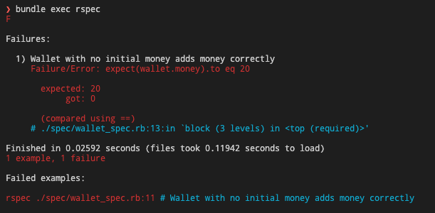
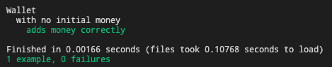
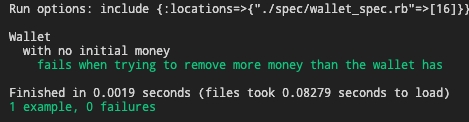

## RSpec

[RSpec](https://rspec.info/) es una herramienta de testing para probar código en Ruby. Está pensada para hacer Behavior Driven Development, y se usa tanto para tests unitarios como de integración.


### ¿Por qué lo usamos?

RSpec se diferencia de otras herramientas para usar testing porque los tests especifican cómo se supone que la aplicación debería comportarse.

Las especificaciones están escritas en lenguaje simple, por lo que los mensajes de fallos y aceptación son fáciles de entender. Al estar basados en comportamiento, se entiende directamente por qué se está testeando algo, y qué consecuencias tiene que no esté pasando.

Además, los tests son útiles para comprobar que algo nuevo que estemos desarrollando no rompe la funcionalidad anterior. Si intentamos agregar un bug, un test bien hecho puede prevenir que rompamos más cosas que las que estamos arreglando. Por eso, en general los proyectos están configurados también con [CircleCI](https://circleci.com/), que (entre otras cosas) corre los tests cuando hay cambios en algunas ramas, o cuando se hacen Pull Requests.

### ¿Cómo lo usamos?

RSpec viene incluido por defecto en Potassium y los proyectos generados incluyen un archivo de configuración `.rspec`. Además, si un proyecto usa [PowerAPI](./power_api.md), se crean tests automáticamente al correr el generador de PowerAPI.

Para correr todos los tests de un proyecto, se ejecuta `bundle exec rspec`. Si quieres correr los tests de un archivo en específico, puedes darle también la ruta del archivo, por ejemplo: `bundle exec rspec ./spec/integration/api/v1/blogs_spec.rb` corre todos los tests que están en ese archivo.

#### Ejemplo

Los siguientes ejemplos fueron hechos usando Ruby 2.7.1, con RSpec 3.9.0

Si estamos haciendo TDD, lo primero que hacemos es escribir los tests. Vamos a suponer que tenemos una billetera (de BTC, por ejemplo), y queremos partir poniendo y sacando plata. Por ahora no nos interesa saber de dónde viene ni dónde va.

Para empezar, creamos los archivos `lib/wallet.rb` y `spec/wallet_spec.rb`:

En `lib/wallet.rb` va el código Ruby que queremos testear. Por ahora, vamos a implementar la funcionalidad que nos permite agregar plata:

```ruby
class Wallet
  attr_reader :money

  def add_money(amount)
  end
end

```

En el archivo `spec/wallet_spec.rb` va lo que queremos testear:

```ruby
require 'wallet'

RSpec.describe Wallet do
  subject(:wallet) { described_class.new(money) }

  let(:money) { 5 }

  context 'with no initial money' do
    let(:money) { 0 }

    it 'adds money correctly' do
      wallet.add_money 20
      expect(wallet.money).to eq 20
    end
  end
```

Si corremos los tests ahora, van a fallar:



Nuestro método `add_money` no hace nada, así que la billetera siempre queda con su cantidad inicial, 0. Vamos a corregirlo:

```ruby
class Wallet
  attr_reader :money

  def initialize(money)
    @money = money
  end

  def add_money(amount)
    @money += amount
  end
end
```

Después de implementar esto, nuestro test pasa:




No es normal que en nuestras billeteras estemos siempre poniendo plata, así que vamos a testear también que podamos sacar.

Para eso, tomaremos una billetera con plata inicialmente, y vamos a sacarle una parte:

```ruby
RSpec.describe Wallet do
...

  context 'with initial money' do
    let(:money) { 20 }

    it 'substracts money correctly' do
      wallet.remove_money 10
      expect(wallet.money).to eq 10
    end
  end
end
```

Nuevamente, para que nuestro test pase, es necesario que implementemos la funcioonalidad de sacar dinero:

```ruby
class Wallet
...

  def remove_money(amount)
    @money -= amount
  end
end
```

Con esto, nuestros dos test pasan. Nos queda uno solo de los casos básicos. Si tratamos de sacar más plata de la que tenemos, ¿tiene sentido que tengamos plata negativa? Para abordar este caso, vamos a hacer un test para probar que sacar más plata de la que tenemos lanza un error.

```ruby
...
  context 'with no initial money' do
  ...
    it 'fails when trying to remove more money than the wallet has' do
       expect { wallet.remove_money 10 }.to raise_error "Tried to remove more money than what's inside the wallet"
    end
  end
```

Y para hacer que el test pase, modificamos nuestro método `remove_money` para que sea así:

```ruby
def remove_money(amount)
  raise "Tried to remove more money than what's inside the wallet" if amount > @money

  @money -= amount
end
```

Esta vez vamos a correr solamente este test, para ahorrarnos un poquito de tiempo (y aprender a especificar qué test vamos a probar). Para eso, corremos el comando `bundle exec rspec ./spec/wallet_spec.rb:16`, y vemos como nuestro último test pasa:



### Recursos Útiles

- [RSpec cheat sheet](https://devhints.io/rspec): una lista resumen de cosas útiles que se pueden hacer con RSpec, y de qué manera se pueden testear las condiciones que queremos.
- [Repositorio de rswag](https://github.com/rswag/rswag): es lo que se usa para testear APIs, en el repositorio hay un getting started y ejemplos básicos de tests de APIs.
