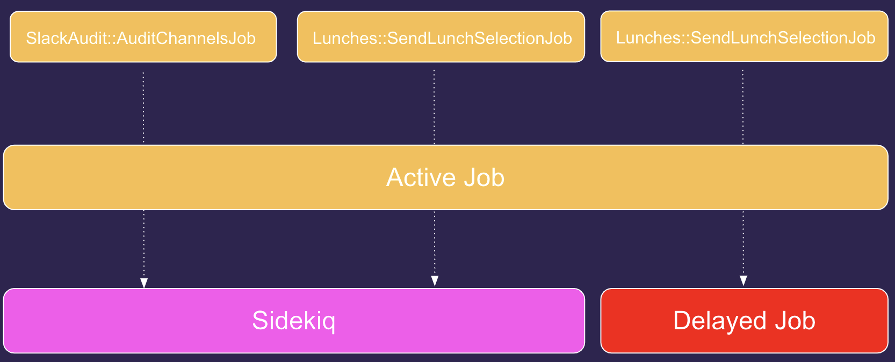
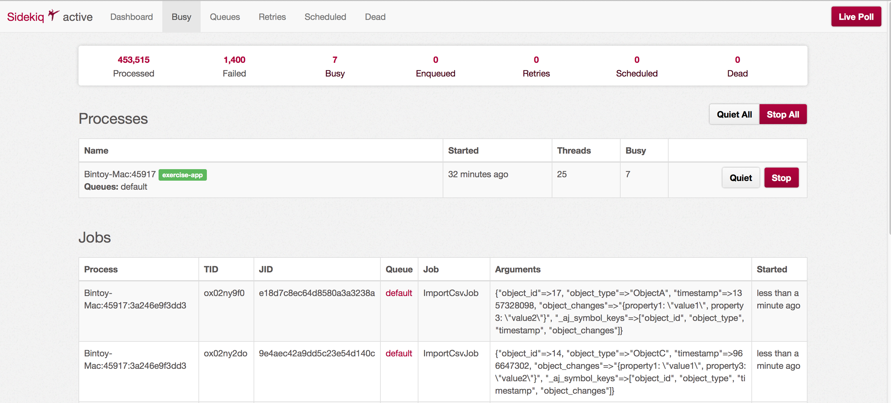

# Active Job

[Es un framework que viene con Rails](https://guides.rubyonrails.org/active_job_basics.html) y nos permite definir tareas (jobs) para ejecutar en un "queuing backend".


Puedes ver la [presentación sobre Jobs](https://www.youtube.com/watch?v=P-Vqh5z5418) que hicimos en Platanus o continuar leyendo sobre el tema aquí en la guía.


### ¿Para qué los usamos?

Usamos jobs como Rails sugiere:

> These jobs can be everything from regularly scheduled clean-ups, to billing charges, to mailings. Anything that can be chopped up into small units of work and run in parallel, really.

pero en Platanus además los usamos para resolver la **lógica de negocios** de nuestra aplicación. Es decir, no solo para tareas triviales.
El motivo de esto es evitar antipatrones como "fat models" o "fat controllers" que ocurren cuando nos vemos obligados a elegir un modelo o un controller para poner business logic.
Para dejar esto más claro, veamos un ejemplo:

Supongamos que tenemos los modelos:

```ruby
class User < ApplicationRecord
  has_many :bank_movements
end

class BankMovement
  belongs_to :user
end
```

y queremos agregar lógica para generar un reporte de movimientos bancarios de un usuario.

¿Dónde podrían esta lógica?

Una opción sería ponerla en el modelo `User`:

```ruby
class User < ApplicationRecord
  has_many :bank_movements

  def generate_report
    # lógica para generar el reporte
  end
end
```

La otra opción sería:

```ruby
class BankMovement < ApplicationRecord
  belongs_to :user

  def self.generate_report(user)
    # lógica para generar el reporte
  end
end
```

Pero la verdad es que en ambos casos no "se siente" muy correcto, ¿no?

Ya los imagino pensando cosas como: "¿donde voy a meter el próximo reporte? ¡la clase `User` se volverá gigante!"

Una posible solución a este problema (la que hemos decidido utilizar en Platanus) es poner esta lógica en jobs. Algo así:

```ruby
class GenerateUserBankMovementsReportJob < ApplicationJob
  def perform(user)
    # lógica para generar el reporte
  end
end
```

Con lo anterior logramos encapsular la lógica de creación del reporte y evitar que modelos como `User` o `BankMovement` empiecen a crecer y a tener múltiples responsabilidades.


Vale la pena aclarar que hasta no hace mucho tiempo atrás usábamos [comandos de power types](https://github.com/platanus/power-types#commands) para resolver este asunto pero, actualmente, dejamos de utilizarlos por considerar que podíamos lograr lo mismo usando solamente los jobs de Rails.


### ¿Cómo los usamos?

Primero creamos el job con el generador:

```bash
bundle exec rails g job generate_user_bank_movements_report
```

Hacer esto generará dos archivos:

En job `app/jobs/generate_user_bank_movements_report_job.rb`:

```ruby
class GenerateUserBankMovementsReportJob < ApplicationJob
  queue_as :default

  def perform(*args)
    # Do something later
  end
end
```

y su test: `spec/jobs/generate_user_bank_movements_report_job_spec.rb`

```ruby
require 'rails_helper'

RSpec.describe GenerateUserBankMovementsReportJob, type: :job do
  pending "add some examples to (or delete) #{__FILE__}"
end
```

Luego, para ejecutar la tarea:

```ruby
GenerateUserBankMovementsReportJob.perform_now(user)
```

¡Eso es todo!

Ahora supongamos que la generación del reporte es una tarea "pesada" y queremos ejecutarla en background. Es decir, no queremos que se procese inmediatamente sino que queremos mandarla a una cola para que se ejecute luego. Esto se hace llamando a `perform_later` en vez de `perform_now` así:

```ruby
GenerateUserBankMovementsReportJob.perform_later(user)
```

Como decíamos, el código anterior no ejecutará inmediatamente la tarea sino que:

* Persistirá (serialize) el job en algún medio definido por el "queuing backend" (sidekiq, delayed_job, etc.) que estemos usando. Por ejemplo: sidekiq utiliza redis y delayed_job postgres o mysql.

* Cuando el "queuing backend" decida, recuperará (deserialize) el job y ejecutará la tarea.

### Instalación

ActiveJob viene con Rails pero en Platanus usamos [Potassium](https://github.com/platanus/potassium) para modificar algunas cosas e instalar sidekiq como queuing backend.
Si generaste el proyecto con [Potassium](https://github.com/platanus/potassium) seguramente ya tendrás todo configurado pero, si no es así, puedes ejecutar: `potassium install background_processor`.

El instalador:

* Agrega el archivo `config/initializers/sidekiq.rb` con la configuración básica de sidekiq: conexión con Redis, autenticación del panel de control, etc.

* Agrega el archivo `config/sidekiq.yml` que permite configurar colas, prioridades y concurrencia entre otras cosas. Por ejemplo:

    ```yaml
    production:
      :concurrency: 5
    :queues:
      - critical
      - default
      - low
    ```

    En el archivo anterior, se configuró que en poducción podrán correr a la vez un máximo de 5 jobs (`concurrency: 5`), que habrán 3 colas (`critical`, `default` y `low`) y que `critical` será la más prioritaria (debido al lugar que ocupa en la lista y no al nombre de la cola).

* En los archivos de environment, agrega la opción `config.active_job.queue_adapter` con los valores:

    * `:async` en `config/environments/development.rb`: para correr jobs en RAM. Esto nos sirve en ambiente de desarrollo pero no para producción ya que un reinicio del server eliminará los jobs que tengamos pendientes de ser ejecutados.

    * `:test` en `config/environments/test.rb`: para obtener helpers que nos ayuden a testear jobs fácilmente.

    * `:sidekiq` en `config/environments/production.rb`: para correr jobs con un "backend serio". En Platanus usamos [Sidekiq](https://github.com/mperham/sidekiq)

* Modifica el archivo `Procfile` y le agrega la línea `worker: bundle exec sidekiq`. Esto nos permitirá levantar sidekiq en un worker de Heroku cuando estemos en ambiente de producción.

### Active Job

Como les expliqué al inicio, Active Job es un framework que nos permite definir tareas pero, además, es una "wrapper" del queuing backend. La utilidad de esto es que podemos definir jobs independientemente del backend que utilicemos.



Entonces, cuando escribimos por ej:

```ruby
class GenerateUserBankMovementsReportJob < ApplicationJob
  queue_as :default

  def perform(*args)
    # Do something later
  end
end
```

lo que estamos haciendo es definir un Job de ActiveJob y no nos interesa si por debajo lo ejecutará [sidekiq](https://github.com/mperham/sidekiq), [delayed_job](https://github.com/collectiveidea/delayed_job) o lo que sea.

El mismo job definido en [Sidekiq](https://github.com/mperham/sidekiq), por fuera de ActiveJob, se vería así:

```ruby
class GenerateUserBankMovementsReportJob
  include Sidekiq::Worker

  def perform(*args)
    # Do something
  end
end
```

Definir tareas y configurar cosas por fuera de ActiveJob es algo que deberíamos evitar, ya que al hacerlo nos volvemos dependientes del backend y, si el día de mañana decidimos usar otro ([delayed_job](https://github.com/collectiveidea/delayed_job) por ejemplo), romperemos alguna funcionalidad.

### Configuraciones de un Job

En la sección de instalación definimos distintas *queues*. En caso que tengamos distintas prioridades para ciertos procesos, podemos especificar la cola a usar con la opción `queue_as`.

También podemos especificar la política en caso de que no se logre ejecutar de manera correcta el job. Esto lo hacemos especificando la opción `retry`. ActiveJob por defecto tiene una política de **reintentar** 5 veces, cada una separada por 3 segundos. Luego de esto se usa la implementación por defecto de Sidekiq, en el que se vuelven a encolar estos jobs pero con un [delay exponencial](https://github.com/mperham/sidekiq/wiki/Error-Handling#automatic-job-retry).

Además podemos especificar que el `Job` se **descarte** en caso de una excepción en específico.

A modo de ejemplo, un proceso que use las dos opciones descritas puede ser definido de la siguiente manera:

```ruby
class ReallyImportantJob < ActiveJob::Base
  queue_as :critical
  discard_on CustomAppException

  def perform(*args)
    # ...
  end
end
```

Las que nombre son configuraciones de las más frecuentes. Para ver más información relacionada con esto, recurre a [la guía de Rails](https://guides.rubyonrails.org/active_job_basics.html).

### Formas de encolar un Job

* **Ejecutar lo antes posible:** en cuanto la cola definida se libere se ejecutará el job. Es importante mencionar aquí que aunque la cola esté vacía, el job correrá de manera asíncrona.

    ```ruby
    GenerateUserBankMovementsReportJob.perform_later(user)
    ```

* **Ejecutar en un momento dado:** se ejecutará el job después del tiempo definido.

    ```ruby
    GenerateUserBankMovementsReportJob.set(wait_until: Date.tomorrow.noon).perform_later(user)
    ```

* **Ejecutar pasado cierto tiempo:** se ejecutará después del plazo dado.

    ```ruby
    GenerateUserBankMovementsReportJob.set(wait: 1.week).perform_later(user)
    ```

* **Ejecutar inmediatamente:** corre el job de manera inmediata, bloqueando la ejecución de tu aplicación. Ojo, esto no llega a Sidekiq, se ejecuta antes.

    ```ruby
    GenerateUserBankMovementsReportJob.perform_now(user)
    ```

### Panel de control de Sidekiq

La gema ofrece una vista donde se puede monitorear el estado de los jobs en la aplicación. Si vas a `config/routes.rb`, vas a ver algo del estilo `mount Sidekiq::Web => '/queue'`. Esto indica que la vista puede ser accedida desde `http://localhost:3000/queue`.



> El password para poder ingresar al dashboard estará definido en la variable de entorno: SIDEKIQ_ADMIN_PASSWORD.

### Mails

ActiveJob se integra muy bien con [ActionMailer](https://guides.rubyonrails.org/action_mailer_basics.html) y nos permite mandar mails a la cola de manera simple. Por ejemplo:

Si tengo el mailer:

```ruby
class RecruitingProcessMailer < ApplicationMailer
  def personal_interview_mail(recruiting_process)
    # ...
  end
end
```

puedo mandarlo a sidekiq de la siguiente manera:

```ruby
Recruiting::ProcessMailer.personal_interview_mail(recruiting_process).deliver_later
```

sin la necesidad de escribir un job específico para esto.

Es importante destacar además que los mails son agregados a la cola `mailers` y que potassium configura esto en `config/sidekiq.yml`.

```yaml
production:
  :concurrency: 5
:queues:
  - mailers
```

### Trabajos recurrentes

Ponte en el caso en que quisieras mandar un correo a los usuarios todos los días a las 8:00hrs con un chiste para acompañar su café. Para esto podemos usar la gema `sidekiq-scheduler`. Esta también viene en la configuración de Potassium. Pero también puedes agregarla ejecutando `potassium install schedule`.

Supongamos que tenemos nuestro Job definido:

```ruby
class SendUsersAJokeJob < ApplicationJob
  queue_as :default

  def perform
    # Get a funny meme and send it to all users.
  end
end
```

Podemos definir la recurrencia de este Job usando un [Cron](https://crontab.guru/). Estos se definen en `config/sidekiq.yml`

```yaml
:schedule:
  SendUsersAJokeJob:
    cron: '0 8 * * * *' # Runs all days at 8:00 hrs.
    class: HelloWorld
```

### Recursos útiles

* [Presentación Platanus sobre el tema](https://www.youtube.com/watch?v=P-Vqh5z5418)

* [Sidekiq Docs](https://github.com/mperham/sidekiq/wiki/Getting-Started)

* [Sidekiq + ActiveJob](https://github.com/mperham/sidekiq/wiki/Active+Job)

* [Sidekiq-history](https://github.com/russ/sidekiq-history)

* [ActiveJob](https://edgeguides.rubyonrails.org/active_job_basics.html)

* [Buenas prácticas](https://github.com/mperham/sidekiq/wiki/Best-Practices)

* [Active Job Log](https://github.com/platanus/active_job_log)
