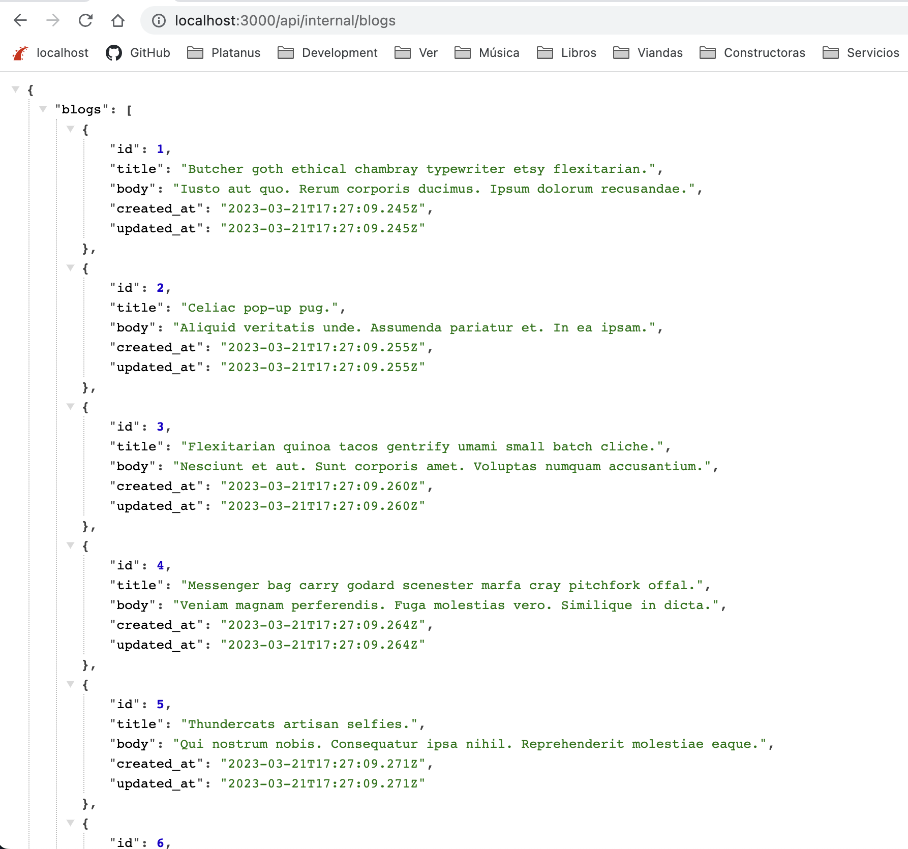
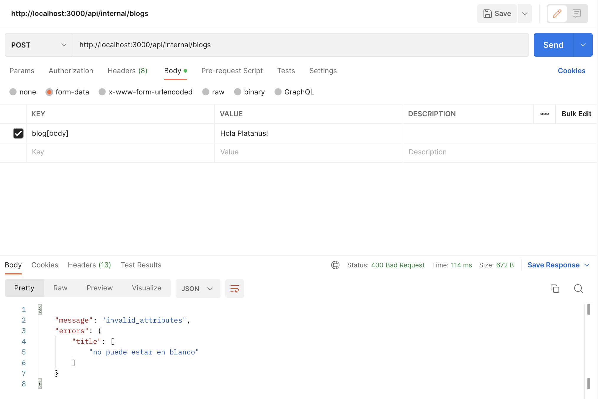

# Power API

Es un [engine de Rails](https://guides.rubyonrails.org/engines.html#what-are-engines-questionmark) desarrollado por **Platanus** que reúne un conjunto de gemas y configuraciones pensadas para construir APIs REST de calidad.

### ¿Por qué la usamos?

Por dos motivos:

1. Porque en esta gema hemos ido recopilando todas aquellas herramientas que consideramos nos han sido útiles a lo largo de nuestros desarrollos en Platanus.

1. Porque todas estas configuraciones varían muy poco (o nada) de proyecto en proyecto. Por esto, nos pareció buena idea realizar estas mejoras en un único lugar para luego ocupar en todas nuestras aplicaciones.

### ¿Cómo la usamos?

### Instalación

La gema viene instalada si el proyecto se generó usando [Potassium](https://github.com/platanus/potassium) con la opción `api` activada. Si el proyecto no fue creado con Potassium, se puede instalar siguiendo las instrucciones de [README](https://github.com/platanus/power_api#installation).

### Usamos el generador de la gema para agregar un recurso a la API

Supongamos que tenemos el modelo:

```ruby
class Blog < ApplicationRecord
end
```

y queremos tener los típicos endpoints REST:

```plain text
GET     /api/internal/blogs
POST    /api/internal/blogs
GET     /api/internal/blogs/:id
PUT     /api/internal/blogs/:id
DELETE  /api/internal/blogs/:id
```

Para esto, deberíamos ejecutar el siguiente generador:

```bash
rails g power_api:controller blog
```

Esto creará el controlador (dentro de `/app/controllers/api/internal/blogs_controller.rb`) y todo lo necesario para que tengas tus endpoints funcionando.
Para más información u opciones que permite el comando, revisa la [documentación de la gema](https://github.com/platanus/power_api#controller-generation-exposed-and-internal-modes)

```ruby
class Api::Internal::BlogsController < Api::Internal::BaseController
  def index
    respond_with Blog.all
  end

  def show
    respond_with blog
  end

  def create
    respond_with Blog.create!(blog_params)
  end

  def update
    blog.update!(blog_params)
    respond_with blog
  end

  def destroy
    respond_with blog.destroy!
  end

  private

  def blog
    @blog ||= Blog.find_by!(id: params[:id])
  end

  def blog_params
    params.require(:blog).permit(
      :title,
      :body
    )
  end
end
```

**Tener en cuenta:**

El generador sirve para crear los endpoints REST típicos y [anidados](https://github.com/platanus/power_api#--parent-resource). Si necesitas algo custom, deberás hacerlo a mano. Pero siempre ten en cuenta que si piensas en recursos REST, probablemente encontrarás una forma de modelar que calce con lo que ofrece el generador.

### Usamos [AMS](https://github.com/rails-api/active_model_serializers) para estructurar el formato de respuesta de nuestra API

Siguiendo el ejemplo anterior, si corremos el generador, se agregará el siguiente serializer en `/app/serializers/api/internal/blog_serializer.rb`

```ruby
class Api::Internal::BlogSerializer < ActiveModel::Serializer
  type :blog

  attributes(
    :id,
    :title,
    :body,
    :created_at,
    :updated_at
  )
end
```

Al ejecutar por ejemplo la request `GET /api/internal/blogs` obtendremos algo así:



**Tener en cuenta:**

* Siempre utiliza serializers para responder con el API. Es importante que todos los endpoints devuelvan la información con el mismo formato.

### Usamos un [concern de Rails](https://api.rubyonrails.org/classes/ActiveSupport/Concern.html) para manejar los errores que genera la API

Supongamos que tenemos el siguiente controller con el `create` endpoint y supongamos también que el atributo `title` es requerido:

```ruby
class Api::Internal::BlogsController < Api::Internal::BaseController
  def create
    respond_with Blog.create!(blog_params)
  end

  def blog_params
    params.require(:blog).permit(
      :title,
      :body
    )
  end
end
```

Al ejecutar la request `POST /api/internal/blogs` sin enviar el atributo `title`, se lanzará una exception que será manejada por el [concern](https://github.com/platanus/power_api#the-apierror-concern) devolviendo una respuesta con formato estándar:



**Tener en cuenta:**

* Siempre lanza exceptions y deja que el concern los maneje. No hagas condicionales ni devuelvas errores custom. Los errores siempre deberían tener el mismo formato y ser manejados en un único lugar (el concern).

* Si necesitas manejar algún tipo de error específico, siempre podrás agregarlo así:

    ```ruby
    class Api::BaseController < PowerApi::BaseController
      rescue_from "MyCustomErrorClass" do |exception|
        respond_api_error(:bad_request, message: "some error message", detail: exception.message)
      end
    end
    ```

### Usamos un [custom responder](https://github.com/platanus/power_api#the-apiresponder) para manejar las respuestas de nuestra API

Siguiendo el ejemplo anterior:

```ruby
class Api::Internal::BlogsController < Api::Internal::BaseController
  def create
    respond_with Blog.create!(blog_params)
  end

  def blog_params
    params.require(:blog).permit(
      :title,
      :body
    )
  end
end
```

Al ejecutar `POST /api/internal/blogs`, el método `respond_with` invocará al responder y entregará el objeto `Blog` que se acaba de crear usando el serializer y, por tratarse de un `POST`, entenderá que debe devolver el HTTP status code 201 (created).

El responder además devolverá:

* Un HTTP status code 200 OK si se trata de un `GET` o un `PUT` además del/los recurso/s serializado/s con AMS.

* Un HTTP status code 204 No Content si se trata de un `DELETE`.

**Tener en cuenta:**

* Evitar usar `render`. El uso de `render` se salta el responder y nos obliga a especificar el código y recurso a devolver en el mismo controller. Esto es una mala práctica porque es algo que debería definirse en un único lugar y ser consistente a través de todos los controladores.

### Usamos RSpec para testear nuestra API

Si usamos el generador `rails g power_api:controller blog`, se crearán dentro del directorio:
`spec/requests/api/internal/blogs_spec.rb` los tests para nuestro controlador.

```ruby
require 'rails_helper'

RSpec.describe 'Api::Internal::BlogsControllers', type: :request do
  describe 'GET /index' do
    let!(:blogs) { create_list(:blog, 5) }
    let(:collection) { JSON.parse(response.body)['blogs'] }
    let(:params) { {} }

    def perform
      get '/api/internal/blogs', params: params
    end

    before do
      perform
    end

    it { expect(collection.count).to eq(5) }
    it { expect(response.status).to eq(200) }
  end

  describe 'POST /create' do
    let(:params) do
      {
        blog: {
          title: 'Some title',
          body: 'Some body'
        }
      }
    end

    let(:attributes) do
      JSON.parse(response.body)['blog'].symbolize_keys
    end

    def perform
      post '/api/internal/blogs', params: params
    end

    before do
      perform
    end

    it { expect(attributes).to include(params[:blog]) }
    it { expect(response.status).to eq(201) }
  end

  describe 'GET /show' do
    let(:blog) { create(:blog) }
    let(:blog_id) { blog.id.to_s }

    let(:attributes) do
      JSON.parse(response.body)['blog'].symbolize_keys
    end

    def perform
      get '/api/internal/blogs/' + blog_id
    end

    before do
      perform
    end

    it { expect(response.status).to eq(200) }

    context 'with resource not found' do
      let(:blog_id) { '666' }

      it { expect(response.status).to eq(404) }
    end
  end

  describe 'PUT /update' do
    let(:blog) { create(:blog) }
    let(:blog_id) { blog.id.to_s }

    let(:params) do
      {
        blog: {
          title: 'Some title',
          body: 'Some body'
        }
      }
    end

    let(:attributes) do
      JSON.parse(response.body)['blog'].symbolize_keys
    end

    def perform
      put '/api/internal/blogs/' + blog_id, params: params
    end

    before do
      perform
    end

    it { expect(attributes).to include(params[:blog]) }
    it { expect(response.status).to eq(200) }

    context 'with resource not found' do
      let(:blog_id) { '666' }

      it { expect(response.status).to eq(404) }
    end
  end

  describe 'DELETE /destroy' do
    let(:blog) { create(:blog) }
    let(:blog_id) { blog.id.to_s }

    def perform
      delete '/api/internal/blogs/' + blog_id
    end

    before do
      perform
    end

    it { expect(response.status).to eq(204) }

    context 'with resource not found' do
      let(:blog_id) { '666' }

      it { expect(response.status).to eq(404) }
    end
  end
end
```

### Usamos [API Pagination](https://github.com/davidcelis/api-pagination) para la paginación

Para activarla simplemente debemos ejecutar el método `paginate` así:

```ruby
class Api::Internal::BlogsController < Api::Internal::BaseController
  def index
    respond_with paginate(Blog.all)
  end
end
```

Para ver el recurso paginado se deberá ejecutar la request así:

```plain text
http://localhost:3000/api/internal/blogs?page[number]=2&page[size]=5
```

Esto agregará:

* Headers relacionados con la paginación.

* Links a `self`, `first`, `prev`, `next` y `last` en el serializer.

### Usamos [Ransack](https://github.com/activerecord-hackery/ransack) para el filtrado de recursos

Para activarlo simplemente debemos ejecutar el método `filtered_collection` así:

```ruby
class Api::Internal::BlogsController < Api::Internal::BaseController
  def index
    respond_with filtered_collection(Blog.all)
  end
end
```

Para filtrar la información se deberá ejecutar la request así:

```plain text
<http://localhost:3000/api/internal/blogs?q[title_eq]=Vile%20Bodies>
```

Para más opciones de filtrado revisa [la documentación](https://github.com/activerecord-hackery/ransack#search-matchers)

### Modo internal vs. Modo exposed

El modo internal se utiliza cuando la API va a ser consumida por un cliente front que comparte sesión con la API. En cambio, la API modo exposed está pensada para ser usada por clientes que están servidos en otro lado. Las principales diferencias son que:

* En modo internal se usa [devise](https://github.com/heartcombo/devise) para autenticar los recursos. En cambio en el modo exposed se usa [Simple Token Authentication](https://github.com/gonzalo-bulnes/simple_token_authentication) (que se instala sobre devise)

* En modo internal no hay versiones. Se entiende que la API tendrá un único cliente entonces no tiene sentido versionar. Por esto en modo internal verás controllers como: `Api::Internal::BlogsController` y en exposed: `Api::V1::BlogsController`, `Api::V2::BlogsController`, etc.

> ℹ️ Es importante saber que se puede tener en un mismo proyecto una api internal y exposed.

### Usamos [Simple Token Authentication](https://github.com/gonzalo-bulnes/simple_token_authentication) para autorizar el acceso a nuestra API (solo en modo exposed)

Para ver el funcionamiento, puedes visitar el README de la gema pero en corto lo que hacemos es lo siguiente:

1. Corriendo el generador de la gema, crearemos una migración que agregará un `authentication_token` al modelo que queremos autorizar.

1. Ejecutaremos en el modelo a autorizar el método `acts_as_token_authenticatable` así:

    ```ruby
    class User < ApplicationRecord
      acts_as_token_authenticatable
    
      # more code...
    end
    ```

1. Luego en el controller que queremos que sea autorizado ejecutaremos `acts_as_token_authentication_handler_for` así:

    ```ruby
    class Api::V1::BlogsController < Api::V1::BaseController
      acts_as_token_authentication_handler_for User, fallback: :exception
    
      # endpoints...
    end
    ```

    Esto exigirá que las requests sean firmadas con email y token

1. Ejecutaremos la request así: `GET <http://localhost:3000/api/v1/blogs/1?user_email=developer@platan.us?user_token=xxx`>

**Tener en cuenta:**

* Podemos correr el instalador de Power API así:

    ```bash
    rails g power_api:exposed_api_config --authenticated-resources=user
    ```

    para que deje lista la configuración de Simple Token Authentication

* Por defecto el token se manda por query string, quizás sería bueno cambiar la configuración de Simple Token Authentication para que se mande por header.

* La gema no viene con un endpoint que permita conseguir el token del usuario. Por esto, es buena idea crear a mano un controller `login_attempts_controller.rb` con un action `create` que devuelva el token para un `email` y `password`.

### Recursos útiles

* [Power API](https://github.com/platanus/power_api)

* [Blog Post: Cómo crear una API REST en Rails testeada, documentada y con buenas prácticas en 1 minuto y 54 segundos.](https://blog.platan.us/c%C3%B3mo-crear-una-api-rest-en-rails-testeada-documentada-y-con-buenas-pr%C3%A1cticas-en-1-minuto-y-54-4839009318a0) (Está un poco desactualizado el ejemplo pero el espíritu es el mismo)

* [API Pagination](https://github.com/davidcelis/api-pagination)

* [ActiveModelSerializers](https://github.com/rails-api/active_model_serializers)

* [Ransack](https://github.com/activerecord-hackery/ransack)

* [Responders](https://github.com/heartcombo/responders)

* [Simple Token Authentication](https://github.com/gonzalo-bulnes/simple_token_authentication)
