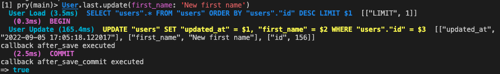

# Observers

Un observer es una clase que, como dice su nombre se encarga de observar al modelo que lleva su nombre y tienen una labor muy parecida o igual a los [callbacks](https://guides.rubyonrails.org/active_record_callbacks.html) de modelos.

Por ejemplo si queremos llamar una función cada vez que se crea una instancia de un modelo lo podemos hacer de la siguiente manera:

```bash
$ rails generate observer MyModel
```

Esto generará un observer de `MyModel`

```ruby
class MyModelObserver < PowerTypes::Observer
  after_create: :puts_hello

  def puts_hello
    puts 'hello'
  end
end
```

Luego en `MyModel` debemos añadir:

```ruby
class MyModel < ActiveRecord::Base
  include PowerTypes::Observable
end
```

Ahora cada vez que se ejecute

```ruby
MyModel.create
```

se ejecutará `puts_hello`.

Esto también se puede hacer con callbacks de la siguiente manera:

```ruby
class MyModel < ActiveRecord::Base
  after_create: :puts_hello

  def puts_hello
    puts 'hello'
  end
end
```

Como pueden ver las dos formas son equivalentes. Entonces ¿Por qué usar observers?

### **¿Por qué ocupar observers?**

Porque nos permite desacoplar lógicas de los modelos que no están directamente relacionadas con ellos.

### **¿Cuál es el criterio para poner algo en un callback o en el observer?**

Por un lado en los callbacks va todo lo necesario para mantener la integridad del objeto, por ejemplo, el formateo de un rut. Si guardamos un objeto sin formato de rut y todos los demás están formateados, entonces ese modelo en sí estará "corrupto".

Por otro lado, en observers debería ir toda la lógica que está relacionada con el modelo pero que no es necesaria para mantener la integridad de este, por ejemplo, el envío de un mail.

Entonces la regla general sería algo como: ¿Mi objeto puede vivir sin esto?, si la respuesta es sí, entonces va en un observer, si la respuesta es no, va en un callback.

Por último la lógica no debe estar literalmente dentro del observer, lo mejor es que en el observer se llame algún job, comando, value, etc y que estos manejen la lógica. Por ejemplo:

```ruby
class SalesObserver
  after_update :add_to_sales_report

  def generate_report
    AddToSalesReportJob.perform_later(object) # En este job va toda la lógica
  end
end
```

### **¿Qué son y cuándo usar los callbacks after commit?**

Los modelos de ActiveRecord tienen [callbacks de transacción](https://guides.rubyonrails.org/active_record_callbacks.html#transaction-callbacks) dentro de los que está el callback `after_commit`. Este puede ser ejecutado después del `create`, `update` o `save`, asegurando que su ejecución sea después de que los cambios hayan sido guardados efectivamente en la base de datos, es decir, después del commit.

PowerTypes permite utilizar estos callbacks dentro de los observers. Se llaman `after_create_commit`, `after_update_commit` y `after_save_commit`.

La recomendación es usar estos callbacks cuando se ejecute algo que deberá volver a buscar el objeto a la base de datos. Por ejemplo, si en un callback `after_save` se encola un job que recibe el objeto como parámetro, y este job es ejecutado instantáneamente por Sidekiq, ocurrirá que irá a buscar la instancia a la base de datos justo antes de que se haga el commit de los cambios, generando una ejecución inconsistente del job ya que se utilizó la versión no actualizada del objeto. En la siguiente imagen se muestra un ejemplo:



En el ejemplo anterior, el callback `after_save` es ejecutado antes de que el objeto sea guardado en la base de datos, mientras que el `after_save_commit` es ejecutado después del commit, asegurando que los cambios ya están guardados en la base de datos.
