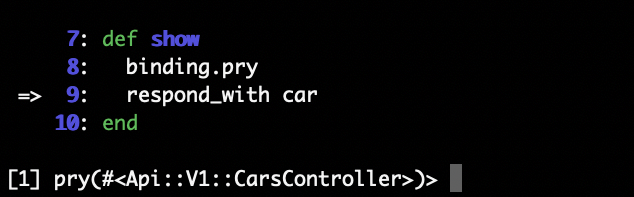
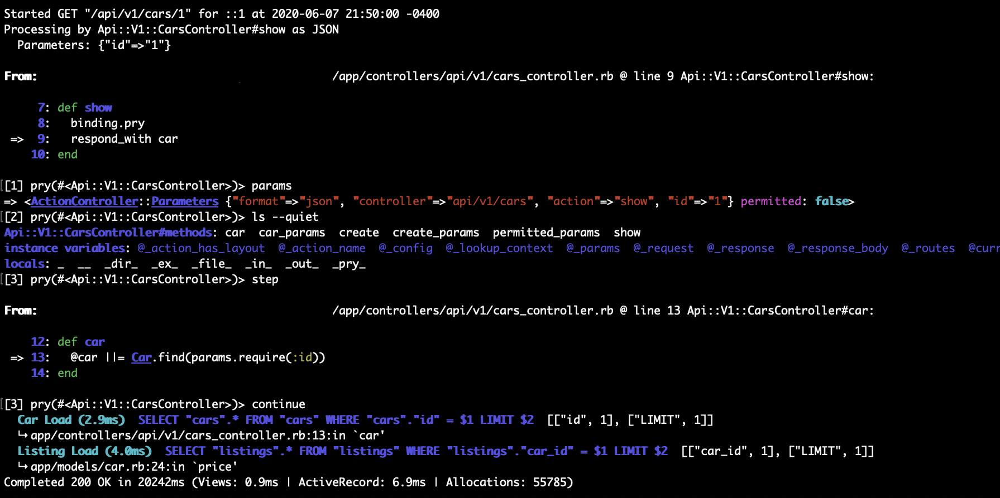

# Pry

[Pry](https://github.com/pry/pry) es una consola para ruby que apunta a ser un reemplazo a IRB. En particular ofrece una mejor experiencia añadiendo funcionalidades que no están presentes en la consola built-in, como syntax highlighting, navegación en clases y debugging.

## ¿Por qué lo usamos?

La consola es más cómoda que IRB y tiene ciertos añadidos que mejoran la experiencia. Además pry nos permite introducir breakpoints en el código sin esfuerzo. Esto sirve para debuggear fácilmente en cualquier sector del código, ya sean controladores, servicios, comandos, modelos, inicializadores, etc. El debugging es muy importante en el proceso de desarrollar aplicaciones y ahorra muchísimo tiempo.

Por otro lado, la integración de pry con los proyectos es transparente y sin complicaciones, por lo que esta herramienta es ideal para ser incluida.

## ¿Cómo lo usamos?

Pry viene incluido por defecto en Potassium, por lo que los proyectos generados incluyen un archivo de configuración `.pryrc` que, entre otras cosas, agrega alias para ciertas funcionalidades. En proyectos que no lo tengan, se puede instalar usando `potassium install pry [--force]` con el cuidado de revisar los cambios en git.

Al ejecutar `bundle exec rails c` ya se está usando pry, sin embargo, una forma que entrega mucho valor a la hora de debuggear es introduciendo breakpoints en el código. Para hacerlo, en cualquier parte del código se puede introducir el siguiente statement: `binding.pry`. Con eso, cuando corra el servidor y la aplicación llegue a ese punto, la ejecución se verá pausada y en la consola se podrá explorar y acceder al scope y variables que tiene la aplicación en ese momento.

## Ejemplo

Supongamos que queremos debuggear el método show del siguiente controlador:

```ruby
class CarsController < Api::V1::BaseController
  def show
    respond_with car
  end

  private

  def car
    @car ||= Car.find(params.require(:id))
  end
end
```

Para hacerlo debemos agregar un breakpoint, de forma que el método show quede así:

```ruby
def show
  binding.pry
  respond_with car
end
```

Al ir a esa ruta, en este caso un `GET` al endpoint `/api/v1/cars/<id>`, la ejecución se detendrá cuando llegue a esa línea y en consola donde esté corriendo el servidor, se verá lo siguiente:



Una vez ahí, hay acceso a todo el scope que tiene ese método, y pry nos permite, entre otras cosas, lo siguiente:

* Explorar los métodos y atributos disponibles en el contexto ejecutando `ls`, en este caso todo lo presente dentro del método del controlador.

* Ver los valores de las variables a las que se puede acceder. En este caso podremos por ejemplo explorar el valor de `params` y las llaves que contiene.

* Avanzar por línea con `next` o el alias `n`.

* Avanzar por llamado a función con `step` o el alias `s`.

* Salir del breakpoint con `continue` o `c` y seguir en la ejecución.

Acá un ejemplo de debugging completo:



Se puede ver que pry muestra no solo la línea donde se detuvo la ejecución, sino que también lo que la rodea, y el nombre del scope donde está parado. En este caso se ve que en primera instancia se detuvo en la línea 9, dentro del controlador señalado como `#<Api::V1::CarsController>`.

Como nota adicional, es importante que estos breakpoints no deben aparecer nunca en código que se va a subir y publicar, se deben mantener solo de manera temporal para development. De todas maneras contamos con la ayuda de linters configurados para que aleguen cuando se nos esté pasando una de esas líneas a un commit.

## Recursos Útiles

* [Pry cheat sheet](https://gist.github.com/lfender6445/9919357): [@lfender6445](https://gist.github.com/lfender6445) tiene una guía rápida con algunos de los comandos útiles que provee pry.

* [Repositorio](https://github.com/pry/pry): tiene documentación, guía de instalación y una [wiki](https://github.com/pry/pry/wiki) bastante completa, sin embargo cubre casos de uso mucho más profundos/complejos. Los ejemplos que ya se incluyen en esta guía cubren la mayor parte de los casos de uso comunes.
