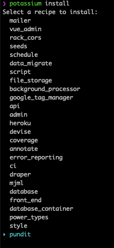
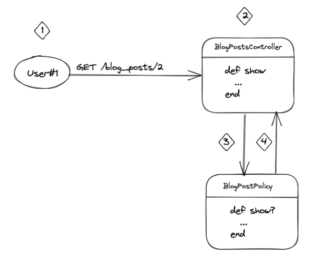
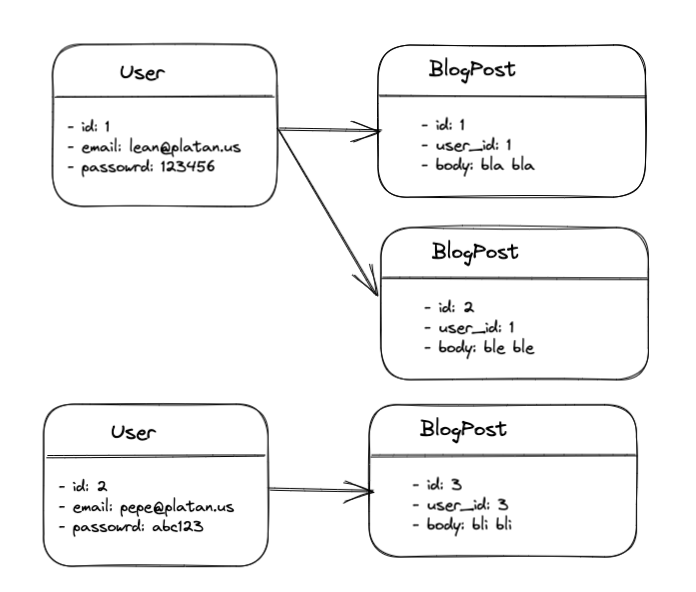
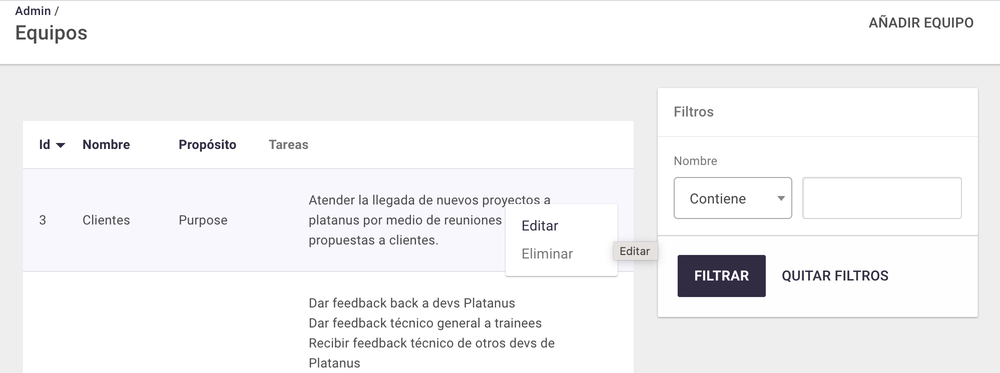
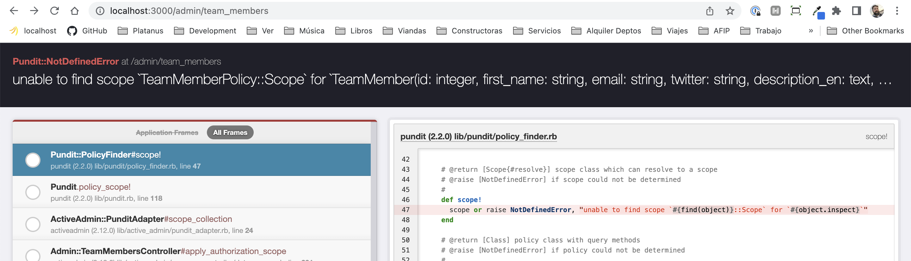
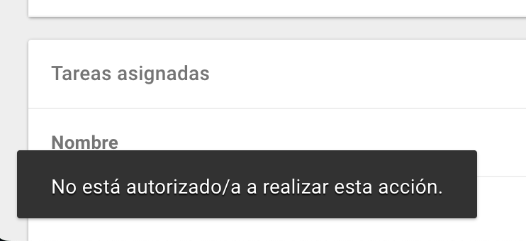

# Pundit

[Pundit](https://github.com/varvet/pundit) es la gema de Ruby que utilizamos para dar permisos de acceso en nuestras aplicaciones.

## ¿Por qué la usamos?

* Para encapsular la lógica de permisos en un solo lugar (las policies) y separarla de los recursos (controllers y modelos).

* Porque es simple de entender y configurar.

* Porque se integra bien con Active Admin.

## ¿Cómo la usamos?

### Instalación

Podemos instalar la gema con [potassium](https://github.com/platanus/potassium) al crear un proyecto o luego así:



### Uso básico

Autorizar un recurso con Pundit sigue este camino:



**Punto 1**

Un usuario hace una request a un recurso. En este caso `User#1` intenta acceder a un blog post a través de la url `GET /blog_posts/2` 

**Punto 2**

La solicitud llega a `BlogPostsController#show` action.

```ruby
class BlogPostsController < ApplicationController
  def show
    authorize blog_post
    respond_with blog_post
  end

  private

  def blog_post
    @blog_post ||= BlogPost.find(params[:id])
  end
end
```

La primera línea que se ejecuta es `authorize(blog_post)`. Este método `authorize` viene con Pundit y lo que hace es buscar dentro de `/app/policies` **una cuyo nombre contenga la clase del recurso que pasamos a ****`authorize`**** como primer parámetro + el sufijo Policy**. En este caso como el objeto `blog_post` es una instancia del modelo `BlogPost`, Pundit buscará la policy `BlogPostPolicy` en `/app/policies/blog_post_policy.rb`. Si no la encuentra, lanzará el error `Pundit::NotDefinedError` y deberás agregarla. Si la encuentra, Pundit **internamente** hará algo así:

```ruby
BlogPostPolicy.new(current_user, blog_post).show?
```

Donde:

1. `BlogPostPolicy` es la policy que se infiere a partir de la clase del recurso. En el ejemplo se infiere a partir de `BlogPost.find(3)`.

1. `current_user` es el usuario logueado. En el ejemplo: `User.find(1)`.

1. `blog_post` es el recurso sobre el que decidimos si el usuario puede acceder o no. En el ejemplo: `BlogPost.find(params[:id])` o `BlogPost.find(3)` que es lo mismo.

1. `show?` es un método en la policy que tiene la lógica de permisos para la acción `BlogPostsController#show`. Es importante tener en cuenta que esto también funciona por convención. Si la acción del controller es `show` en la policy Pundit buscará internamente **un método de instancia con el mismo nombre + ?** → `show?`

**Punto 3**

Como dijimos en el punto anterior, al encontrar la `BlogPostPolicy` se busca y ejecuta el método de instancia `show?`. Este método define la lógica de permisos para un recurso específico (una instancia del modelo `BlogPost`) y una acción de controller específica (`show` en este caso). 

Entonces, si tenemos la policy:

```ruby
class BlogPostPolicy < ApplicationPolicy
  def show?
    user.blog_posts.where(id: record.id).any?
  end
end
```

y la siguiente información en la DB:



Veamos qué ocurre con los siguientes flujos:

* `User#1` intenta acceder a `/blog_posts/2`.

    En este caso:

    * `user`: es igual a `current_user` o lo que es igual `User.find(1)`

    * `blog_posts`: es una colección (de Active Record) de `BlogPost`s que contiene dos instancias. Una con id 1 y otra con id 2. Esto porque `user` es dueño de esos dos posts según la info que definimos más arriba.

    * `record`: es el recurso. En el ejemplo `BlogPost.find(2)`

    Con lo anterior podemos ver si `User#1` tiene acceso sobre `BlogPost#2` en la acción `BlogPostsController#show`

    ```ruby
    class BlogPostPolicy < ApplicationPolicy
      def show?
        user.blog_posts.where(id: record.id).any? #=> true
        # User.find(1).blog_posts.where(id: BlogPost.find(2).id).any? #=> true
        # User#1 que es dueño de los blog posts 1 y 2 contiene a 2? #=> true
      end
    end
    ```

    Como resulta ser que sí tiene permisos, el método `authorize` de `BlogPostsController#show` devuelve `true` y permite ejecutar `respond_wih blog_post` devolviendo la información requerida por `User#1`.

* `User#2` intenta acceder a `/blog_posts/3`.

    En este caso ocurre algo similar al ejemplo anterior porque `User#2` es dueño del `BlogPost#3`.

* `User#1` intenta acceder a `/blog_posts/3`.

    En este caso el código en `show?` evalúa `false` y Pundit lanza la exception `Pundit::NotAuthorizedError` que impide que `User#1` acceda al recurso `BlogPost#3` 

    ```ruby
    class BlogPostPolicy < ApplicationPolicy
      def show?
        user.blog_posts.where(id: record.id).any? #=> false
        # User.find(1).blog_posts.where(id: BlogPost.find(3).id).any? #=> false
        # User#1 que es dueño de los blog posts 1 y 2 contiene a 3? #=> false
      end
    end
    ```

### Integración con Active Admin

Normalmente en nuestros proyectos Platanus tenemos dos dominios bien definidos:

1. La app.

1. El admin o back office.

En el primero normalmente el usuario logueado es una instancia de `User`. En cambio, en el segundo, es un `AdminUser`. Algo también común, no solo en los proyectos Platanus, es que los permisos sobre un mismo recurso (supongamos una instancia de `BlogPost`) son bien distintos en un dominio u otro. Por ej es frecuente que un usuario admin pueda acceder a recursos de otros usuarios pero este comportamiento es poco frecuente del lado de la app.

Con este nuevo panorama, modifiquemos la policy del ejemplo para autorizar un recurso en ambos dominios.

Habíamos dicho que para que `User#1` acceda a `/blog_posts/2` la policy se ve así:

```ruby
class BlogPostPolicy < ApplicationPolicy
  def show?
    user.blog_posts.where(id: record.id).any? #=> true
    # User.find(1).blog_posts.where(id: BlogPost.find(2).id).any? #=> true
    # User#1 que es dueño de los blog posts 1 y 2 contiene a 2? #=> true
  end
end
```

Ahora supongamos que `AdminUser#1` quiere acceder a `/admin/blog_posts/2` utilizando la misma policy.

```ruby
class BlogPostPolicy < ApplicationPolicy
  def show?
    user.blog_posts.where(id: record.id).any? #=> NoMethodError: undefined method `blog_posts'
    # AdminUser.find(1).blog_posts.where(id: BlogPost.find(2).id).any?
  end
end
```

Es hacer esto devuelve un error ya que la variable `user` de `show?` en vez de contener una instancia de `User` ahora contiene una de `AdminUser`. El problema con esto es que como `AdminUser` no tiene la relación `blog_posts` definida, el código falla. La forma de arreglar esto es agregar lógica de acceso entendiendo que la variable `user` a veces será una instancia de `User` (cuando se acceda desde el dominio de la app) pero otras de `AdminUser` (cuando se acceda desde back office). La policy corregida se ve así:

```ruby
class BlogPostPolicy < ApplicationPolicy
  def show?
    case user
    when User
      user.blog_posts.where(id: record.id).any?
    when AdminUser
      true
    else
      raise 'invalid user type'
    end
  end
end
```

Ahora el código funciona porque antes de evaluar el permiso estamos viendo si el recurso se está accediendo a través de un `User` o un `AdminUser`. Si bien esta solución es “aceptable”, mantener esta estrategia complicaría la lógica de las policies ya que todas arrastrarían el problema de “si es admin hacer x pero si es user hacer y”. Para evitar esto, en Platanus **usamos policies diferentes para la app y el admin.** El código con este cambio queda de la siguiente manera:

En `/app/policies/blog_post_policy.rb` seguimos poniendo, igual que antes, los permisos para el dominio de la app.

```ruby
class BlogPostPolicy < ApplicationPolicy
  def show?
    user.blog_posts.where(id: record.id).any?
  end
end
```

En cambio para el admin, agregamos una nueva policy para el mismo recurso (`BlogPost`) dentro de `app/policies/back_office/blog_post_policy.rb`

```ruby
class BackOffice::BlogPostPolicy < BackOffice::DefaultPolicy
  def show?
    true
  end
end
```

De esta manera se simplifica la lógica ya que del lado de la app `user` siempre será una instancia de `User` en cambio en el admin, siempre será `AdminUser`.

### Pundit Admin Adapter

Como mencioné anteriormente, una de las ventajas de usar Pundit es que [se integra bien con Active Admin](https://activeadmin.info/13-authorization-adapter.html) que es el framework de administración que usamos en Platanus.

En la práctica, esto significa que para autorizar un recurso en la back office solo se debe definir la policy y Active Admin hará el resto. Por ej: si tengo el recurso `Team` y la policy:

```ruby
class BackOffice::TeamPolicy < BackOffice::DefaultPolicy
  def show?
    false
  end
end
```

Active Admin esconderá automáticamente la opción “Ver” de ese recurso y la ruta `/admin/teams/:id` no existirá.



Algo importante a tener en cuenta es que al trabajar con [acciones custom](https://activeadmin.info/8-custom-actions.html) (aquellas definidas por `member_action` o `collection_action`) Active Admin manejará la visibilidad de la ruta pero los links habrá que manejarlos manualmente. Por ej si tengo:

```ruby
ActiveAdmin.register Team do
  member_action :import_form, method: :get do
    render("admin/import_form", locals: { team: resource })
  end

  action_item :import_form, only: [:show] do
    link_to "Ir al import form", import_form_admin_team_path(resource)
  end
end
```

y la policy:

```ruby
class BackOffice::TeamPolicy < BackOffice::DefaultPolicy
  def import_form?
    false
  end
end
```

la ruta `/admin/teams/3/import_form` no existirá pero el link en el header sí:


Para corregir esto, se debe agregar una condición al `action_item` así:

```ruby
action_item :import_form, only: [:show], if: proc { authorized?(:import_form, resource) } do
  link_to "Ir al import form", import_form_admin_team_path(resource)
end
```

De esta manera, solo se muestra el link si `authorized?(:import_form, resource)` evalúa `true`. Como ya se imaginarán, `authorized?` es un método de Active Admin que conecta con Pundit y permite preguntar para una acción específica (en este caso `:import_form` definida por la `member_action`) si el admin logueado puede acceder a `resource` (en este caso una instancia de `Team` → `resource = Team.find(3)`) o no.

### Default Policy

Para controlar el acceso **por default **a los recursos es que agregamos una clase base a las policies. Entonces, las de la app heredarán de `ApplicationPolicy` → `/app/policies/application_policy.rb` y las de admin de `BackOffice::DefaultPolicy` → `/app/policies/back_office/default_policy.rb`.

Por ej, si tengo la policy:

```ruby
class BackOffice::BlogPostPolicy < BackOffice::DefaultPolicy
end
```

con la siguiente clase base:

```ruby
class BackOffice::DefaultPolicy
  # ...

  def index?
    false
  end

  def show?
    false
  end

  def create?
    false
  end

  def new?
    create?
  end

  def update?
    false
  end

  def edit?
    update?
  end

  def destroy?
    false
  end

  # ...
end
```

si como un admin user intento acceder a `/admin/blog_posts/3`, no podré hacerlo porque al no tener `BackOffice::BlogPostPolicy` definida la acción `show?` se accederá **por defecto **al método `:show?` definido en `BackOffice::DefaultPolicy`, evaluará `false` y no me dejará acceder a la vista.

> ℹ️ Dependiendo del tipo de aplicación y lo sensible que sea el tema seguridad en la misma, nos convendrá o no hacer que las clases base sean más o menos restrictivas.

### Preguntas frecuentes

**¿Cómo manejar un admin que puede ver todo y otro que tiene acceso restringido?**

Supongamos que tenemos el modelo `BlogPost` que tiene un atributo `deleted_at` que se llena cuando alguien borra el blog. Supongamos además que queremos que desde la back office, un `AdminUser` con rol “super admin” pueda ver absolutamente todos los blogs pero uno con rol “supervisor” solo pueda ver aquellos que no fueron borrados. Para lograr esto haremos lo siguiente:

1. Agregar scopes a `BlogPost` para poder obtener fácilmente recursos borrados.

    ```ruby
    class BlogPost < ApplicationRecord
      scope :published, -> { where(deleted_at: nil) }
    end
    ```

1. Definir un atributo rol en el modelo `AdminUser` así:

    ```ruby
    class AdminUser < ApplicationRecord
      enum role: { supervisor: 0, super_admin: 1 }, _default: 'supervisor', _prefix: true
    end
    ```

1. Modificar la policy para definir las reglas de acceso para cada rol:

    ```ruby
    class BackOffice::BlogPostPolicy < BackOffice::DefaultPolicy
      def show?
        scope = admin_user.role_supervisor? ? :published : :all
        BlogPost.send(scope).where(id: record.id).any?
      end
    end
    ```

    En el código anterior se puede ver que se buscará el blog post (`record`) específico en la colección completa en el caso de que el `AdminUser` logueado (`admin_user`) sea un `super_admin` o en la colección filtrada (solo aquellos que no fueron borrados) en el caso de que sea `supervisor`.

**¿Cómo testear una policy con RSpec?**

Tomemos como ejemplo la policy de la pregunta anterior:

```ruby
class BackOffice::BlogPostPolicy < BackOffice::DefaultPolicy
  def show?
    scope = admin_user.role_supervisor? ? :published : :all
    BlogPost.send(scope).where(id: record.id).any?
  end
end
```

Pasos a seguir:

1. Agregar `require "pundit/rspec"` al archivo `spec/rails_helper.rb` para tener los helpers de RSpec específicos de Pundit si es que no viene ya con Potassium.

1. Agregar la policy en `spec/policies/back_office/blog_post_policy_spec.rb`

1. Definir en `let`s todo aquellos que puede variar:

    1. `admin_user`

    1. `record`

    ```ruby
    describe BackOffice::BlogPostPolicy do
      subject { described_class }
    
      let(:role) { "super_admin" }
      let(:admin_user) { create(:admin_user, role: role) }
      let(:deleted_at) { nil }
      let(:record) { create(:block_post, deleted_at: deleted_at) }
    
      # ...
    end
    ```

1. Probar los permisos sobre una acción variando los `let`s.

    ```ruby
    describe BackOffice::BlogPostPolicy do
      subject { described_class }
    
      let(:role) { "super_admin" }
      let(:admin_user) { create(:admin_user, role: role) }
      let(:deleted_at) { nil }
      let(:record) { create(:block_post, deleted_at: deleted_at) }
    
      permissions :show? do
        context "with super_admin role" do
          let(:role) { "super_admin" }
    
          it { expect(subject).to permit(admin_user, record) }
    
          context "with deleted record" do
            let(:deleted_at) { DateTime.current }
    
            it { expect(subject).to permit(admin_user, record) }
          end
        end
    
        context "with supervisor role" do
          let(:role) { "supervisor" }
    
          it { expect(subject).to permit(admin_user, record) }
    
          context "with deleted record" do
            let(:deleted_at) { DateTime.current }
    
            it { expect(subject).not_to permit(admin_user, record) }
          end
        end
      end
    end
    ```

**¿Qué significa el error ****`Pundit::NotDefinedError`****?**



Significa que nos falta agregar la policy para el recurso que acabamos de agregar. Se arregla agregando la policy y definiendo permisos para todas las acciones (que pueden ser las que vienen por default de `BackOffice::DefaultPolicy`)

```ruby
class BackOffice::TeamMemberPolicy < BackOffice::DefaultPolicy
end
```

**¿Por qué en active admin no puedo acceder a un recurso?**



Posiblemente porque el permiso está evaluando `false`. Por ej si vemos el error al entrar a `/admin/team_members/666` debemos revisar en `BackOffice::TeamMemberPolicy` si el permiso en `show?` está evaluando `true` o `false`. Si resulta que la acción no está definida en esa policy habrá que revisar `BackOffice::DefaultPolicy`

## Recursos útiles

* [Github de Pundit](https://github.com/varvet/pundit)

* [Receta](https://github.com/platanus/potassium/blob/master/lib/potassium/recipes/pundit.rb) de potassium (puede ser útil para ver qué se instala)
