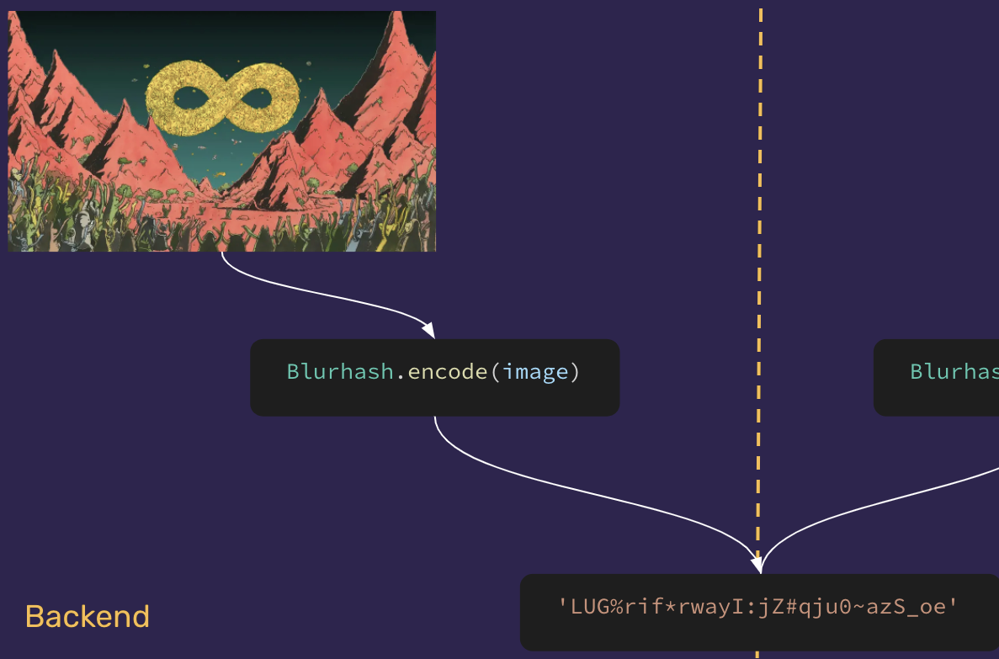

# Manejo y procesamiento de imágenes

## Motivación

Consideremos una vista con imágenes subidas por usuarios, donde tenemos menos control sobre lo que suben. Si las mostramos tal cuál fueron subidas con un `` y nada más, podríamos tener una carga no muy atractiva, algo así:

[Ver video](assets/manejo-y-procesamiento-de-imagenes-1.qt)

Hay varios problemas con esto:

* Mientras las imágenes no se han cargado se ve un espacio vacío

* Cuando se van cargando hay un momento que se ven a la mitad

* Se demoran harto en cargar todas

En esta sección de la guía vamos a ver algunas cosas que se pueden hacer con Shrine para que potencialmente la carga sea más amigable:

[Ver video](assets/manejo-y-procesamiento-de-imagenes-2.qt)

Las cosas que veremos acá, también [fueron implementadas en Potassium](https://github.com/platanus/potassium/pull/398), ahí en el PR puedes ver más detalles también.

## [Blurhash](https://blurha.sh/)

Del video anterior, probablemente lo que más llama la atención son esas versiones borrosas de las imágenes que aparecen antes de que las imágenes mismas se muestren. Eso se logra con Blurhash: una herramienta que permite representar una imagen como un string que luego se decodifica en el frontend y se obtiene algo que se pueden pintar en un `<canvas>` rápidamente.



Con esto se evita el espacio en blanco y la carga por partes que se ven en el primer video.

Para usar blurhash con Shrine, necesitamos procesar la imagen para obtener el string y guardarlo en la metadata del archivo. Usaremos el [plugin add_metadata](https://shrinerb.com/docs/plugins/add_metadata) para agregar la metadata. Para procesar la imagen, usaremos [ruby-vips](https://github.com/libvips/ruby-vips) un procesador de imágenes alternativo a ImageMagick que ha mostrado tener mejor performance y menor uso de memoria. Esto se ve así:

```ruby
class ImageUploader < Shrine
  add_metadata :blurhash do |io, derivative: nil, **|
    if derivative.nil?
      Shrine.with_file(io) do |file|
        image = Vips::Image.new_from_file(file.path, access: :sequential)

        # Transformamos el archivo a un tamaño más pequeño para acelerar el procesamiento
        image = image.resize(100.0 / image.width)

        # image.to_a entrega un arreglo con los pixeles en formato rgba, Blurhash requiere solo rgb
        flat_rgb_pixels = []
        image.to_a.each do |row|
          row.each { |pixel| flat_rgb_pixels.concat(pixel[0..2])  }
        end

        # Finalmente obtenemos el string, que se guarda en file.metadata['blurhash']
        Blurhash.encode(image.width, image.height, flat_rgb_pixels)
      end
    end
  end
end
```

Con esto ya tenemos un código que podemos usar en el front para renderear un placeholder mientras se carga la imagen.

## Derivatives

Hasta ahora podemos evitar que nuestra vista tenga espacios vacíos en un principio y que luego las imágenes se empiecen a cargar por partes, pero todavía nos gustaría que el usuario pueda verlas lo más rápido posible. Para esto usaremos derivatives para disminuir el peso de las imágenes, de dos maneras:

1. Tener distintos tamaños. Así el front puede usar el tamaño que más se adecúe al uso que se le dará en una vista y no tiene que cargar una imagen de mayor peso. Esto ya lo vimos en [los ejemplos de Shrine](https://www.notion.so/platanus/general.md#ejemplo-heredando-de-un-uploader)

1. Tener imágenes en formato `webp`, un formato más liviano que `png` o `jpg` con muy poca perdida de calidad

Para esto usaremos nuevamente `vips`. Si quisieramos tener variaciones de tamaño pequeño, tanto en el formato original como en formato `webp`, tendríamos que hacer lo siguiente:

```ruby
class ImageUploader < Shrine
  Attacher.derivatives do |original|
    vips = ImageProcessing::Vips.source(original)
    {
      sm: vips.resize_to_limit!(426, 240),
      webp_sm: vips.convert('webp').resize_to_limit!(426, 240),
    }
  end
end
```

## ¿Cómo se ve esto en Potassium?

En Potassium agregamos algunos archivos y configuraciones para facilitar el uso de estas cosas. La idea es que sirva como un ejemplo y base que se pueda customizar según sea necesario.

## Backgrounding

El procesamiento de una imagen para sacar sus derivatives puede ser costoso en recursos y tiempo. Por esto, usamos el plugin de `backgrounding` para que este procesamiento [se encole en un job](https://github.com/platanus/potassium/blob/master/lib/potassium/assets/config/shrine.rb#L43).

Hacer esto resulta en que hay un momento entre que se sube una imagen y que esta se procesa, en que las derivatives no existen. Por lo tanto, si se pidiera una url para ellas en una vista, habría un problema. Para evitar esto, usamos una combinación de dos plugins para tener un fallback:

1. [Derivation Endpoint](https://shrinerb.com/docs/plugins/derivation_endpoint): nos permite generar una url on-the-fly con una variación redimensionada de la imagen según parámetros de `height` y `width`. [Usado acá](https://github.com/platanus/potassium/blob/master/lib/potassium/assets/app/uploaders/cover_image_uploader.rb#L28)

1. [Default Url](https://shrinerb.com/docs/plugins/default_url): Nos permite definir una url por defecto cuando el archivo solicitado no existe. [En nuestro caso](https://github.com/platanus/potassium/blob/master/lib/potassium/assets/app/uploaders/cover_image_uploader.rb#L34), lo usamos para entregar una url generada con el derivation endpoint anterior cuando se pide una derivative

## [CoverImageUploader](https://github.com/platanus/potassium/blob/master/lib/potassium/assets/app/uploaders/cover_image_uploader.rb)

Uploader de ejemplo que incluye todo lo que ya habíamos mencionado:

* Inclusión de blurhash a la metadata

* Derivatives de 3 tamaños distintos, cada uno en `jpg` y en `webp`

* Url default para derivatives faltantes usando la derivation url

## [ImageHandlingAttributes](https://github.com/platanus/potassium/blob/master/lib/potassium/assets/app/serializers/concerns/image_handling_attributes.rb)

Concern de serializer incluido en el `BaseSerializer`. Agrega un método `add_image_handling_attributes` que permite a cualquier serializador agregar `attributes` para el blurhash y para las urls de las derivatives de una imagen.

Dado un attachment de nombre `image` que usa el `CoverImageUploader`, se puede usar así:

```ruby
add_image_handling_attributes(
  attachment_name: :image,
  derivatives: CoverImageUploader::DERIVATIVES.keys,
  include_original_image: true
)
```

Se usa la constante `CoverImageUploader::DERIVATIVES` para indicar que quiero agregar al objeto serializado todas las derivatives.

Si se tuviera solo una derivative `sm`, esto agregaría algo así al json resultante:

```ruby
{
  # ...
  image_blurhash: 'LUG%rif*rwayI:jZ#qju0~azS_oe',
  image: {
    sm: { url: 'someurl.com/bla' },
    original: { url: 'someurl.com/ble' }
  }
}
```

## [ImageHandlingUtilities](https://github.com/platanus/potassium/blob/master/lib/potassium/assets/config/initializers/shrine/plugins/image_handling_utilities.rb)

Plugin custom de Shrine que se usa en el `CoverImageUploader`. Agrega algunos métodos de instancia y de clase al modelo que use ese uploader. Para un attachment de nombre `image`, estos son:

* `image_blurhash`: retorna el blurhash sacado de la metadata

* `generate_image_derivatives`: genera todas las derivatives definidas en el Uploader. Si el archivo ya tenía algunas derivatives definidas, estas serán reemplazadas.

    Puede ser útil si se agregan derivatives a un uploader que no tenía, o si se cambia la definición de estas en uno que sí tenía. En estos casos se tendría que reprocesar los archivos ya existentes, por ejemplo, llamando a este método en un job.

    Método de clase asociado: `generate_all_image_derivatives`

* `generate_image_metadata`: genera toda la metadata del attachment.

    Útil si se agrega metadata nueva que se necesita en records existentes.

    Método de clase asociado: `generate_all_image_metadata`

* `generate_image_derivatives_and_metadata`: lo mismo que ambos métodos anteriores juntos, pero la gracia es que se preocupa de abrir el archivo solo una vez para procesar derivatives y metadata.

    Método de clase asociado: `generate_all_image_derivatives_and_metadata`

## Frontend

Hasta ahora hemos visto cómo usar Shrine para generar estas cosas que nos pueden ayudar a mejorar nuestra experiencia de carga de imágenes. Lo que sigue es cómo usar esto en nuestras vistas. Esta parte no viene en Potassium, pero acá se explicará que se necesitaría para implementarlo con Vue 3.

## Renderear blurhash

Para mostrar la imagen borrosa asociada al blurhash, necesitamos un componenete que maneje la decodificación del código y el pintado de los pixeles resultantes en un canvas. Para esto necesitamos agregar el paquete de blurhash:

```bash
yarn add blurhash
```

Luego, el componente se vería así:

```javascript
<script setup lang="ts">
import { ref, onMounted } from 'vue';
import { decode } from 'blurhash';

interface Props {
  blurhash: string,
}
const props = defineProps<Props>();

const INITIAL_CANVAS_SIZE = 32;

const canvas = ref<HTMLCanvasElement | null>(null);

onMounted(() => {
  const pixels = decode(props.blurhash, INITIAL_CANVAS_SIZE, INITIAL_CANVAS_SIZE);
  const imageData = new ImageData(pixels, INITIAL_CANVAS_SIZE, INITIAL_CANVAS_SIZE);
  const context = canvas.value?.getContext('2d');
  context?.putImageData(imageData, 0, 0);
});
</script>

<template>
  <canvas
    ref="canvas"
    :width="INITIAL_CANVAS_SIZE"
    :height="INITIAL_CANVAS_SIZE"
  />
</template>
```


Notar que estamos seteando un tamaño fijo de 32px para el canvas. Esto es porque se necesita un tamaño explícito para decodificar el blurhash y renderearlo en el canvas, pero de todas maneras después se puede cambiar su tamaño con css. Por otro lado, usar un canvas pequeño ayuda con el performance. [Esto es lo que recomienda blurhash](https://github.com/woltapp/blurhash#how-fast-is-encoding-decoding)


## Transición de blurhash a imagen

Para determinar cuando pasar del canvas con el blurhash a la imagen, necesitamos un componente que renderee ambos en el mismo espacio, pero mostrando solo el blurhash. Luego, cuando la imagen esté totalmente cargada, intercambie la opacidad de ambos elementos. Para determinar cuándo hacer esto, usamos el evento `@load` de ``.
También necesitamos considerar el formato webp. Tiene buena compatibilidad con browsers modernos, pero para mayor cobertura usaremos un `<picture>` que permita usar el formato webp solo si el browser lo permite. En el caso contrario, se usaría como fallback un src `jpg`:

```javascript
<script setup lang="ts">
import { ref } from '@vue/reactivity';
import BlurhashCanvas from './blurhash-canvas.vue';

interface Props {
  src: string,
  webpSrc?: string,
  blurhash?: string,
}
withDefaults(defineProps<Props>(), {
  webpSrc: undefined,
  blurhash: undefined,
});

const isLoaded = ref(false);
</script>

<template>
  <div
    class="relative"
  >
    <blurhash-canvas
      v-if="blurhash"
      :blurhash="blurhash"
      class="absolute w-full h-full transition-opacity duration-500"
      :class="isLoaded ? 'opacity-0' : 'opacity-100'"
    />
    <picture>
      <source
        ref="webpSource"
        type="image/webp"
        :srcset="webpSrc"
      >
      <source
        ref="jpegSource"
        type="image/jpeg"
        :srcset="src"
      >
      
    </picture>
  </div>
</template>
```


El `loading="lazy"` es un atributo del `` que le dice al browser que solo cargue la imagen si es actualmente visible, o está cerca de serlo. [Acá más información sobre lazy loading](https://web.dev/browser-level-image-lazy-loading/)


Con esto ya podemos usar este componente para renderear nuestras imágenes de una manera más amigable.
