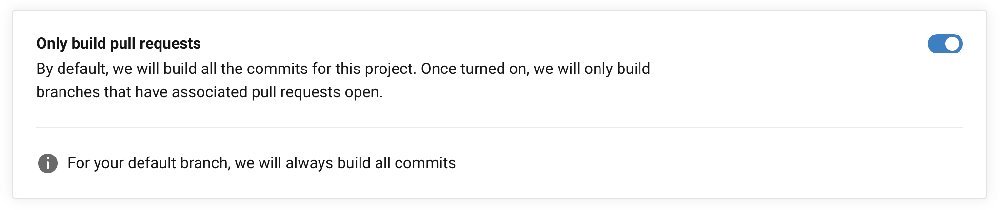

# Migración Hound → reviewdog

### Contexto

Desde hace un tiempo estamos pasando los proyectos que usaban Hound para el linting a reviewdog. Hound corría en un servidor hosteado por nosotros y usaba una versión de Hound de cuando el proyecto era completamente open-source. Lamentablemente ciertas partes del proyecto pasaron a ser closed-source por lo que nos quedamos con una versión antigua.

Además, Hound usaba una versión particular de los linters, por lo que al hacer una actualización de rubocop por ejemplo, había que actualizar todos los proyectos para que fueran compatibles, haciendo que la actualización de reglas ocurriera muy esporádicamente.

Reviewdog es una especie de formateador de los outputs de los linters, y se puede correr donde uno quiera. Esto nos permite correrlo en CircleCI y no depende de versiones particulares de los linters, simplemente recibe el output de un linter y reporta a GitHub el comentario correspondiente.

### Pasos para migrar un proyecto antiguo

1. Los proyectos actualmente no cuentan con los linters como dependencias por lo que se deben agregar. Para eso se deben *lockear* a `devDependencies` del `package.json` las siguientes librerías: `eslint`, sus respectivos plugins como `eslint-plugin-import` o `eslint-plugin-vue` y `stylelint`.
* **Ejemplo**: [https://github.com/platanus/mok/blob/master/package.json](https://github.com/platanus/mok/blob/master/package.json)

1. Por el lado de ruby, se deben agregar al `Gemfile` bajo el grupo `:development, :test` todas las gemas relativas al linting, esto es `rubocop` y los plugins como `rubocop-rspec`, `rubocop-rails`, etc.
* **Ejemplo**: [https://github.com/platanus/mok/blob/master/Gemfile](https://github.com/platanus/mok/blob/master/Gemfile)
* **Nota:** rubocop suele introducir breaking changes en cada actualización de minor antes de que lleguen a la versión `1.0`, por lo que se debería dejar la versión especificada al menos como `~> 0.82.0`, es decir, fijando el minor pero permitiendo updates al patch.

1. Copiar las reglas de cada linter a la raíz del proyecto, esto implica los archivos: `.eslintrc.json` , `.rubocop.yml` y `.stylelintrc.json`. En [Potassium](https://github.com/platanus/potassium) están incluidos los archivos, considerando el de rubocop actualizado para ser compatible con la versión `0.82`.
* **Nota**: Al terminar este paso ya tenemos los linters con sus reglas en el proyecto, lo siguiente es correr los linters en CircleCI.

1. Actualizar el archivo `config.yml` incluido en cada proyecto. Para esta actualización hay que basarse en el archivo incluido [aquí](https://github.com/platanus/potassium/blob/master/lib/potassium/assets/.circleci/config.yml.erb). En primer lugar el job llamado `build` se renombra a `test` y en segundo lugar se agrega un nuevo job llamado `lint`. Este último agrega los pasos necesarios para realizar linting en el proyecto usando caché; se puede copiar entero sin cambiar. Finalmente se agrega una sección `workflows` que especifica cómo se deben correr ambos jobs, en este caso en paralelo y utilizando un contexto global para el de linting. 
* **Nota 1: **si no se requiere linting de `eslint` o de `stylelint` se pueden eliminar los steps correspondientes a cada uno, y si no se va a usar ninguno se pueden eliminar los steps correspondientes a dependencias de `yarn` y su caché.
* **Nota 2: **el contexto llamado `org-global` lo que hace es incluir la variable de entorno necesaria (`REVIEWDOG_GITHUB_API_TOKEN`) para que reviewdog reporte a GitHub.
* **Nota 3: **el job de linting no va a reportar una falla (o una cruz roja) a GitHub en caso de encontrar violaciones, solo va a comentar el PR. Esto se condice con el comportamiento que tenía Hound.

1. Asumiendo que ya está CircleCI activado en el proyecto, se debe ir a la configuración del proyecto para marcar que solo corra los builds en PRs. Esto es necesario porque reviewdog no reporta nada si no hay un PR en el que hacerlo. Para activar esta configuración ir en los settings del proyecto a la sección `Advanced`. Ahí seleccionar `Only build pull requests` como se ve en la foto.
* **Nota**: Para la rama master igual se van a correr los tests al mergear un PR pero no se reportarán errores de linting.

